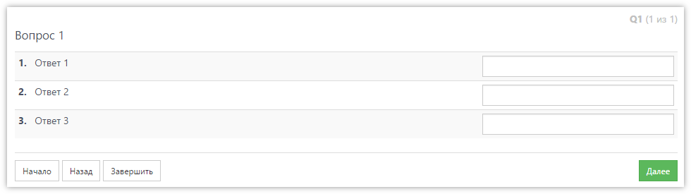
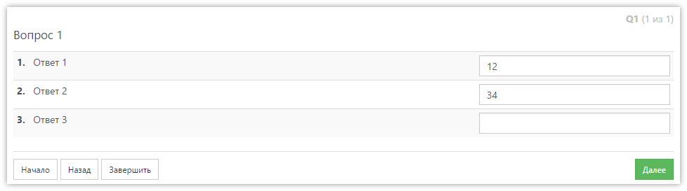
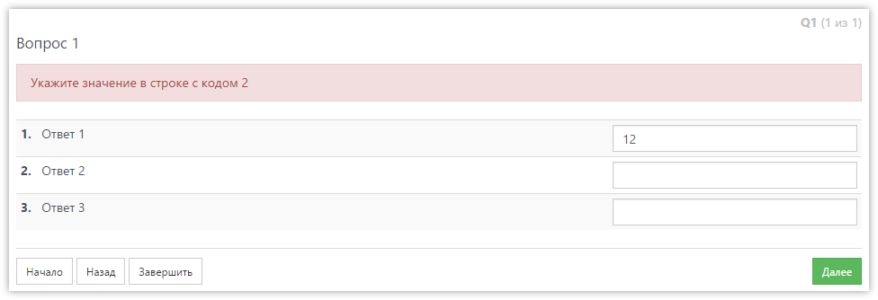

# Ручной контроль правильности ответа на вопрос

В **SURVEY**STUDIO по умолчанию любой вопрос должен содержать ответ, иначе оператор не сможет перейти к следующему вопросу. Причем если вопрос табличный - требуется чтобы ответ был в каждой видимой строке таблицы. Это удобно и позволяет разработчику не выполнять ручные проверки, отвечен ли вопрос.

Однако, бывают случаи, когда необходимо отказаться от автоматической проверки, и взять весь контроль над ответом на вопрос в свои руки. Теперь это возможно.

Допустим у нас есть простой табличный вопрос (числовой) следующего вида:



Обычное поведение системы - будет требоваться ответ во всех трёх строках. Но, допустим, нам надо сделать так, что в строке с кодом 3 ответ может отсутствовать. Тогда мы в свойствах вопроса, в разделе _Логика_, ставим флаг:

- Не требовать обязательного ответа на вопрос (проверка ответа скриптами).

Теперь система будет контролировать только формат вводимых значений (в данном случае чтобы вводились числа), но не наличие ответов. Т.е. можно перейти к следующему вопросу вообще не отвечая на Q1. Чтобы разрешить оставлять пустым число только в строке с кодом 3, напишем скрипт после ответа для Q1:

```js
var visibleRows = Q.rows.getVisible();
for (var i = 0; i < visibleRows.length; i++) {
    var row = visibleRows[i];
    if (row.code != 3 && row.openValueInt == undefined) {
        return error('Укажите значение в строке с кодом ' + row.code);
    }
}
```

В результате вопрос можно ответить таким образом:



А если не указать, например, ответ в строке с кодом 2, то будет выдано сообщение об ошибке:



Ручной контроль ответов можно использовать для любых типов вопросов.
