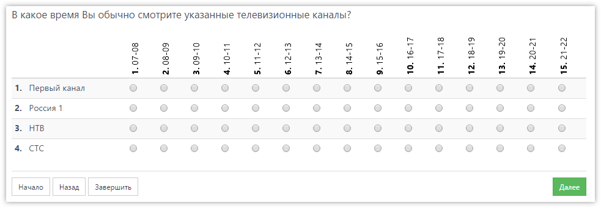

# Вертикальный текст в заголовке колонок табличных вопросов

Бывают случаи, когда в табличном вопросе (единственный или множественный выбор) много вариантов ответов (колонок), и текст в заголовках отображается не очень красиво, переносится по словам, или вообще не влезает.

Решить проблему можно развернув текст вертикально. Для этого достаточно включить в свойствах вопроса флаг _Вертикальный текст в заголовках колонок табличного вопроса_.

В результате получим примерно такой вид вопроса:

Можно ещё немного улучшить вид и отключить у колонок показ кодов, установив у каждого варианта ответа флаг _Не отображать код варианта ответа_. Получится так:

