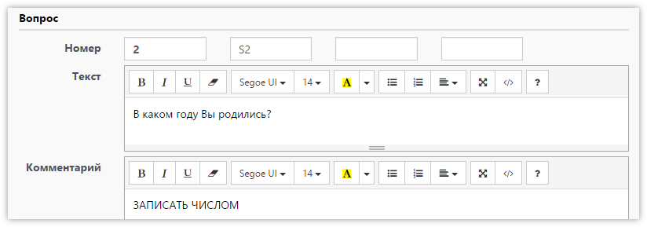
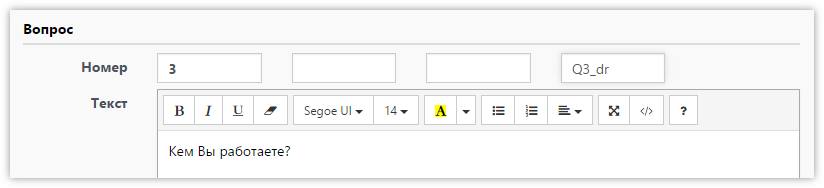
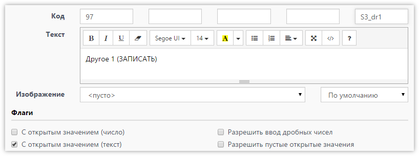

# Правила формирования имен переменных (колонок) в итоговом массиве

Достаточно часто встречаются случаи, когда стандартные имена переменных в выгруженном массиве - не устраивают, по одним или другим причинам. Например, заказчик исследования хочет от Вас получить массив совпадающий его макетом. **SURVEY**STUDIO позволяет использовать как стандартные правила формирования имен переменных, так и указывать свои имена. Давайте попробуем разобраться, откуда берутся в массиве имена `Q2`, `Q3_34`, `Q3_98T` и т.д. и как это изменить.

Для начала давайте определимся, какими могут быть имена переменных, чтобы избежать ошибок при выгрузке массива.

- Имя каждой переменной должно быть уникальным; дублирование недопустимо. Регистр значения не имеет: _VarName_, _varname_, _VARNAME_ – одно и то же имя.
- Имя может содержать как английские, так и русские буквы, цифры и символы `_.@#$` Символ «минус» (-) автоматически заменяется подчёркиванием. Пробелы недопустимы.
- Максимальная длина имени – 64 байта (64 английские буквы или 32 русские).
- Переменная должна начинаться с буквы и не должна заканчиваться точкой (.)
- В качестве имени нельзя использовать зарезервированные SPSS слова (_ALL, AND, BY, EQ, GE, GT, LE, LT, NE, NOT, OR, TO, WITH_), а также стандартные имена переменных **SURVEY**STUDIO, которые можно посмотреть [здесь](../help/3004.md#_3).

Принцип формирования имен переменных в массиве зависит от типа вопроса. Например, если вопрос просто числовой или текстовый, то в массиве, для хранения ответа на него, достаточно всего одной переменной, и имя ей можно задать любое. Предположим, есть у нас вопрос:

> Q2: В каком году Вы родились? (ЗАПИСАТЬ ЧИСЛОМ)

По умолчанию в массиве будет переменная с именем `Q2`. Но если мы хотим, чтобы переменная называлась `S2`, то просто указываем это имя в текстовом поле, сразу за номером вопроса:

Точно также можно заменить имя переменной в массиве для вопроса с единственным выбором, т.к. он тоже для хранения ответа использует только одну переменную. Однако в вопросе с выбором есть возможность использовать открытые значения для вариантов ответа, которые также попадают в массив в переменные со своими именами, по одной на каждое открытое значение. Для примера возьмем вопрос:

> Q3: Кем Вы работаете? (ОДИН ОТВЕТ)
>
> 1 - Учителем 
> 2 -  Дворником 
> 3 -  Программистом 
> 98 -  Другое (ЗАПИСАТЬ) 
> 99 - Затрудняюсь ответить

В этом вопросе у нас в массиве по умолчанию получится одна переменная для самого вопроса, с именем `Q3`, а также ещё одна переменная для открытого текстового значения, с именем `Q3_98T`. Имя этой переменной уже содержит не только номер вопроса, но ещё и код варианта ответа, т.к. вполне возможно что открытые значения будут не только у одного варианта ответа, и каждое значение должно попасть в свою переменную с уникальным именем. Имена переменных для открытых значений можно указать в следующих двух текстовых полях (первое для числового открытого значения, а второе для текстового):

В этом примере мы указали имя `Q3_dr`, и это вполне допустимо, т.к. открытое значение у нас одно. Однако, если их несколько, такой подход уже не годится, т.к. для всех открытых значений будет использоваться одно и тоже имя переменной и мы получим ошибку при попытке выгрузить массив.

Для решения этой проблемы можно использовать подстановки (макросы) при указании имени переменной. Вот список всех допустимых подстановок:

- _{0}_ - заменяется на номер вопроса;
- _{1}_ - заменяется на код варианта ответа (для вопросов с выбором);
- _{2}_ - заменяется на код строки (для табличных вопросов);
- _{3}_ - заменяется на код варианта ответа, для которого задается этот вопрос (при использовании циклов по какому-то другому вопросу).

И так, допустим у нас в `Q3` несколько открытых значений, и стандартные имена переменных в массиве получаются `Q3_97T` и `Q3_98T`, а мы хотим `Q3_97_dr` и `Q3_98_dr`. Чтобы такое получить, надо в поле для имени переменной для открытого текстового значения указать простой шаблон с подстановкой `Q3_{1}_dr`, т.е. при выгрузке {1} заменится на код 97 и 98 и мы получим нужные имена переменных. Можно написать более универсальный шаблон, не указывая номер вопроса, т.е. `Q{0}_{1}_dr`, чтобы если мы скопируем этот вопрос, или изменим его номер - нам не пришлось бы менять ещё и шаблоны имен переменных.

Раз мы теперь знаем, как написать не просто имя переменной, а шаблон имени (с использованием подстановок), можем перейти к вопросам с множественным выбором и таблицам. В отличии от вопроса с единственным выбором - множественный выбор использует в массиве по одной переменной для каждого варианта ответа. Например у нас вопрос:

> Q4: Где Вы используете Интернет? (ЛЮБОЕ ЧИСЛО ОТВЕТОВ)
>
> 1 - Дома 
> 2 - На работе 
> 3 - В дороге 
> 98 - Другое (ЗАПИСАТЬ) 
> 99 - Не помню

При выгрузке этого вопроса мы получим в массиве 6 переменных: `Q4_1`, `Q4_2`, `Q4_3`, `Q4_98`, `Q4_99`, в которых будет указано, выбран ли соответствующий вариант ответа или нет, а также `Q4_98T` для открытого значения для кода 98. Если такие имена нас не устраивают, можно их заменить. И тут уже без шаблонов не обойтись. Предположим хотим назвать переменные `FX_1`, `FX_2` и т.д., и `FX_dr` для открытого значения. Просто указываем шаблон `FX_{1}` для переменных самого вопроса (первое поле после номера вопроса), и `FX_dr` для открытого текстового значения.

Если вопрос табличный, то у него есть ещё строки, а в каждой строке есть варианты ответа. Тут понадобится подстановка {2}, которая заменится на код строки, а далее (если таблица с множественным выбором) необходимо добавить уже известную подстановку {1}. Например для таблицы с множественным выбором стандартный шаблон (используемый если ничего не указать) будет выглядеть так: `Q{0}_{2}_{1}`, т.е. получим переменные `Q5_1_1`, `Q5_1_2` и т.д.

Понимаю, что не так просто всё это сразу понять и начать применять. Так что чтобы совсем запутать - добавлю, что шаблоны (или просто имена) переменных можно указывать не только в самом вопросе, а и в вариантах ответа, где также есть 3 текстовых поля после кода варианта ответа. Они аналогичны тем, что есть в вопросе, но задают имя или шаблон для одного конкретного варианта ответа. Используют их редко. Например, как указано выше, если в вопросе есть два варианта ответа с открытыми значениями и нам нужны переменные не `Q3_97_dr` и `Q3_98_dr`, а например `S3_dr1` и `S3_dr2`, то для самого вопроса мы можем указать имя S3 (или шаблон `S3_{1}` для множественного выбора), а такие имена переменных для открытых текстовых значений надо указать уже непосредственно в самих вариантах ответа, 97 и 98. Примерно так:

Внимательный читатель заметит, что у варианта ответа после кода не три поля для имен переменных, а четыре. Первое поле после кода служит для указания псевдонима для самого кода варианта ответа. Т.е. когда нам надо, чтобы в именах переменных использовался не код, а что-то другое, например буквы A, B, C и т.д. Не будем вас запутывать ещё и этим, т.к. за всю историю **SURVEY**STUDIO была, наверное, только пара проектов, где это требовалось.
