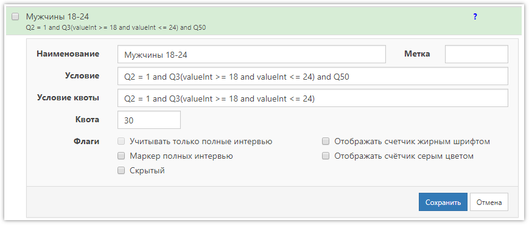

# Счётчики, квоты и полные интервью

Используемая в **SURVEY**STUDIO система подсчёта интервью и учёта квот не совсем понятна нашим пользователям. А самое главное - есть лёгкое непонимание что такое «Полное интервью», которое очень важно, так как именно эти интервью обычно интересуют заказчика исследования, и, следовательно, только они должны учитываться в квотах.

Давайте разбираться.

Для начала определимся, что интервью - это записанные в базу ответы респондента на заданные вопросы. Респондент может не подойти по условиям скринера или он уже не интересует нас, так как квота по полу/возрасту заполнена, или просто звонок мог оборваться, и довести интервью до конца не удалось - все подобные интервью не могут считаться полными, так как в них нет ответов на все интересующие нас вопросы. Следовательно, нам надо понять - какое интервью будем считать полным? Скорее всего, это то интервью, в котором пройдены все контрольные вопросы и есть ответ на последний вопрос в анкете.

Таким образом получаем, что **полное интервью** - это когда есть ответ на последний, значимый для нас, вопрос анкеты.

Допустим, последний вопрос у нас Q50, не важно какого он типа (лишь бы не *Информационный*, потому что в нём не может быть никакого ответа), и если есть любой ответ на него - это **полное интервью**.

Теперь посмотрим на свойства [счётчика](../help/3003.md) в проекте:


Основные поля в свойствах счётчика, которые необходимо заполнить - это *Наименование* и *Условие*. С наименованием всё понятно - указывается что угодно, чтобы понять что именно считает этот счётчик. А вот *Условие* как раз и задаёт, какие интервью будем этим счётчиком считать. В приведённом примере нас интересуют мужчины (вопрос Q2, единственный выбор с ответами 1 и 2) в возрасте 18-24 года (вопрос Q3, числовой), и при этом нам нужны только полные интервью, то есть в условие добавлена проверка на наличие любого ответа на вопрос Q50. В таком виде счётчик будет прекрасно работать, и мы будем видеть, сколько таких интервью уже сохранено в проекте. Подробнее о синтаксисе выражений можно почитать [здесь](../help/1006.md).

**ВАЖНО!** Флаг *Маркер полных* интервью не имеет НИКАКОГО отношения к подсчёту интервью, определению полное оно или нет и так далее. Этот флаг может быть установлен только у одного счётчика, который будет по умолчанию использоваться в отчёте статистики «Операторы / Интервью» телефонного опроса. Обычно его ставят у счётчика, считающего все полные интервью в проекте, то есть в нашем примере у такого счётчика было бы условие `Q50` - просто наличие ответа на последний вопрос анкеты. В отчёте мы увидим статистику, сколько каждый оператор сделал полных интервью.

Теперь, допустим, нам надо не просто считать мужчин 18-24, а ещё и ограничить количество таких интервью, то есть ввести на них квоту. Для этого немного доделаем наш счётчик и допишем в поле *Условие квоты* то же самое условие, только без проверки на полное интервью. Смысл двух условий следующий: основное условие считает интервью, сохранённые в базу данных, а условие квоты - проверяется во время заполнения анкеты, то есть ещё до сохранения в базу. Можно оставить только одно основное условие, но тогда квота будет срабатывать только в тот момент, когда будут ответы на все вопросы, указанные в этом условии, то есть в нашем случае - только после ответа на последний вопрос Q50. Это пустая трата рабочего времени оператора, так как раз нам респондент не подходит уже - надо как можно быстрее закончить это интервью и искать следующего. Именно для этого существует второе условие, чтобы как только по нему мы поняли, что респондент не подходит - сразу завершить интервью. Также необходимо указать в поле *Квота* число необходимых интервью:



В итоге, система будет обрабатывать этот счётчик следующим образом: если уже есть ответы на вопросы Q2 и Q3 (потому что они необходимы для проверки условия для квоты), сначала будет произведён подсчёт уже сохранённых интервью в базе (используя основное условие), после чего будет проверено, подходит ли заполняемое в данный момент интервью под условие квоты, и если подходит, а также уже сохранено в базе 30 подходящих интервью - ввод будет завершён, и в базу это интервью не попадёт ([можно сделать](../faq.md#Q5), чтобы сохранялось, но по умолчанию - сохранено не будет).

Может возникнуть вопрос: что делать, если в анкете сложная логика и «последних» вопросов для подсчёта полных интервью может быть несколько? В этом случае можно, конечно, в условиях счётчиков прописать все возможные последние вопросы. Но можно поступить проще. Нужно добавить в конец анкеты дополнительный, технический вопрос, в котором проставлять ответ скриптом перед показом, и именно этот вопрос использовать в условиях счётчиков. В этом случае важно, чтобы логика предпоследних вопросов позволила дойти до этого вопроса. То есть не должно быть принудительного завершения в конце интервью.

Например, добавляем последним вопросом Q999 с текстом «Автоответ. Полное интервью.» Тип вопроса *Числовой*. После сохранения добавляем в него скрипт перед показом для автоматического проставления ответа:

```js
Q.openValueNum = 1;
return answered;
```

Теперь в условиях счётчиков для проверки на полное интервью нужно указывать `Q999`.

Квоты и счётчики никак не влияют на сохранённые данные, так что их можно добавлять, удалять, изменять как угодно во время сбора данных в проект. При изменении условий - счётчики будут пересчитаны автоматически.
