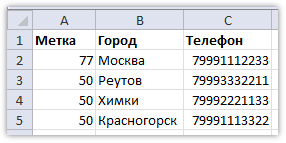
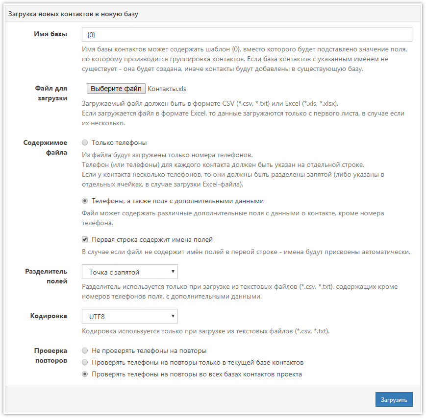
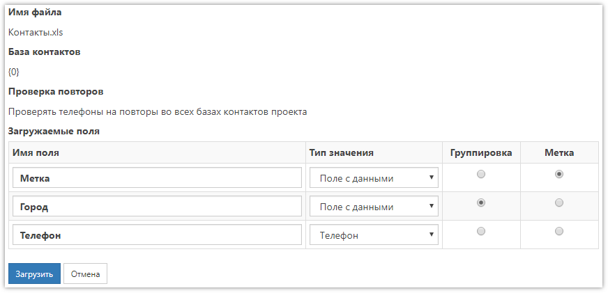
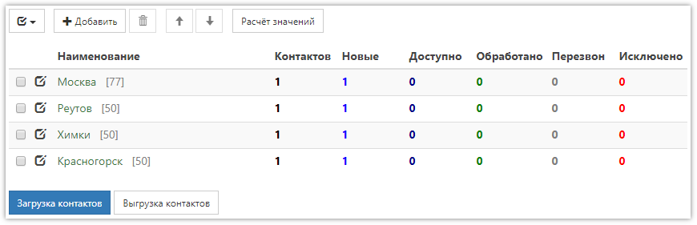

# Автоматическая группировка баз контактов

Загружаемый в **SURVEY**STUDIO файл с контактами можно автоматически разбивать на отдельные базы контактов с присвоением им определённых меток, таким образом группируя контакты. Всё это делается несколькими кликами мышкой; главное - подготовить файл для загрузки.

Допустим, необходимо загрузить контакты с разбивкой по городу, то есть так, чтобы в каждой базе контактов находились телефоны только одного города. Помимо этого, в свойствах каждой базы должна быть указана метка - код региона, к которому этот город относится.

Теперь нужно подготовить файл, содержащий номера телефонов, города и необходимые метки. Для примера возьмём 4 телефона:

Далее нужно перейти в раздел проекта «Базы контактов» и под списком баз нажать синюю кнопку `Загрузка контактов`. В поле «Имя базы» формы загрузки контактов необходимо использовать шаблон `{0}`. Вместо него будет подставляться значение из выбранного на следующем шаге поля. Также здесь важно выбрать пункт *Телефоны, а также поля с дополнительными данными*. Остальные настройки не имеют значения для группировки. Размер загружаемого файла не должен превышать 24 Мб.

После нажатия кнопки `Загрузить` потребуется указать типы значений полей. Для поля «Телефон» ставим тип «Телефон», для остальных полей - «Поле с данными». Если какие-то поля загружать не нужно, им можно поставить тип «Пропустить». При необходимости названия полей можно изменить.

Теперь самое главное - в столбце «Группировка» напротив поля «Город» ставим точку. По этому полю загружаемый файл будет разбиваться, а вместо шаблона `{0}` в названии базы из него будут подставлены значения.

Если в свойствах создаваемых баз нужны метки, то в столбце «Метка» напротив одноимённого поля также нужно поставить точку.

После нажатия кнопки `Загрузить` получим такой результат:

Каждая база контактов носит название города из колонки «Город», содержит соответствующий номер телефона, а в качестве метки указан код региона.
