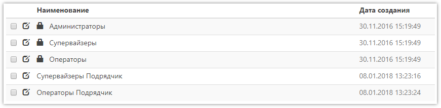
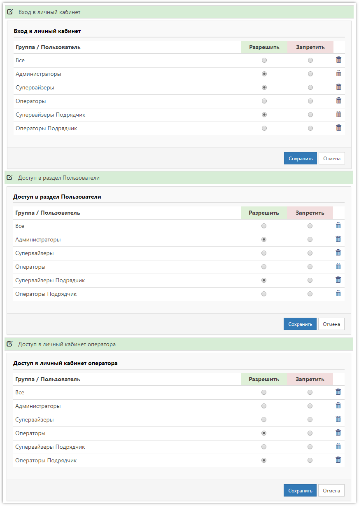
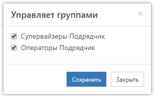
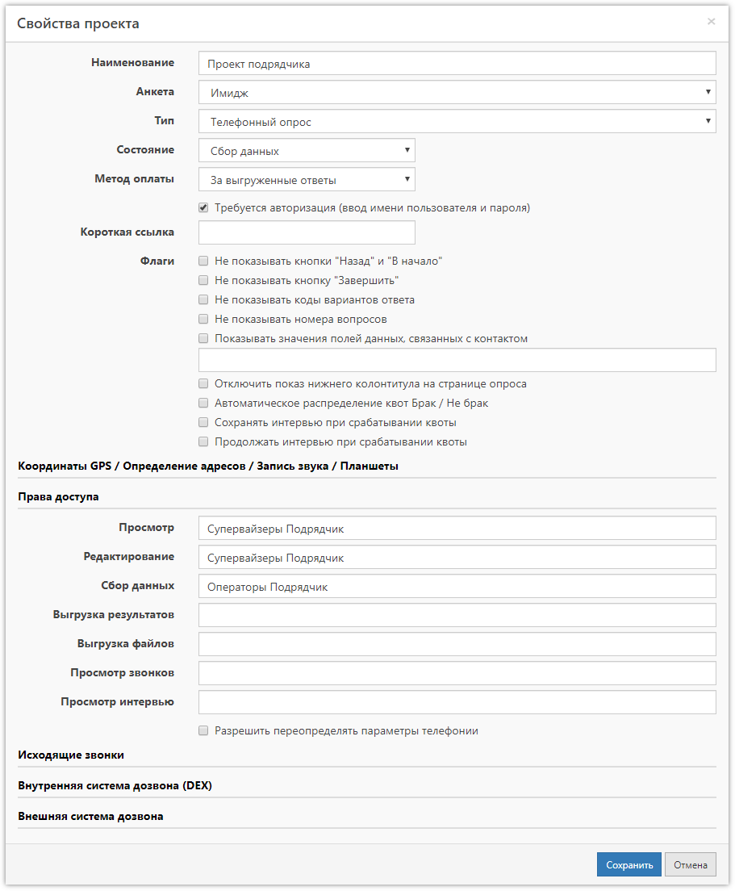

# Делегирование прав подрядчику

Сбор данных в проект можно выполнять силами подрядчика. Чтобы свести к минимуму собственные трудозатраты, подрядчику можно дать практически любые права на свой личный кабинет, однако, обычно требуется предоставить доступ к одному проекту и дать возможность создавать пользователей-операторов. Давайте посмотрим на примерах как это всё можно сделать.

Допустим, подрядчику «Подрядчик» необходимо дать возможность просматривать статистику своего проекта, управлять счётчиками, загружать базы контактов и вносить изменения в свойства проекта. Кроме этого, подрядчик должен самостоятельно создавать пользователей для своих операторов, не имея доступа к другим пользователям личного кабинета.

Для начала необходимо создать новые [группы пользователей]({{ variables.ss_url }}/client/usergroups): «Супервайзеры Подрядчик» и «Операторы Подрядчик»:

В первую группу будут входить пользователи, имеющие права на редактирование проекта и создание новых пользователей, а во вторую - опрашивающие респондентов - операторы. Теперь необходимо предоставить этим группам соответствующие [права доступа]({{ variables.ss_url }}/client/accessrights), группе «Супервайзеры Подрядчик»:

- Вход в личный кабинет
- Доступ в раздел Пользователи

А группе «Операторы Подрядчик»:

- Доступ в личный кабинет оператора.

Группе операторов доступ в личный кабинет оператора разрешать не обязательно. В этом случае, пользователи не смогут увидеть список доступных для них проектов, а также не смогут заполнить тестовую анкету без прямой ссылки на неё.

Далее нужно создать [пользователя]({{ variables.ss_url }}/client/users), который будет супервайзером. Он должен входить только в обе наши группы. Нажав кнопку `Управляет группами`, необходимо выбрать, как минимум, группу «Операторы Подрядчик» - только её пользователей супервайзер сможет просматривать и редактировать. Если здесь выбрать группу супервайзеров - он сможет добавлять пользователей в свою же группу, то есть создавать дополнительных пользователей-супервайзеров.

Логин и пароль пользователя-супервайзера теперь можно передать подрядчику. Но осталось ещё предоставить созданным группам доступ к проекту, потому что пока у них нет доступа ни к одному проекту. Для этого нужно открыть свойства делегируемого проекта и указать названия групп в полях блока «Права доступа»:

Теперь пользователь-супервайзер может просматривать, редактировать и создавать для себя пользователей-операторов, не имея доступа к другим пользователям личного кабинета, а также может просматривать статистику своего проекта, управлять в нём счётчиками, загружать базы контактов и вносить изменения в свойства проекта. Пользователи-операторы могут видеть в личном кабинете оператора (если у группы есть право доступа в него) только свой проект и проводить в нём интервью. Так как супервайзер входит в группу операторов, он тоже может проводить интервью.

Если супервайзерам нужно разрешить выгрузку массива, то в поле *Выгрузка результатов* необходимо также указать название соответствующей группы. При необходимости пользователям можно предоставить любые другие права, доступные в системе.

**Важный момент.** Предоставление права *Редактирование групп пользователей и прав доступа* даёт пользователям возможность повысить себе права до уровня администратора и получить таким образом полный доступ к личному кабинету.
