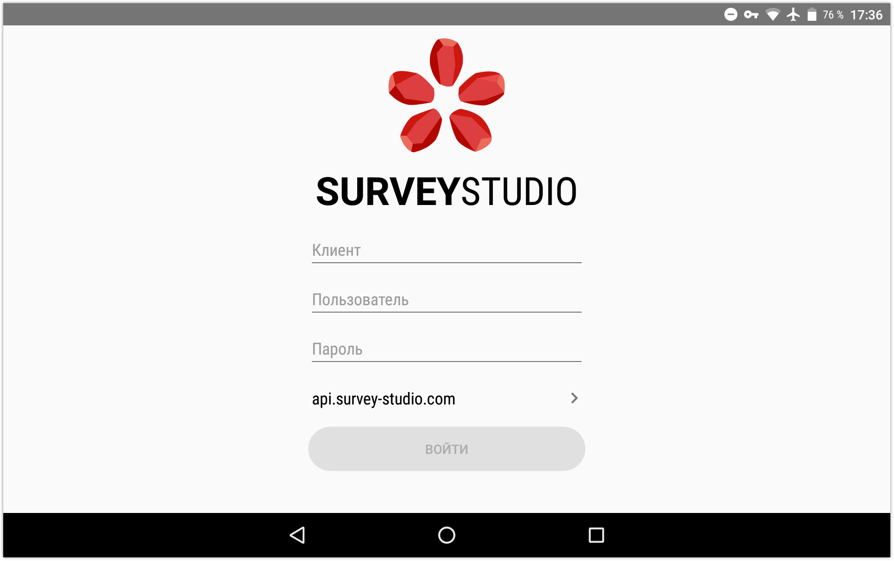
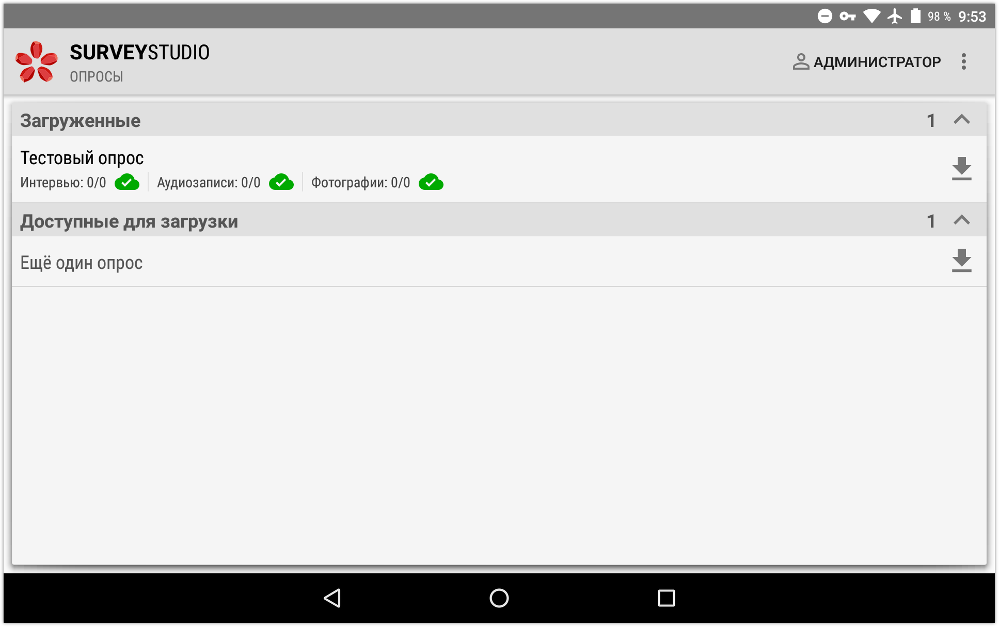
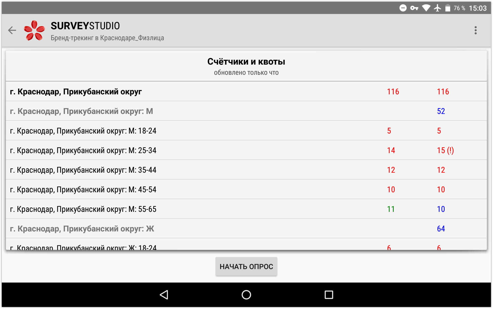
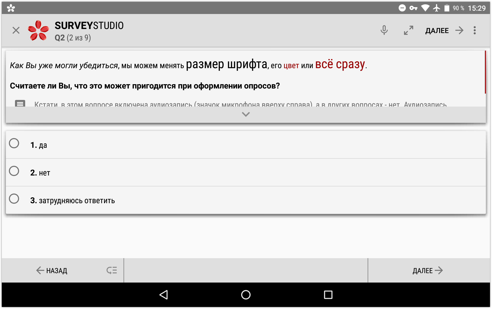
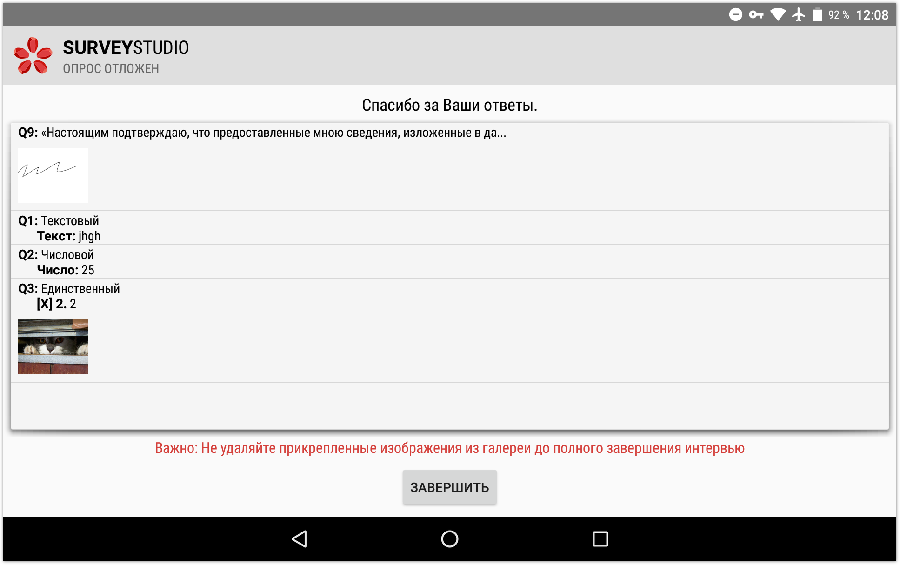
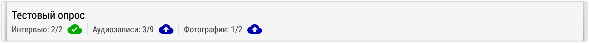
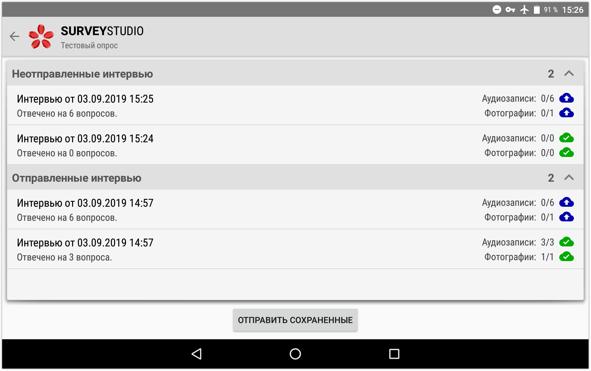

# Использование приложения на планшете

Многие наши клиенты уже освоили [планшетные опросы](1007.md) и регулярно проводят их, привлекая подрядчиков в регионах или новых интервьюеров своих компаний, но не всегда достаточно времени, чтобы подробно всем объяснять, как пользоваться системой. Данная статья предназначена для исполнителей, которые смогут самостоятельно разобраться с приложением и найти ответы на возникающие вопросы.

## Минимальные требования и начало работы

Перед выходом в поле необходимо убедиться, что устройство, на котором вы будете работать, соответствует следующим требованиям:

- версия Андроид 4.1 или новее,
- размер экрана 7 дюймов и более,
- оперативная память 2 Гб и более,
- часовой пояс, дата и время соответствуют местности проведения опроса.

Вы можете попробовать использовать приложение на устройстве, которое не соответствует этим требованиям, однако возможны проблемы: от невозможности работать до отсутствия аудиозаписей.

**ВАЖНО!** В продаже были неудачные модели планшетов с неисправленными их производителем ошибками, приводящими к отсутствию записей. Нам известно о двух таких моделях: Asus ZenPad C 7.0 (Z170CG) и Asus ZenPad 10 (Z300C). Также разговор может не записываться, если вместе с приложением **SURVEY**STUDIO одновременно запущено какое-либо другое приложение, использующее микрофон. Поэтому если вы впервые работаете на новом устройстве, рекомендуем после нескольких полных интервью убедиться, что все данные отправляются на сервер, и менеджер проекта их видит.

Если у вас нет подходящего устройства, например имеется только iPhone, есть возможность проводить опрос в браузере при постоянном доступе в интернет и без некоторых функций, например без аудиозаписи или откладывания интервью. Ссылку на анкету можно получить у руководителя проекта.

Для проведения опроса в приложении **SURVEY**STUDIO постоянный доступ в интернет не требуется. После загрузки опроса и обновления счётчиков его можно отключить. Интернет необходим для:

- входа в приложение и скачивания или обновления опроса,
- отображения карты с вашим текущим местоположением и определения адреса (если включено в проекте). Ранее загруженная область карты доступна без интернета,
- отправки собранных данных (интервью, записи, фотографии, подписи респондентов),
- получения с сервера текущих значений счётчиков,
- отправки сообщения об ошибке.

Если приложение ещё не установлено – необходимо это сделать. Откройте Play Маркет, в строке поиска введите *SurveyStudio*, нажмите на найденное приложение с красным значком, а затем кнопку `Установить`. Найти приложение также можно, перейдя [по этой ссылке](https://play.google.com/store/apps/details?id=ru.siisltd.surveystudio).

## Вход и загрузка опроса

Откройте установленное приложение и заполните поля *Клиент, Пользователь, Пароль* данными, полученными от руководителя. Если вам не дали адрес сервера – оставьте его по умолчанию: *api.survey-studio.com*. При необходимости можно изменить сервер, нажав на него. При первом входе приложение может запросить некоторые разрешения. Нужно дать их все, иначе оно работать не будет.

Если при запуске приложения вы увидели что-то другое, а не экран входа, то либо ваш руководитель уже вошёл в приложение, и тогда в верхнем правом углу экрана со списком опросов должно отображаться ваше имя пользователя, либо кто-то из ваших коллег не вышел после [завершения работы](#_6) – сделайте это, чтобы ваши интервью не засчитались другому интервьюеру.

После входа вы попадёте на экран со списком разрешённых вам опросов. Нажмите на доступный для загрузки опрос, чтобы скачать его. Нажав и удерживая палец на загруженном опросе, можно открыть его контекстное меню, с помощью которого опрос удаляется.

Обновить список опросов, чтобы, например, проверить загруженные опросы на изменения, можно, проведя по экрану пальцем сверху вниз, или через меню (в верхнем правом углу три точки). Если у загруженного опроса справа есть стрелка вниз, как у доступных опросов, значит он был изменён менеджером и его нужно загрузить повторно, просто нажав на него.

## Проведение интервью

При нажатии на загруженный опрос открывается его экран. Здесь отображаются квоты, которые требуется соблюсти. Также в списке могут быть счётчики - информация о том, сколько интервью той или иной категории сохранено. Во второй колонке указано количество интервью, которые нужно провести, в третьей – сколько уже проведено. Если числа красного цвета – квота закрыта, если ещё есть восклицательный знак – сохранено больше, чем нужно. Такое бывает, например, когда планшет не подключён к интернету, то есть у приложения нет возможности узнать, что кто-то из интервьюеров уже закрыл квоту, и интервью можно продолжать проводить, хотя уже не надо. Или когда несколько интервьюеров начинают заполнять последнюю для квоты анкету, и все они доходят до последнего вопроса.

Кнопка запуска анкеты находится внизу по центру. Чтобы ознакомиться с анкетой без сохранения ответов, нажмите три точки в правом верхнем углу и выберите пункт *Начать тестовый опрос*. Рекомендуем перед началом работы на проекте всегда заполнять тестовую анкету полностью хотя бы один раз. Это поможет сэкономить вам время, если вдруг в анкете есть ошибка, которую никто ещё не заметил, но из-за неё невозможно работать.

В анкете всё достаточно просто. В левом верхнем углу находится кнопка завершения интервью, она же может выполнять функцию откладывания интервью для продолжения в другое время, если эта функция включена в проекте руководителем. Справа от логотипа, внизу, отображается код текущего вопроса, его порядковый номер и общее количество вопросов анкеты (эта информация может быть скрыта менеджером). В правом верхнем углу всегда есть кнопки для перехода к следующему вопросу (`Далее`) и вызова контекстного меню анкеты (три точки), с помощью которого можно поменять размер текста. Если доступно - может быть кнопка переключения вопроса в режим просмотра респондентом (стрелки по диагонали) - без текста вопроса, комментария интервьюеру и, возможно, без некоторых вариантов ответа, строк таблицы или колонок. Также здесь может отображаться иконка микрофона, информирующая об осуществлении аудиозаписи.

Если не запрещено в проекте - в левом нижнем есть кнопки для перехода к предыдущим вопросам анкеты: кнопка `Назад` позволяет вернуться на один вопрос, а кнопка, расположенная чуть правее неё, открывает меню, где выбирается любой из ранее отвеченных вопросов. В правом нижнем углу всегда доступна кнопка `Далее`. В зависимости от требований к опросу, на нижней панели также могут быть кнопки для прикрепления фотографий и подписи респондента.

Когда текст вопроса, список ответов или таблица не помещаются на экране, их можно прокручивать пальцем в нужную сторону. Также есть возможность поворачивать планшет для комфортного заполнения вопроса, если режим отображения не зафиксирован принудительно настройками проекта. Картинку, содержащуюся в вопросе или ответе, можно увеличить на весь экран, нажав на неё.

После завершения каждого интервью под прощальным текстом можно посмотреть сохранённые ответы, а ещё ниже может отображаться важная информация, на которую стоит обратить внимание.

## Отправка данных

Все собранные данные автоматически отправляются на сервер, если доступ в интернет есть. Если нет – они начнут выгружаться, когда он появится. Отслеживать текущее состояние данных можно на экране со списком опросов. Зелёное облако означает, что всё отправлено, синее – в процессе отправки. В примере ниже отправлены все интервью, 3 из 9-ти аудиозаписей и 1 из 2-х фотографий:

**Важный момент.** Количество отправленных интервью – это все интервью, которые вы начинали, а не только полные – в которых есть ответ на последний вопрос анкеты. И если, например, ваш менеджер говорит, что вы заполнили 5 анкет, а вы видите, что отправлено 10, то, скорее всего, это означает, что в этих 10 есть только 5 полных.

Посмотреть состояние каждого интервью и ответы в них можно, выбрав пункт *Завершённые интервью* в меню экрана опроса. Также здесь есть кнопка `Отправить сохранённые` на случай, если автоматическая отправка по каким-то причинам не началась. Удерживая палец на отправленном интервью, можно вызвать его контекстное меню с пунктом *Переместить в неотправленные* – для повторной отправки на сервер, если в этом появится необходимость (пока был один такой случай). Отправленные данные хранятся на планшете 7 дней, а потом могут быть автоматически удалены для освобождения памяти.

## Завершение работы

После завершения работы на проекте ваша задача – убедиться, что все собранные данные отправлены на сервер. Это можно сделать как визуально, по иконкам с облаками, так и с помощью встроенной в приложение функции: в меню экрана со списком опросов выберите пункт *Выйти*. Если есть неотправленная информация, то вы увидите окно с пояснением, в каком именно опросе и что не отправлено.

Если собранные данные **для вас важны** – отправьте их. Когда сбор данных в проект будет закрыт менеджером, ваша информация не отправится. Кроме того, были случаи удаления неотправленных анкет интервьюерами, которые использовали планшеты своих коллег.

## Настройки приложения

Через меню экрана со списком опросов можно открыть настройки приложения. Здесь доступны такие параметры:

- *Язык* 
Выбор языка интерфейса.
- *Размер текста* 
Изменение размера шрифта: текст можно сделать крупнее или мельче. Размер также можно менять прямо в анкете, через её контекстное меню.
- *Разрешить выход с потерей данных* 
Отключает запрет на выход из приложения без отправки данных. Восстановление будет невозможно.
- *Защита интервью* 
Здесь можно синхронизировать время, если это не произошло по каким-то причинам автоматически.
- *Отправлять прикреплённые файлы только через WiFi* 
Запрещает отправку файлов через мобильную сеть. Интервью всегда отправляются через любую доступную сеть.

## Удаление приложения

Перед удалением приложения важно убедиться, что все собранные данные отправлены на сервер. Восстановление будет невозможно.

Приложение с правом администратора устройства удалить нельзя, поэтому сначала нужно это право отключить. Это можно сделать в настройках планшета. Наиболее простой способ удаления такой:

1. Перетащить приложение в корзину и согласиться с удалением.
2. Планшет предложит открыть настройки администрирования – откройте.
3. Нажмите на приложение, а затем кнопку `Отключить`.
4. Ещё раз перетащить приложение в корзину и согласиться с удалением.

Данный процесс показан на видео (на разных версия Андроид может выглядеть по-разному):

<video src="/articles/images/1012_vid_001.mp4" style="max-width: 100%;" controls="controls"></video>

## Возможные проблемы и их устранение

### При входе в приложение появляется сообщение об ошибке.

Проверьте, что заполнены все три поля (*Клиент, Пользователь, Пароль*) и верными данными, а также адрес сервера *api.survey-studio.com*, если вам не давали другой. Убедитесь, что доступ в интернет с планшета есть (открывается какой-нибудь сайт в браузере).

### Опрос не загружается на планшет, появляется сообщение о том, что нужно попробовать позже. Как скачать?

Попробуйте скачать опрос через 5-10 минут. Также проверьте, есть ли с планшета доступ в интернет (открывается какой-нибудь сайт в браузере). Попробуйте перезагрузить планшет.

### При запуске анкеты или во время её заполнения появляются сообщения об ошибках в скриптах или действиях. Что делать?

Убедитесь, что у вас установлена последняя версия приложения: откройте Play Маркет, найдите приложение, и если на его странице есть кнопка `Обновить` – обновите. Если ошибка в анкете осталась – сообщите о ней руководителю проекта для исправления разработчиком анкеты.

### После нажатия кнопки `Начать опрос` анкета иногда открывается долгое время. Почему это происходит?

При запуске анкеты обновляются счётчики. Если интернет-соединение нестабильное или с низкой скоростью, этот процесс может занимать до 40 секунд. Попробуйте подключиться к другой сети или отключиться от интернета полностью и подключаться периодически для отправки данных и обновления счётчиков.

### После нажатия `Начать опрос` открывается серый экран с кнопкой `Отмена`, анкета не начинается. Что делать?

Вероятно, в настройках проекта менеджер включил требование определения GPS-координат перед началом интервью, а планшет не может их получить. Координаты определяются по:

- GPS/ГЛОНАСС, если планшет улавливает сигналы со спутников,
- Wi-Fi, мобильной сети, IP-адресу, если есть доступ в интернет.

То есть если на планшете выключен модуль GPS или вы находитесь в помещении и без интернета, то планшет никак не сможет определить текущее местоположение. Если вы не можете добиться определения координат, рекомендуем обсудить эту ситуацию с руководителем проекта. Возможно, требование координат можно отключить в проекте.

### Менеджер утверждает, что у меня сделано X интервью, хотя вижу, что отправлено Y. Где остальные?

Приложение отправляет на сервер все интервью, даже если анкету открыли и сразу закрыли. Счётчики проекта обычно считают только полные интервью – в которых есть ответ на последний вопрос анкеты. Можно попросить менеджера посмотреть статистику *Операторы / Интервью* по счётчику полных интервью. Скорее всего, там будет видно, что всего интервью – Y, а полных – X.

### После завершения интервью появляется сообщение, что ответы будут удалены. Что делать?

Если во второй строке сообщения написано *«Обработка была остановлена на вопросе QXX из-за отсутствия ответа или ошибки»* – необходимо сообщить об этом руководителю проекта для исправления ошибки логики. На всякий случай, лучше сделать скриншот экрана с этим сообщением.

Если вторая строка начинается словами *«Обработка завершилась корректно...»* – скорее всего, это связано с тем, что во время заполнения анкеты вы возвращались к предыдущим вопросам и меняли в них ответы. Это привело к переходу к другим вопросам анкеты (сценарий опроса пошёл по другой ветке). В результате часть ответов оказалась лишней. Если это так, то можно нажать *Выполнить очистку и сохранить*. Если же вы не меняли ответы или это сообщение появляется слишком часто, то, как и в предыдущем абзаце, это может говорить об ошибке в логике анкеты.

В непонятной ситуации лучше нажимать кнопку *Сохранить без очистки* для сохранения интервью с максимально возможным количеством ответов. Также можно нажать *Перезапуск для проверки*, чтобы открыть анкету заново и проверить ответы.

### Периодически появляется сообщение о том, что пользователь не авторизован. Что это означает?

Приложение не может подключиться к серверу, так как указанный при входе логин или пароль не совпадает с текущим, либо пользователя заблокировали, переместив его в архив. Свяжитесь с менеджером для выяснения причин. Возможно, по ошибке вам изменили пароль, и тогда нужно изменить его обратно на тот, с которым вы входили в приложение.

### Собранные данные не отправляются долгое время. Почему?

Посмотрите, нет ли в верхнем правом углу экранов жёлтого треугольника. Если есть – нажмите, здесь указана причина и что именно не удаётся отправить. Скорее всего, проект закрыли для сбора данных.

Также данные могут не отправляться по причине, указанной выше – что-то не так с пользователем на сервере.

Ещё одной причиной может быть ошибка в прошивке вашего планшета. В некоторых версиях Андроид есть проблема, из-за которой некорректно работает DNS в приложениях. Попробуйте перезагрузить планшет, нажать `Отправить сохранённые` на экране завершённых интервью, и оставить его на полчаса подключённым к сети. Скорее всего, это поможет.

Бывает, на планшете интернет-соединение настолько нестабильно, что не отправляются даже интервью. В этом случае необходимо подключить планшет к другой сети.

### Почему аудиозапись короче общей длительности интервью, и на ней нет части разговора?

Если во время заполнения анкеты свернуть приложение, выключить экран или отложить интервью (если такая возможность включена в проекте), то аудиозапись приостанавливается и включается снова при продолжении опроса, а общая длительность интервью - это разница между временем его окончания и начала.

Также это может быть связано с низкой производительностью планшета. Проверьте, что его характеристики соответствуют [минимальным требованиям](#_2).

### Почему количество сохранённых и отправленных интервью уменьшилось?

Отправленные на сервер данные хранятся на планшете 7 дней, а затем могут быть автоматически удалены для освобождения памяти.

## Требуется помощь разработчиков приложения

Если вы обнаружили ошибку в приложении, у вас есть вопрос или предложение – об этом можно написать в форме обратной связи. Откройте экран со списком опросов на планшете, где возникла сложность. Вверху справа нажмите три точки и выберите пункт «О приложении». Затем нажмите внизу «Обратная связь», заполните форму и отправьте подготовленное письмо. Оно отправится после подключения к интернету, если в данный момент доступа в сеть нет.
