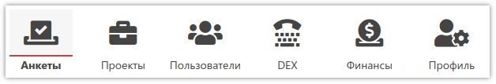
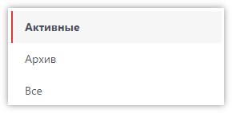
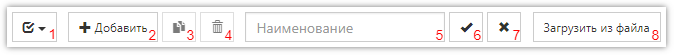
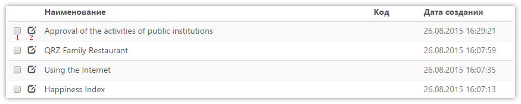
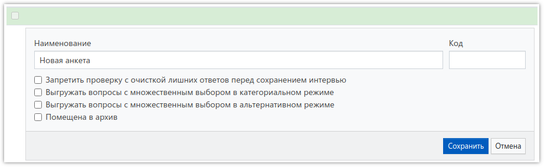
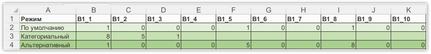

# Работа со списком анкет, добавление новой анкеты

## Список анкет

Для перехода к [списку анкет]({{ variables.ss_url }}/client/questionnaires), выберите соответствующий раздел в верхнем меню [Личного кабинета]({{ variables.ss_url }}/client):

Любая анкета, если она уже не используется, но удалять Вы её не хотите - может быть помещена в архив (см. ниже свойства анкеты). По умолчанию в списке не отображаются анкеты, помещенные в архив. Слева от списка находятся кнопки, позволяющие выбрать, показывать ли только активные анкеты, только помещенные в архив, или все вместе:

Список анкет представлен в виде таблицы, с возможностью выбора строк, добавления новых, удаления существующих, а также создания копий. Над таблицей расположены соответствующие кнопки:

1. Быстрое выделение всех анкет в списке, или снятие выделения.
2. Добавление новой анкеты.
3. Создание копии выделенной анкеты (или нескольких).
4. Удаление выделенных анкет.
5. Поле для ввода названия анкеты для поиска/фильтрации. Можно указать часть названия.
6. Кнопка для осуществления поиска/фильтрации по значениям, указанным в предыдущих полях.
7. Кнопка для отмены наложенных на список фильтров.
8. Загрузка анкеты из [файла](1007.md).

Сам список Ваших анкет выглядит следующим образом:

1. Выделение анкеты (или нескольких) для выполнения различных операций (копирование, удаление).
2. Открытие редактора свойств анкеты.

## Добавление новой анкеты

Для добавления новой анкеты (создание анкеты) необходимо нажать кнопку `Добавить` (над таблицей со списком анкет, или справа от заголовка раздела). Откроется редактор свойств новой анкеты (он же открывается при нажатии кнопки открытия свойств анкеты в строке таблицы со списком анкет, для изменения свойств уже существующей анкеты):

В редакторе свойств анкеты можно указать *Наименование анкеты*, а также, при необходимости, *Код*, если Вам удобнее идентифицировать анкеты по неким кодам Ваших проектов, принятым в Вашей организации.

Дополнительно можно включить необходимые флаги:

- *Запретить проверку с очисткой лишних ответов перед сохранением интервью* 
Включение этого флага отключит функцию нормализации ответов перед сохранением интервью. Процесс нормализации представляет собой повторный проход анкеты, без участия оператора, и оставляет ответы только на те вопросы, на которые, согласно логики ветвлений, был произведен переход. Появление лишних ответов возможно, если оператор возвращался на предыдущие вопросы анкеты и что-то менял в ответах, при этом, например, часть последующих ответов становятся не актуальными (допустим уже отвеченный вопрос не должен задаваться, согласно изменившимся ответам). Включать этот флаг можно только в том случае, если Вы понимаете что делаете и осознаёте, что в итоговом массиве могут появиться ответы, которых там быть не должно.

- *Выгружать вопросы с множественным выбором в категориальном режиме* 
Включает глобально для всех вопросов с множественным выбором (а также табличных вопросов с множественным выбором) категориальный режим выгрузки. По умолчанию вопросы с множественным выбором в итоговом массиве будут представлены в виде переменных, по одной на каждый вариант ответа, в которых будут записаны 1 или 0, в зависимости от того, выбран ли этот вариант ответа в вопросе, или нет. Если вопрос не задавался - значения переменных будут пустые. Категориальный режим меняет это поведение на следующее: каждая переменная в массиве (их количество будет равно максимальному возможному количеству ответов на вопрос) будет содержать код выбранного ответа, или будет пустой.

- *Выгружать вопросы с множественным выбором в альтернативном режиме* 
Альтернативный режим выгрузки отличается от основного (используемого по умолчанию, см. выше описание) тем, что если вариант ответа выбран, то в переменную в массиве будет записано не 1, а код этого варианта ответа. На скриншоте ниже показаны выбранные ответы 1,5,8 во всех режимах выгрузки:

- *Помещена в архив* 
Помечает анкету как архивную, т.е. она не будет отображаться в списке анкет по умолчанию.
