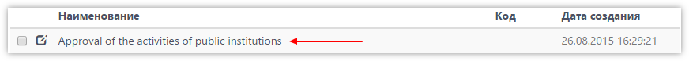
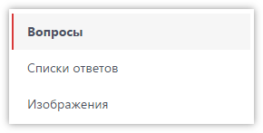
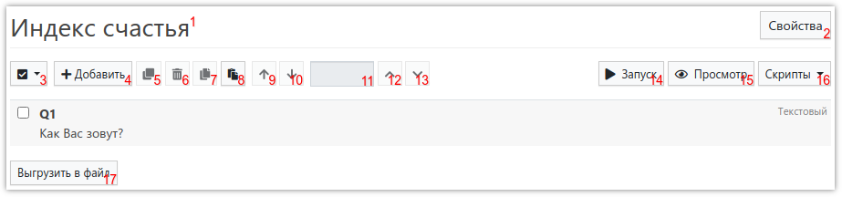
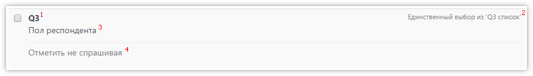

# Редактор вопросов анкеты

Редактор вопросов анкеты (дизайнер анкеты) - это, пожалуй, самый большой и сложный раздел [Личного кабинета]({{ variables.ss_url }}/client). Именно здесь производится программирование анкет, по которым в дальнейшем будет проводиться опрос респондентов.

Редактор вопросов состоит из трёх основных разделов, для переключения между которыми используется меню, слева:

- *Вопросы* 
В этом разделе производится вся работа с вопросами анкеты.

- *Списки ответов* 
Раздел для работы со списками вариантов ответов на вопросы. Обычно нет необходимости переходить в этот раздел, т.к. всю работу со списками вариантов ответов можно производить непосредственно при редактировании вопроса.

- *Изображения* 
Раздел используется для загрузки изображений, которые можно добавлять к тексту вопросов, а также к вариантам ответа.

В редакторе вопросов Вы в первую очередь увидите достаточно большое количество кнопок, а также саму таблицу со списком вопросов Вашей анкеты:

1. Наименование анкеты.
2. Редактирование свойств анкеты (наименование, флаги и прочее - то же самое, что можно изменить в [списке анкет](1001.md)).
3. Выделение всех вопросов в анкете либо наоборот - снятие отметки с выделенных вопросов.
4. Добавление нового вопроса (вопрос добавляется в конец анкеты).
5. Создание копий выделенных вопросов (созданные копии добавляются в конец анкеты).
6. Удаление выделенных вопросов.
7. Копирование выделенных вопросов в буфер обмена (на сервере).
8. Добавление вопросов из буфера обмена (может использоваться для копирования вопросов из одной анкеты в другую).
9. Перемещение выделенных вопросов вверх.
10. Перемещение выделенных вопросов вниз.
11. Поле для указания номера вопроса, перед которым (или после которого) необходимо переместить выделенные вопросы. Если ничего не указано - вопросы будут перемещены либо в самое начало анкеты, либо в самый конец.
12. Перемещение выделенных вопросов перед указанным в поле 11.
13. Перемещение выделенных вопросов после указанного в поле 11.
14. Кнопка для запуска анкеты в отладочном режиме, без сохранения ответов в базу данных. Открывшуюся ссылку можно использовать без авторизации в системе.
15. Просмотр анкеты в режиме печати.
16. Открытие редактора глобальных скриптов анкеты.
17. Выгружает анкету в [файл](1007.md), который можно передать другому клиенту. Пока что анкеты с картинками выгружаются без картинок. [Напишите нам]({{ variables.ss_url }}/client/support), если нужно скопировать анкету полностью.

Каждый вопрос, добавленный в анкету, отображается в списке следующим образом:

1. Номер вопроса.
2. Тип вопроса, а также, если вопрос подразумевает выбор вариантов ответа - наименование списка вариантов ответа.
3. Текст вопроса.
4. Комментарий к вопросу (может отсутствовать).
