# Свойства вопроса (редактирование вопроса) анкеты

При добавлении нового вопроса в анкету или при редактировании существующего необходимо указать различные параметры, влияющие как на тип вопроса, его внешний вид, а также логику обработки ответов на него, так и на представление полученных данных в итоговом массиве.

Самым главным в вопросе является его номер. Номер является положительным целым числом и должен быть уникальным для всей анкеты. Изменение номера вопроса допускается, но только до тех пор, пока не начат сбор данных в проект по этой анкете. Нумерация вопросов не обязательно должна быть по порядку, т.е. ничего не мешает создать вопросы с номерами Q45, Q3, Q8, Q1 и т.д. То, в каком порядке вопросы будут показаны при работе анкеты - задается именно расположением вопросов в анкете, а не их номером.

Редактор свойств вопроса содержит много полей, так что будем разбирать их последовательно.

## Вопрос

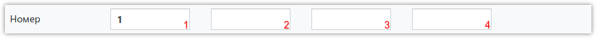

1. Номер вопроса (обязательное поле). После начала сбора данных по анкете не рекомендуется изменять номер вопроса, а также удалять вопрос - это может привести к проблемам при выгрузке массива.
2. Шаблон имени переменной для вопроса.
3. Шаблон имени переменной для числового открытого значения для ответа (в вопросах с единственным или множественным выбором).
4. Шаблон имени переменной для текстового открытого значения для ответа (в вопросах с единственным или множественным выбором).

Шаблоны имён переменных используются для [замены стандартных имён переменных](../articles/1005.md) в массиве.

Редактор текста вопроса позволяет производить форматирование текста, задавать цвет, фон и т.д. Текст вопроса должен быть указан обязательно.

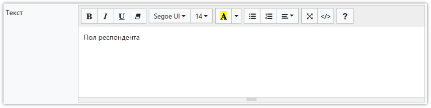

Дополнительно к тексту вопроса, можно указать комментарий, который при показе вопроса выводится под текстом, и обычно служит для описания того, как правильно ответить, что необходимо учесть при ответе и т.д.

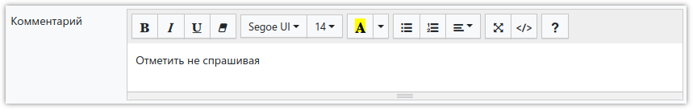

Дополнительно к тексту вопроса можно добавить изображение, которое необходимо предварительно загрузить в разделе Изображения (в редакторе анкеты слева). Здесь же можно выбрать расположение картинки относительно текста.

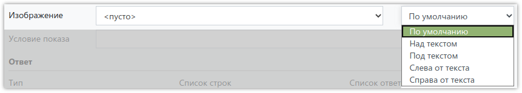

Если требуется задавать вопрос при выполнении определённого условия, то его необходимо указать в следующем поле:

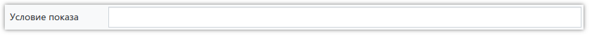

О синтаксисе выражений, использующихся для условий, можно прочитать в [соответствующем разделе](1006.md).

## Ответ

Далее необходимо указать, что за тип ответа подразумевает этот вопрос, а также, при необходимости, [задавать списки](1004.md) вариантов ответа:

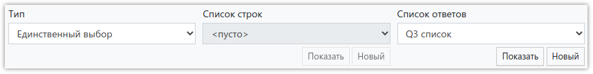

Поддерживаются следующие типы ответов на вопрос:

- *Информация* 
Просто отображение информации. Вопрос с таким типом ответа не подразумевает ответа, как такового. Используется обычно для приветствий, или вывода какой-либо важной информации, помогающей ответить на последующие вопросы анкеты.

- *Текстовый* 
Открытый вопрос, с текстовым полем для ввода ответа.

- *Числовой* 
Открытый вопрос, с текстовым полем для ввода числового ответа.

- *Единственный выбор* 
Выбор одного ответа из списка. Необходимо задать список вариантов ответа.

- *Множественный выбор* 
Выбор одного или нескольких ответов из списка. Необходимо задать список вариантов ответа.

- *Таблица: текст* 
Табличный вопрос, где каждая строка представлена в виде текстового поля для ввода ответа. Необходимо задать список строк.

- *Таблица: числа* 
Табличный вопрос, где каждая строка представлена в виде текстового поля для ввода числового ответа. Необходимо задать список строк.

- *Таблица: единственный выбор* 
Табличный вопрос, где каждая строка представлена в виде выбора одного варианта из нескольких. Необходимо задать список строк, а также список вариантов ответа.

- *Таблица: множественный выбор* 
Табличный вопрос, где каждая строка представлена в виде выбора одного или нескольких вариантов ответа из списка. Необходимо задать список строк, а также список вариантов ответа.

Для вопросов, подразумевающих выбор вариантов ответов - необходимо задать список возможных вариантов ответов. Списки вариантов ответов также используются для задания строк в табличных вопросах. Список можно выбрать, посмотреть (а также изменить) его содержимое, или тут же создать и заполнить новый.

В вопросах с множественным выбором вариантов ответов, а также в табличных вопросах с множественным выбором, можно указать минимальное и/или максимальное количество выбранных вариантов:

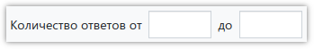

Если в вопросе с единственным или множественным выбором содержится очень много вариантов ответа, то можно указать количество колонок, на которые будет разбит список при отображении вопроса:
{: #columns}

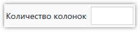

## Флаги

В этом разделе можно включить различные флаги, управляющие отображением вопроса:

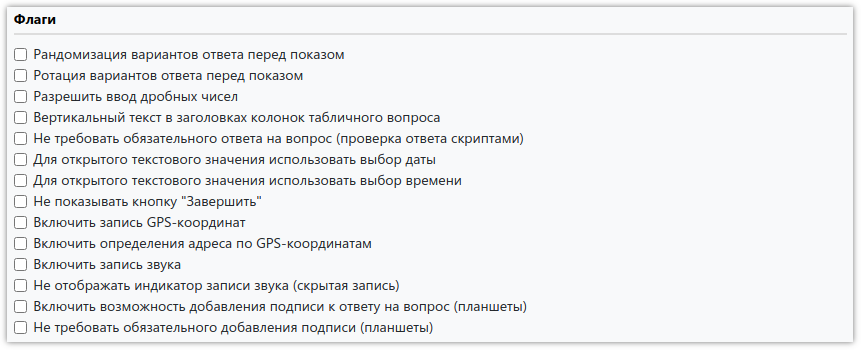

- *Рандомизация вариантов ответа перед показом* 
При включении варианты ответа в вопросах с единственным или множественным выбором, а также строки в табличных вопросах, будут перемешаны в случайном порядке.

- *Ротация вариантов ответа перед показом* 
При включении варианты ответа в вопросах с единственным или множественным выбором, а также строки в табличных вопросах, будут сдвигаться на один шаг для каждого следующего интервью. Например, если в первом интервью варианты ответа были 1,2,3,4, то во втором будут 2,3,4,1, в третьем - 3,4,1,2 и т.д.

- *Разрешить ввод дробных чисел* 
По умолчанию в вопросах с типом ответа *Числовой* или *Таблица: числа* допускается вводить только целые числа. Включение этого флага позволит указать число с двумя знаками после запятой, например *8,23*.

- *Вертикальный текст в заголовках колонок табличного вопроса* 
При включении, текст в заголовках колонок табличного вопроса будет выводиться вертикально. Обычно используется, если в вопросе очень много колонок и горизонтальный текст не влезает.

- *Не требовать обязательного ответа на вопрос (проверка ответа скриптами)* 
При включении этого флага будет отключено требование обязательного ответа на вопрос. Все проверки при этом необходимо [производить самостоятельно](../articles/1003.md), в скрипте после ответа.

- *Для открытого текстового значения использовать выбор даты* 
Переключает текстовый вопрос в режим ввода даты, а также добавляет форму выбора даты.

- *Для открытого текстового значения использовать выбор времени* 
Переключает текстовый вопрос в режим ввода времени, а также добавляет форму выбора времени.

- *Не показывать кнопку "Завершить"* 
Во время интервью скрывает в текущем вопросе кнопку "Завершить". Скрыть эту кнопку во всех вопросах можно [в свойствах проекта](3001.md#flags).

- *Включить запись GPS-координат* 
Добавляет в массив координаты места опроса в момент заполнения текущего вопроса. Координаты сохранятся, если в проекте включена запись координат и устройство сможет определить местоположение. Если опрос проходит через браузер, браузер может запросить разрешение на отправку координат. В случае отказа, координаты сохранены не будут. Включить запись GPS-координат для всего интервью (одни координаты для одного интервью) можно в свойствах проекта.

- *Включить определения адреса по GPS-координатам* 
Добавляет в массив адрес места опроса в момент заполнения текущего вопроса. Адрес сохранится, если в проекте включена запись адреса и устройство сможет определить текущие GPS-координаты. Если опрос проходит через браузер, браузер может запросить разрешение на отправку координат. В случае отказа, адрес сохранён не будет. Включить определение адреса по GPS-координатам для всего интервью (один адрес для одного интервью) можно в свойствах проекта.

- *Включить запись звука* 
Добавляет в массив ссылку на MP3-файл, записанный в момент заполнения текущего вопроса. Разговор запишется, если в проекте включена запись звука и опрос проходит на планшете [в приложении **SURVEY**STUDIO](../articles/1007.md). Включить запись звука для всего интервью (один файл для одного интервью) можно в свойствах проекта.

- *Не отображать индикатор записи звука (скрытая запись)* 
Скрывает значок микрофона в приложении при включённой записи звука. Отключить индикатор записи во всех вопросах анкеты можно в свойствах проекта.

- *Включить возможность добавления подписи к ответу на вопрос (планшеты)* 
Добавляет в вопрос кнопку, открывающую поле, в котором респондент должен расписаться пальцем.

- *Не требовать обязательного добавления подписи (планшеты)* 
Разрешает перейти к следующему вопросу без подписи.

## Фотографии

К вопросу можно прикреплять фотографии. Ссылки на файлы будут в массиве после ответа на вопрос. Здесь включается эта функция и при необходимости указывается допустимое количество прикреплённых файлов:

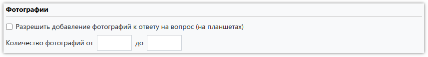

Если поля не заполнены – нужно будет прикрепить 1 фото. Если заполнено только поле от – нужно будет прикрепить строго указанное количество. Если заполнено только поле до – можно будет прикрепить от 0 до указанного количества.

## Выгрузка

Следующий набор флагов управляет тем, как будет формироваться итоговый массив с собранными интервью:

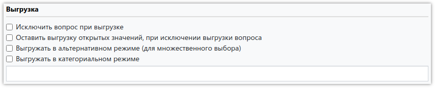

- *Исключить вопрос при выгрузке* 
При включении этого флага вопрос не включается в выгружаемый массив.

- *Оставить выгрузку открытых значений, при исключении выгрузки вопроса* 
При включении этого флага, при включенном флаге Исключить вопрос при выгрузке, сам вопрос не включается в выгружаемый массив, однако переменные содержащие открытые значения - будут выгружены.

- *Выгружать в категориальном режиме* 
По умолчанию вопросы с множественным выбором в итоговом массиве будут представлены в виде переменных, по одной на каждый вариант ответа, в которых будут записаны 1 или 0, в зависимости от того, выбран ли этот вариант ответа в вопросе, или нет. Если вопрос не задавался - значения переменных будут пустые. Категориальный режим меняет это поведение на следующее: каждая переменная в массиве (их количество будет равно максимальному возможному количеству ответов на вопрос) будет содержать код выбранного ответа или будет пустой. 
Дополнительно, при включении категориального режима выгрузки, можно задать список подмены порядковых номеров ответов, используемых при формировании имен переменных в массиве, на любые другие значения. Например, если по умолчанию номера ответов будут 1,2,3,4, а нам надо чтобы в массиве в именах переменных было указано 01,02,03,04, или A,B,C,D, то можно просто указать этот список в поле ввода под флагом.

- *Выгружать в альтернативном режиме (для множественного выбора)* 
Альтернативный режим выгрузки отличается от основного (используемого по умолчанию, см. выше описание) тем, что если вариант ответа выбран, то в переменную в массиве будет записано не 1, а код этого варианта ответа. На скриншоте ниже показаны выбранные ответы 1,5,8 во всех режимах выгрузки:

## Действия и скрипты

Если новый вопрос был сохранён, то при повторном открытии его свойств в нижней левой части окна будут доступны кнопки:

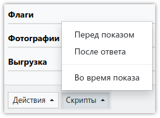

- *Действия* 
Позволяет указать набор действий, выполняемых перед показом вопроса, а также после ответа на него. Действия являются простым средством управления переходами на вопросы, в зависимости от выбора определенных ответов, а также используются для скрытия или показа вариантов ответа, завершения интервью по условию, пропуска вопросов и т.д. Подробнее можно прочитать в [соответствующем разделе](1005.md).

- *Скрипты* 
Когда задачу не получается решить с помощью Действий, на помощь приходят скрипты, написанные на языке JavaScript. Скрипты, как и Действия, могут выполняться перед показом вопроса и после ответа на него, но ещё во время отображения вопроса в браузере. Подробнее можно прочитать в [соответствующем разделе](2000.md).
