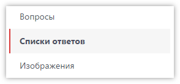

# Редактор списка вариантов ответа

Во всех вопросах, предполагающих выбор одного или нескольких вариантов из списка - необходимо задать список возможных вариантов ответа. Один и тот же список можно использовать в разных вопросах. Также, любой список вариантов ответа можно использовать в табличных вопросах для указания списка строк.

Для редактирования списков вариантов ответов можно использовать отдельный раздел, который доступен в меню слева редактора анкеты:

 Однако обычно, проще работать со списками ответов прямо при редактировании свойств вопроса:

Отсюда можно сразу создать новый список, или показать/изменить уже существующий. Список ответов будет открыт в отдельном окне, где можно указать как свойства самого списка, так и заполнить его вариантами ответа. Для ускорения работы можно использовать импорт ответов из текста.

## Работа со списком вариантов ответа

1. Наименование списка вариантов ответов.
2. Быстрое выделение всех ответов в списке, или снятие выделения.
3. Добавление нового варианта ответа в список.
4. Создание копии выбранных вариантов ответа и добавление их в конец списка.
5. Удаление выбранных вариантов ответа.
6. Быстрая установка или снятие флагов для всех выбранных вариантов ответа.
7. Перемещение выбранных вариантов ответа вверх.
8. Перемещение выбранных вариантов ответа вниз.
9. Поле для указания кода варианта ответа, перед или после которого необходимо переместить выбранные варианты ответа.
10. Перемещение выбранных вариантов ответа перед указанным вариантом (его код задается в поле 9) либо, если код не задан - варианты ответа перемещаются в начало списка.
11. Перемещение выбранных вариантов ответа после указанного варианта (его код задается в поле 9) либо, если код не задан - варианты ответа перемещаются в конец списка.
12. Кнопка для переключения в режим импорта вариантов ответа из текста.

## Импорт вариантов ответа из текста

После нажатия кнопки `Импорт` откроется текстовый редактор, в котором можно написать необходимые варианты ответа, или вставить текст из буфера обмена. Каждая строка в тексте должна содержать код (число) и текст варианта ответа. Код от текста можно отделять пробелом, скобкой или точкой. При установке флага *Коды справа от текста* система будет ожидать, что код будет указан в конце строки, а не в начале.

Распознанные варианты ответа попадут в список, заменив собой все существующие элементы.

## Свойства варианта ответа

Для добавления нового варианта ответа в список, или редактирования существующего, используется следующая форма:

1. Код варианта ответа, должен быть обязательно указан и быть уникальным для редактируемого списка. Представляет собой целое число. Допускает использование отрицательных и нулевых значений. После начала сбора данных по анкете не рекомендуется изменять коды вариантов ответа, а также удалять варианты ответа из списка - это приведёт к проблемам при выгрузке массива.
2. Псевдоним для этого кода варианта ответа, используемый при выгрузке массива. Например, если указан код 1, а необходимо, чтобы в массиве при выборе этого кода (или в имени переменной) использовалась буква 'A' - её необходимо указать в этом поле.
3. Шаблон имени переменной для варианта ответа.
4. Шаблон имени переменной для числового открытого значения для этого варианта ответа (в вопросах с единственным или множественным выбором).
5. Шаблон имени переменной для текстового открытого значения для этого варианта ответа (в вопросах с единственным или множественным выбором).
6. Текст варианта ответа (может отсутствовать).
7. Выбор изображения, которое будет показано рядом с этим вариантом ответа. Его необходимо предварительно загрузить в разделе Изображения (в редакторе анкеты слева).
8. Выбор расположения изображения относительно текста варианта ответа.

Шаблоны имён переменных используются для [замены стандартных имён переменных](../articles/1005.md) в массиве.

## Флаги

Каждый вариант ответа содержит множество флагов, влияющих на отображение, логику и выгрузку:

- *С открытым значением (число)* 
Добавляет варианту ответа поле для ввода числового значения. По умолчанию значение можно (и требуется) указать только если вариант ответа выбран.

- *С открытым значением (текст)* 
Добавляет варианту ответа поле для ввода текстового значения. По умолчанию значение можно (и требуется) указать только если вариант ответа выбран.

- *Блокирующий / исключающий* 
В вопросе с множественным выбором при выборе варианта ответа, у которого включен этот флаг, выбор других вариантов ответа блокируется. Обычно используется для исключающих ответов, например "Не знаю" или "Затрудняюсь ответить".

- *Всегда отображается* 
При включении этого флага, вариант ответа нельзя скрыть, используя [Действия](1005.md) или [Скрипты](2000.md).

- *Не подлежит рандомизации / ротации* 
Запрещает изменение положения варианта ответа в списке, если включена рандомизация или ротация элементов списка.

- *Запрещено использовать в циклах* 
Запрещает использование этого варианта ответа в [циклах по вопросу](2001.md#repeatqnfrom-qnto-qnsrc-repeatqnfrom-qnto-qnsrc-codes) (автоматический повтор вопроса или блока вопросов для каждого варианта ответа).

- *Исключить поле при выгрузке* 
Отключает выгрузку этого варианта ответа в итоговый массив, даже если он выбран.

- *Отключить выгрузку открытого значения* 
Отключает выгрузку открытых значений для этого варианта ответа в итоговый массив.

- *Скрыть в режиме респондента* 
Скрывает ответ, строку или колонку таблицы в режиме просмотра респондентом вопроса на планшете.

- *Разрешить ввод дробных чисел* 
Включает возможность ввода дробных чисел в открытое числовое значение для этого варианта ответа. По умолчанию допускается вводить только целые числа.

- *Разрешить пустые открытые значения* 
Включение этого флага позволит не заполнять поля для открытых значений, когда вариант ответа выбран. По умолчанию значение должно быть указано обязательно.

- *Не отображать код варианта ответа* 
Отключает показ кода для этого варианта ответа при показе вопроса. Отключить все коды анкеты можно в [свойствах проекта](3001.md#flags).

- *Не отображать текст варианта ответа* 
Отключает показ текста для этого варианта ответа при показе вопроса.

- *Расположить в первой колонке внизу* 
При использовании отображения списка вариантов ответа [в несколько колонок](1003.md#columns), включение этого флага заставит этот вариант ответа расположиться в первой колонке в самом низу списка.

- *Использовать выбор даты (пока не реализовано)* 
Переключает текстовое поле этого ответа в режим ввода даты, а также добавляет форму выбора даты.

- *Использовать выбор времени (пока не реализовано)* 
Переключает текстовое поле этого ответа в режим ввода времени, а также добавляет форму выбора времени.

- *Не требовать ответ в строке таблицы* 
Делает строку табличного вопроса необязательной для заполнения.

## Групповое изменение флагов

Часто необходимо установить или снять один или несколько флагов сразу для нескольких или всех вариантов ответа. Для этого достаточно выбрать необходимые варианты ответа и нажать кнопку `Флаги`:

В открывшейся форме установить необходимые флаги и нажать соответствующую кнопку, в зависимости от того, что нужно сделать.
