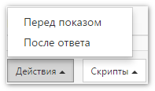

# Действия перед показом и после ответа на вопрос

Одним из средств управления логикой работы анкеты являются действия, которые в зависимости от условия выполняют указанную операцию, например переход на вопрос или завершение интервью. Для каждого вопроса можно задать два списка действия: перед показом и после ответа.

Действия *перед показом* выполняются непосредственно перед показом вопроса интервьюеру/респонденту, а действия *после ответа* - уже после показа вопроса и получения ответа на него, а также после проверки полученного ответа на правильность.

Выполнение системой действий производится последовательно, таким образом порядок действий в списке имеет важное значение. У каждого действия можно указать условие, при котором оно выполняется. Если условие не задано - действие выполняется всегда. Если условие выполняется (или не задано), то будет выполнено указанное действие. При этом последовательное выполнение действий производится до тех пор, пока одно из них не вернет окончательный результат (переход на вопрос, завершение интервью, вывод сообщения об ошибке и т.д.).

Открыть редактор действий можно с помощью кнопки `Действия`, которая появляется в левом нижнем углу окна [свойств вопроса](1003.md) после сохранения нового вопроса. Щёлкнув по ней, можно выбрать желаемый редактор:

Окно с редактором действий выглядит следующим образом:

1. Быстрое выделение всех действий в списке или снятие выделения.
2. Добавление нового действия в список.
3. Создание копии выбранных действий и добавление их в конец списка.
4. Удаление выбранных действий.
5. Перемещение выбранных действий вверх.
6. Перемещение выбранных действий вниз.
7. Список действий.

При добавлении нового действия или при изменении существующего, будет открыта форма, позволяющая указать условие, тип действия, а также необходимые параметры, если выбранное действие их требует:

1. Условие выполнения действия. Может отсутствовать, при этом действие будет выполняться всегда. Подробнее про синтаксис выражений, которые используются для условий, можно прочитать [в соответствующем разделе](1006.md).
2. Действие, которое нужно выполнить.
3. Первый числовой параметр.
4. Первый текстовый параметр.
5. Второй числовой параметр.
6. Второй текстовый параметр.

Некоторые действия требуют указания параметров, например номер вопроса для перехода. Предусмотрена возможность указать два параметра для действия, при этом каждый параметр может содержать число и/или строку.

Рассмотрим каждый тип действия подробнее.

## Переходы и пропуск

- *Переход на вопрос* 
Осуществляет переход на необходимый вопрос. Номер вопроса указывается в первом числовом параметре.

- *Завершить интервью* 
Выполняется завершение интервью. В первом текстовом параметре можно указать текст сообщения, которое будет выведено после завершения интервью. Если его оставить пустым, будет выведено стандартное сообщение.

- *Пропустить вопрос* 
Это действие имеет смысл только перед показом вопроса. Он заставляет систему перейти сразу к следующему по порядку вопросу, не показывая текущий.

- *Пометить как отвеченный* 
Имитирует ответ на вопрос без его показа. Обычно используется совместно с предыдущими (вышестоящими) действиями, которые проставляют необходимые ответы. Если вопрос останется без ответа - он будет показан.

- *Пометить как отвеченный или пропустить* 
Работает также, как и действие *Пометить как отвеченный*, только в случае, если вопрос остался без ответа - пропускает его, переходя к следующему по порядку.

- *Пропустить, если нет видимых вариантов ответа или строк* 
Если в вопросе с выбором или в табличном вопросе нет ни одного ответа или строки, это действие пропустит вопрос и перейдёт к следующему по порядку.

## Скрыть варианты ответа

- *Скрыть все варианты ответа* 
Скрывает все варианты ответа в вопросе. Обычно последующие действия показывают какие-то определенные варианты, например отмеченные в предыдущих вопросах.

- *Скрыть указанные варианты ответа* 
Скрывает варианты ответа, список кодов которых задается в первом текстовом параметре. Если необходимо скрыть сразу несколько вариантов ответа - их коды указываются через запятую, например: 2,5,6.

- *Скрыть варианты ответа, отмеченные в указанном вопросе* 
Скрывает варианты ответа, которые были выбраны в вопросе с номером, указанном в первом числовом параметре.

- *Скрыть варианты ответа с кодами в указанном диапазоне* 
Скрывает варианты ответа в заданном диапазоне. В первом числовом параметре указывается код начала диапазона, во втором – конец диапазона.

## Показать варианты ответа

- *Показать все варианты ответа* 
Показывает все варианты ответа в вопросе. Обычно последующие действия скрывают какие-то определенные варианты, например отмеченные в предыдущих вопросах.

- *Показать указанные варианты ответа* 
Показать варианты ответа, список кодов которых задается в первом текстовом параметре. Если необходимо показать сразу несколько вариантов ответа - их коды указываются через запятую, например: 2,5,6.

- *Показать варианты ответа, отмеченные в указанном вопросе* 
Показывает варианты ответа, которые были выбраны в вопросе с номером, указанном в первом числовом параметре.

- *Показать только указанные варианты ответа* 
Показать только варианты ответа, список кодов которых задается в первом текстовом параметре. При этом все другие варианты ответа будут скрыты. Если необходимо показать сразу несколько вариантов ответа - их коды указываются через запятую, например: 2,5,6.

- *Показать только варианты ответа, отмеченные в указанном вопросе* 
Показывает только варианты ответа, которые были выбраны в вопросе с номером, указанном в первом числовом параметре. При этом все другие варианты ответа будут скрыты.

- *Показать варианты ответа с кодами в указанном диапазоне* 
Показывает варианты ответа в заданном диапазоне. В первом числовом параметре указывается код начала диапазона, во втором – конец диапазона.

Статья по теме: [Показать в вопросе только те варианты ответа, которые отметили в предыдущем вопросе](../articles/1002.md)

## Переменные

Обычно переменные используются для автоматической подстановки необходимого значения в текст вопроса (а также в комментарий или текст варианта ответа) с помощью макросов. Например, если в тексте вопроса написать *Здравствуйте, {ФИО}!*, то макрос *{ФИО}* будет заменён на значение переменной *ФИО*.

- *Установить значение переменной из открытого ответа указанного вопроса* 
Устанавливает значение переменной, имя которой указывается в первом текстовом параметре, из открытого значения вопроса, номер которого указывается во втором числовом параметре. Если указанный вопрос избирательного типа (единственный или множественный выбор), то необходимо во втором текстовом параметре указать код варианта ответа, откуда надо взять открытое значение.

- *Установить значение переменной* 
Присваивает переменной, имя которой указывается в первом строковом параметре, значение, указанное во втором строковом параметре.

- *Установить значение переменной из данных контакта* 
Присваивает переменной, имя которой указывается в первом строковом параметре, значение из данных контакта. Имя поля данных указывается во втором строковом параметре.

Существуют стандартные макросы, которые заменяются значениями из полей анкеты:

`{Q1}` – текст или число из простого текстового или числового вопроса.

`{Q2.1N}` – число из числового поля ответа 1, если вопрос с выбором, или из числового поля у строки 1, если вопрос табличный.

`{Q2.98T}` – текст из текстового поля ответа 98, если вопрос с выбором, или из текстового поля у строки 98, если вопрос табличный.

`{Q3.1}` – текст или число ответа в строке 1 табличного текстового или числового вопроса.

`{Q4.1.2N}` – число из числового поля ответа 2 в строке 1 табличного вопроса с выбором.

`{Q4.2.98T}` – текст из текстового поля ответа 98 в строке 2 табличного вопроса с выбором.

## Загрузка ответов

- *Перенести ответы из другого вопроса* 
Переносит в текущий вопрос ответы из вопроса, номер которого указан в первом числовом параметре. Действие не поддерживает табличные вопросы.

- *Загрузить ответы из данных контакта* 
Вставляет в текстовый или числовой вопрос содержимое поля данных контакта, имя которого указывается в первом текстовом параметре.

## Разное

- *Сбросить состояние вариантов ответа* 
Сбрасывает состояние текущего вопроса в изначальное. Очищаются все ответы, а также все варианты ответа становятся видимыми, если были скрыты.

- *Сообщить об ошибке* 
Выводит сообщение об ошибке. Это действие используется после ответа на вопрос для проверки его правильности. В первом текстовом параметре можно указать текст сообщения, которое будет выведено на экран. Если его оставить пустым, будет выведено стандартное сообщение.
