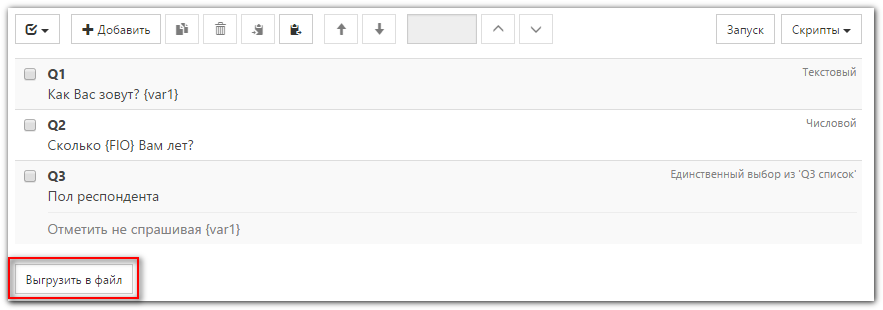
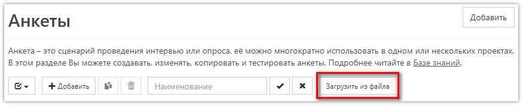

# Выгрузка и загрузка анкеты, описание структуры файла с анкетой 

Любую созданную в системе анкету можно как выгрузить в виде текстового файла, так и загрузить обратно. Эту функцию удобно использовать, например, для передачи запрограммированной анкеты другому клиенту сервиса, просто отправив ему выгруженный файл по электронной почте. Также, возможно формирование файла с анкетой сторонним ПО, для последующей загрузки в **SURVEY**STUDIO.

Чтобы выгрузить анкету, необходимо нажать соответствующую кнопку, находящуюся под списком вопросов:



 Чтобы наоборот, создать новую анкету из файла, необходимо перейти в список анкет и нажать кнопку:



При этом будет создана новая анкета.

## Формат выгружаемого файла

Анкета выгружается в текстовый файл в формате JSON (см. описание [тут](https://ru.wikipedia.org/wiki/JSON) или [тут](http://www.json.org/json-ru.html)). Используемая кодировка: UTF8. В файле записывается один объект [Questionnaire](#questionnaire), содержащий все необходимые свойства анкеты. Каждое свойство объекта состоит из имени (ключ) и значения. При сохранении анкеты из **SURVEYS**TUDIO имена свойств объектов всегда будут заключены в кавычки, однако если файл будет формироваться сторонним ПО - допускается имена свойств указывать без кавычек. Также, при сохранении из **SURVEY**STUDIO, будут заданы значения всех необязательных свойств, которые можно опустить при формировании файла.

Пример содержимого файла:

```json
{
  "Magic": "SS2EQN",
  "Version": "2.0",
  "Name": "Новая анкета",
  "Flags": "None",
  "Questions": [
    {
      "OrderIdx": 1,
      "Number": 1,
      "Text": "Текст вопроса 1",
      "ImagePlacement": "Default",
      "QuestionType": "SingleChoice",
      "Flags": "None",
      "AnswerList": "Q1 список"
    }
  ],
  "AnswerLists": [
    {
      "Name": "Q1 список",
      "AnswerItems": [
        {
          "OrderIdx": 1,
          "Code": 1,
          "Text": "Ответ 1",
          "ImagePlacement": "Default",
          "Flags": "None"
        },
        {
          "OrderIdx": 2,
          "Code": 2,
          "Text": "Ответ 2",
          "ImagePlacement": "Default",
          "Flags": "None"
        },
        {
          "OrderIdx": 3,
          "Code": 3,
          "Text": "Ответ 3",
          "ImagePlacement": "Default",
          "Flags": "None"
        }
      ]
    }
  ]
}
```

 Первые два свойства указывают на версию формата и должны иметь фиксированные значения:

```json
{
  "Magic": "SS2EQN",
  "Version": "2.0"
}
```

## Полный список свойств объекта `Questionnaire` и описание их значений

### `Magic`

Маркер формата файла. Имеет фиксированное значение "SS2EQN".

### `Version`

Версия формата файла. Текущее значение "2.0".

### `Name`

Строка, содержащая имя анкеты. При загрузке, если анкета с таким же именем уже существует - имя будет дополнено числом, чтобы соблюсти требование уникальности.

### `Code`

Целое число, содержащее код анкеты. Может отсутствовать.

### `Flags`

Набор флагов анкеты. Указывается в виде строки, в которой перечислены через запятую имена необходимых флагов:

- *DisableCleanupOnPostProcessing*<br>
Запретить проверку с очисткой лишних ответов перед сохранением интервью

- *MultipleChoiceInCategoricalMode*<br>
Выгружать вопросы с множественным выбором в категориальном режиме

- *MultipleChoiceInAlternativeFlagsMode*<br>
Выгружать вопросы с множественным выбором в альтернативном режиме

- *Archive*<br>
Помещена в архив

Например, два флага можно задать так:

```json
{
  "Flags": "DisableCleanupOnPostProcessing, MultipleChoiceInCategoricalMode"
}
```

### `ScriptPreProcessing`

Скрипт *Подготовка*.

### `ScriptPostProcessing`

Скрипт *Обработка*.

### `ScriptBeforeShow`

Глобальный скрипт *Перед показом*.

### `ScriptAfterAnswer`

Глобальный скрипт *После ответа*.

### `ScriptClientSide`

Глобальный скрипт *Во время показа*, исполняемый в браузере во время показа вопроса.

### `ScriptCSS`

CSS-стили анкеты.

### `Questions`

Массив вопросов анкеты. Каждый элемент массива представляет из себя объект [Question](#question).

### `AnswerLists`

Массив списков вариантов ответов, которые используются в анкете. Каждый элемент массива представляет из себя объект [AnswerList](#answerlist_1).

### `Images`

Массив изображений, которые используются в анкете. Каждый элемент массива представляет из себя объект [Image](#image_2).

## Объект `Question`

Для каждого вопроса необходимо задать значения полей OrderIdx, Number, Text, QuestionType. Остальные поля можно не указывать.

### `OrderIdx`

Целое число, указывающее порядок вопроса в анкете. Допускаются отрицательные значения. Если несколько вопросов будут иметь одинаковое значение в этом поле, то порядок их загрузки не определён.

### `Number`

Номер вопроса. Целое число, больше или равное нулю. Отрицательные значения не допускаются. Номер вопроса должен быть уникален для всей анкеты.

### `Text`

Текст вопроса. Может содержать html-разметку (действуют ограничения на используемые тэги и аттрибуты).

### `Comment`

Текст комментария к вопросу. Также как и сам текст вопроса - может содержать html-разметку.

### `Image`

Имя изображения, связанного с вопросом. Изображение с указанным именем должно быть в списке [Images](#images).

### `ImagePlacement`

Тип расположения изображения относительно текста вопроса. Допустимые значения:

{!help/common/imagePlacement.md!}

Например:

```json
{
  "ImagePlacement": "After"
}
```

### `QuestionType`

Тип вопроса. Допустимые значения:

{!help/common/questionType.md!}

### `Flags`

Набор флагов вопроса. Указывается в виде строки, в которой перечислены через запятую имена необходимых флагов: 

{!help/common/questionFlags.md!}

Например, два флага можно задать так:

```json
{
  "Flags": "RandomizeAnswers, CustomValidation"
}
```

### `Condition`

Условие показа вопроса.

### `AnswerList`

Имя списка вариантов ответов для вопроса. Список с таким именем должен быть в массиве [AnswerLists](#answerlists).

### `RowList`

Имя списка вариантов ответов для строк табличного вопроса. Список с таким именем должен быть в массиве [AnswerLists](#answerlists).

### `MinAnswerCount`

Минимальное необходимое количество ответов для вопроса с множественным выбором (или для каждой строки табличного вопроса с множественным выбором).

### `MaxAnswerCount`

Максимальное допустимое количество ответов для вопроса с множественным выбором (или для каждой строки табличного вопроса с множественным выбором).

### `ColumnCount`

Количество колонок, которое будет использовано при отображении вопроса с единственным или множественным выбором. Для открытого текстового вопроса задаёт количество строк в поле ввода текста.

### `OutputColumnTemplate`

Шаблон для формирования имён переменных в массиве для вопроса.

### `OutputColumnTemplateOVT`

Шаблон для формирования имён переменных в массиве открытых текстовых полей вопроса.

### `OutputColumnTemplateOVN`

Шаблон для формирования имён переменных в массиве открытых числовых полей вопроса.

### `CategoricalIndexes`

Список индексов (переопределение используемых по умолчанию) для вариантов ответа вопроса при выгрузке в категориальном режиме. Указываются через запятую.

### `ScriptBeforeShow`

Скрипт перед показом вопроса.

### `ScriptAfterAnswer`

Скрипт после ответа на вопрос.

### `ScriptClientSide`

Скрипт, исполняемый в браузере во время показа вопроса.

### `BeforeShowActions`

Действия перед показом вопроса. Задаются в виде массива объектов [QuestionAction](#questionaction).

### `AfterAnswerActions`

Действия после ответа на вопрос. Задаются в виде массива объектов [QuestionAction](#questionaction).

## Объект `QuestionAction`

### `OrderIdx`

Целое число, указывающее порядок действий в списке. Допускаются отрицательные значения. Если несколько действий будут иметь одинаковое значение в этом поле, то порядок их загрузки не определён.

### `Condition`

Условие, при выполнении которого действие будет запущено. Если условие не задано - действие запускается всегда.

### `ActionType`

Тип действия. Указывает что необходимо сделать и задаётся одним из возможных значений:

- *JumpToQuestion*
- *JumpToEnd*
- *Skip*
- *Answered*
- *AnsweredOrSkip*
- *SkipIfNoVisible*
- *HideAll*
- *HideCodes*
- *HideCheckedInQuestion*
- *HideFromTo*
- *ShowAll*
- *ShowCodes*
- *ShowCheckedInQuestion*
- *ShowOnlyCodes*
- *ShowFromTo*
- *SetVariableValueFromOpenValue*
- *SetVariableValue*
- *SetVariableValueFromContactData*
- *CopyAnswersFromQuestion*
- *LoadAnswersFromContactData*
- *ResetAnswers*
- *ReturnError*

### `ActionVarLong1`<br> `ActionVarLong2`

Числовые переменные, задающие необходимые параметры для действий.

### `ActionVarTxt1`<br> `ActionVarTxt2`

Текстовые переменные, задающие необходимые параметры для действий.

## Объект `AnswerList`

### `Name`

Имя списка вариантов ответов. Должно быть уникальным для анкеты.

### `ColumnCount`

Если задано, то указывает количество колонок, используемое при отображении вопросов с единственным или множественным выбором.

### `AnswerItems`

Элементы списка вариантов ответа. Задаются в виде массива объектов [AnswerItem](#answeritem).

## Объект `AnswerItem`

### `OrderIdx`

Целое число, указывающее порядок вариантов ответа в списке. Допускаются отрицательные значения. Если несколько вариантов ответа будут иметь одинаковое значение в этом поле, то порядок их загрузки не определён.

### `Code`

Код варианта ответа. Внутри одного списка коды вариантов ответа не должны повторяться.

### `Text`

Текст варианта ответа. Допускается использовать html-разметку. Текст может отсутствовать.

### `Image`

Имя изображения, связанного с вариантом ответа. Изображение с указанным именем должно быть в списке [Images](#images).

### `ImagePlacement`

Тип расположения изображения относительно текста варианта ответа. Допустимые значения см. [ImagePlacement](#imageplacement) у объекта [Question](#question).

### `Flags`

Набор флагов для варианта ответа. Указывается в виде строки, в которой перечислены через запятую имена необходимых флагов:

{!help/common/answerFlags.md!}

### `ExportCodeOverride`

Строка, заменяющая код варианта ответа при выгрузке массива.

### `OutputColumnTemplate`

Шаблон для формирования имён переменных в массиве для варианта ответа.

### `OutputColumnTemplateOVT`

Шаблон для формирования имён переменных в массиве открытого текстового поля варианта ответа.

### `OutputColumnTemplateOVN`

Шаблон для формирования имён переменных в массиве открытого числового поля варианта ответа.

## Объект `Image`

Если анкета содержит изображения, то она должна выгружаться в zip-файл, в котором будет как json-файл с самой анкетой, так и все файлы с изображениями.

### `Name`

Имя изображения. Должно быть уникально для анкеты. Используется для ссылки на изображение из вопроса или варианта ответа.

### `FileName`

Имя файла с изображением.
