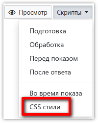

# Изменение оформления анкеты

Анкету, которая будет использоваться в браузере, можно оформить на свой вкус или, например, в корпоративном стиле заказчика с помощью стилей [CSS](https://html5css.ru/css/default.php), которые добавляются в редакторе, открывающимся из выпадающего меню `Скрипты` редактора анкеты:



Описание свойств и селекторов CSS можно найти в интернете, например [здесь](https://html5css.ru/cssref/default.php), а структуру страниц анкеты можно смотреть в браузере, нажав `CTRL+U` или `CTRL+SHIFT+I`.

Ниже представлены примеры изменения различных элементов анкеты:

```css
/* Добавление нестандартного шрифта "Exo 2" */
@import url('https://fonts.googleapis.com/css?family=Exo+2');

/* Установка шрифта "Exo 2" в качестве основного и изменение цвета фона анкеты */
body {
    font-family: 'Exo 2', sans-serif;
    background-color: #eaeaea;
}

/* Выделение текстов вопросов жирным */
[id*='text'] {
    font-weight: bold !important;
}

/* Изменение цвета комментариев */
[id*='comment'] {
    color: #0000ff !important;
}

/* Выделение текстов ответов курсивом */
span.summernote-html {
    font-style: italic !important;
}

/* Изменение цвета подсветки ответа, на который указывает курсор мышки */
.ss-answers-singlechoice > tbody > tr > td.ss-answers-td-hover:hover,
.ss-answers-multiplechoice > tbody > tr > td.ss-answers-td-hover:hover,
.ss-answers-table-text > tbody > tr:hover,
.ss-answers-table-numeric > tbody > tr:hover,
.ss-answers-table-singlechoice > tbody > tr > td:nth-child(n+2):hover,
.ss-answers-table-multiplechoice > tbody > tr > td:nth-child(n+2):hover {
    background-color: #fffcd9;
}

/* Изменение цвета полосы прогресса заполнения анкеты */
#surveybuttons > div > div:nth-child(1) {
    background-color: #ff0000 !important;
}

/* Изменение цвета кнопки Далее */
#processingGoForwardBtn {
    background-color: #ff0000;
    border-color: #b22222;
}

/* Скрытие нижнего блока с именем клиента и логотипом */
.ss-footer {
    display: none;
}
```

Скрыть нижний блок, содержащий имя клиента и логотип **SURVEY**STUDIO, также можно и флагом *Отключить показ нижнего колонтитула на странице опроса*, который находится [в свойствах проекта](3001.md#flags).

Если перед стилем добавить `#ss_current_qn[value="777"] ~` - он применится только к указанному в `value` номеру вопроса. Например, выделить жирным текст вопросов Q2 и Q5 можно так:

```css
#ss_current_qn[value="2"] ~ [id*='text'],
#ss_current_qn[value="5"] ~ [id*='text'] {
    font-weight: bold !important;
}
```
