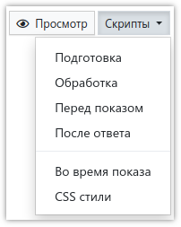

# Написание скриптов

Достаточно часто встречаются анкеты, логику работы которых невозможно реализовать простыми средствами, такими как действия или условия показа вопросов. Для этого в **SURVEY**STUDIO есть поддержка скриптов на языке [JavaScript](https://learn.javascript.ru/), с помощью которых можно реализовать логику работы анкеты практически любой сложности. Более того, скриптами можно полностью создать анкету (вопросы и варианты ответов), не используя [редактор вопросов анкеты](1002.md).

Каждый скрипт представляет собой функцию, которая получает в качестве параметра вопрос, производит некую обработку и возвращает результат. Существуют глобальные для анкеты скрипты, в которые вопрос в качестве параметра не передается. Таким образом, используя синтаксис JavaScript, любой написанный в **SURVEY**STUDIO скрипт в итоге выглядит примерно так:

```js
function Q1_BeforeShow(Q) {
    return skip;
}
```

При этом в **SURVEY**STUDIO не нужно описывать саму функцию для скрипта - это выполняется системой, т.е. в этом примере только строка `return skip;` должна быть написана в окне редактирования скрипта.

## Типы скриптов

В анкете есть глобальные скрипты, не связанные с каким-то конкретным вопросом, а также скрипты для вопросов. Редактор глобальных скриптов можно открыть, выбрав необходимый пункт в меню в верхней правой части редактора вопросов анкеты:



- *Подготовка*<br>
Этот скрипт вызывается в самом начале, один раз при подготовке анкеты для запуска, а также при каждой выгрузке массива. Используется для создания вопросов, изменения их порядка (рандомизация/ротация), установки флагов и т.д. То есть в этом скрипте можно только формировать макет анкеты. Нельзя выполнять действия, влияющие на логику. Например, скрывать/показывать или случайным образом добавлять варианты ответа, объявлять глобальные переменные, от которых будут зависеть переходы между вопросами – для всего этого нужно использовать другие скрипты.

- *Обработка*<br>
Данный скрипт вызывается после завершения анкеты, непосредственно перед записью интервью в базу данных. Здесь можно провести анализ всех ответов в интервью и выполнить какие-то расчеты, исправления и прочие действия.

- *Перед показом*<br>
Глобальный скрипт перед показом вызывается для каждого вопроса перед его показом. Скрипт может вернуть результат, который заставит пропустить вопрос, перейти на какой-то другой вопрос, завершить интервью, или просто подготовить варианты ответа к показу (например скрыть не нужные, и т.д.). В качестве параметра этот скрипт получает переменную `Q`, которая указывает на вопрос, для которого запускается скрипт.

- *После ответа*<br>
Глобальный скрипт после ответа вызывается для каждого вопроса после ответа на него (после проведения базовой проверки корректности ответа). Этот скрипт, так же как и скрипт перед показом, может вернуть результат, который заставит перейти на какой-то другой вопрос, завершить интервью или, проверив ответ, сообщить об ошибке. В качестве параметра этот скрипт получает переменную Q, которая указывает на вопрос, для которого запускается скрипт.

- *Во время показа*<br>
Данный скрипт выполняется во время показа каждого вопроса в браузере, а не на сервере, и не имеет доступа к вопросам и API системы.

*CSS стили* не имеют отношения к скриптам, но прописываются для всей анкеты в целом. Подробную информацию о них можно найти [в этом разделе](1008.md).

Глобальные скрипты перед показом, после ответа и во время показа выполняются перед такими же скриптами, указанными непосредственно в самом вопросе. В [свойствах вопроса](1003.md) для редактирования скриптов используется кнопка:


Локальные скрипты аналогичны соответствующим глобальным скриптам, только выполняются для вопроса, в котором они написаны.

## Результат выполнения скрипта

Любой скрипт должен вернуть в качестве результата специальное значение. Предусмотрен набор вспомогательных функций и глобальных переменных, которые помогают сформировать результат в необходимом формате:

### `return ok;`

Возврат значения *ok* является обычным для любого скрипта и не подразумевает выполнение системой каких-то дополнительных действий. То же самое произойдет, если скрипт не вернет вообще никакого значения.

### `return skip;`

Возврат значения *skip* используется в скриптах перед показом вопроса и заставляет систему сбросить состояние текущего вопроса (аналогично методу [reset()](2002.md#reset)) и перейти к следующему по порядку.

### `return answered;`

Возврат значения *answered* так же используется в скриптах перед показом вопроса и помечает вопрос как отвеченный, без вывода на экран. Т.е. ответ на него должен быть сделан так же скриптом. Система проверит правильность ответа, так же как это происходит в обычном случае. Если ответ не пройдет проверку - вопрос будет показан с сообщением об ошибке. Если вопрос окажется без ответа - он будет выведен на экран.

### `return error('Текст сообщения об ошибке');`

Такой метод возврата результата используется в скриптах после ответа, когда необходимо показать вопрос заново с сообщением об ошибке. Если в функцию `error()` не передано сообщение, которое необходимо показать - будет показано стандартное.

### `return question(123);`

Возврат номера вопроса, на который необходимо совершить переход. Может использоваться как в скриптах перед показом (в этом случае текущий вопрос будет пропущен со сбросом состояния как при возврате *skip*), так и после ответа на вопрос.

### `return exit('Текст прощального сообщения');`

Принудительное завершение интервью. Если в функцию `exit()` не передано сообщение, которое необходимо показать - будет показано стандартное.

### `return exitAndRedirect('Текст прощального сообщения', 'http://www.rbc.ru/');`

Также выполняется завершение интервью, но после его сохранения производится переход на указанный вторым параметром адрес.

### `return exitAndRestart('Текст прощального сообщения');`

(Пока не реализовано) Выполняется завершение интервью, после чего производится повторный запуск для ввода следующего интервью в этот же проект.
