# Работа со списком проектов, добавление нового проекта

## Список проектов {: #list}

Для перехода [к списку проектов]({{ variables.ss_url }}/client/projects), выберите соответствующий раздел в верхнем меню [Личного кабинета]({{ variables.ss_url }}/client):

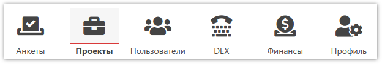

Список проектов представлен в виде таблицы, с возможностью выбора строк, добавления новых. Над таблицей расположены соответствующие кнопки, а также поля для поиска:

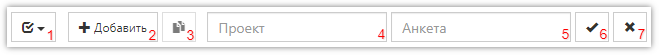

1. Быстрое выделение всех проектов в списке или снятие выделения.
2. Добавление нового проекта.
3. Создание копии одного выделенного проекта.
4. Поле для ввода названия проекта для поиска/фильтрации. Можно указать часть названия или *pkey* из рабочей ссылки.
5. Поле для ввода названия анкеты для поиска/фильтрации. Можно указать часть названия.
6. Кнопка для осуществления поиска/фильтрации по значениям, указанным в предыдущих полях.
7. Кнопка для отмены наложенных на список фильтров.

Сам список проектов выглядит следующим образом:

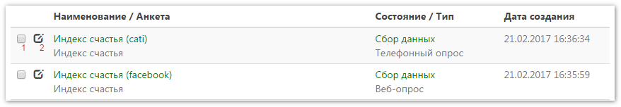

1. Выделение проекта (или нескольких) для выполнения различных операций, которые будут реализованы позже.
2. Открытие редактора свойств проекта.

### Левое меню {: #menu}

Слева от списка находится меню с пунктами для фильтрации проектов по состоянию (см. ниже [свойства проекта](#properties)) и дополнительных возможностей:

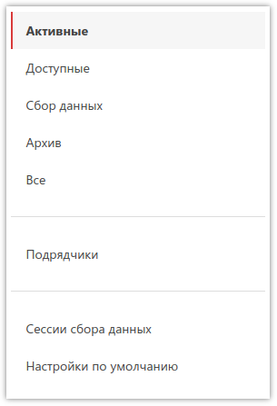

- *Активные* - выводить в списке проектов все проекты, у которых любое состояние, кроме *Архив*. Также сюда не попадают доступные проекты.
- *Доступные* - назначенные вам проекты другим клиентом **SURVEY**STUDIO.
- *Сбор данных* - проекты, у которых состояние *Сбор данных*, кроме доступных.
- *Архив* - проекты, у которых состояние *Архив* - любые проекты, по которым работа завершена.
- *Все* - все проекты, кроме доступных.

Описание остальных пунктов меню - [ниже](#contractors).

## Добавление нового проекта, свойства проекта {: #properties}

Для добавления нового проекта (создание проекта) необходимо нажать кнопку `Добавить` (над таблицей со списком проектов или справа от заголовка раздела). Откроется редактор свойств нового проекта (он же открывается при нажатии кнопки свойств проекта в строке таблицы со списком проектов, для изменения свойств уже существующего проекта):

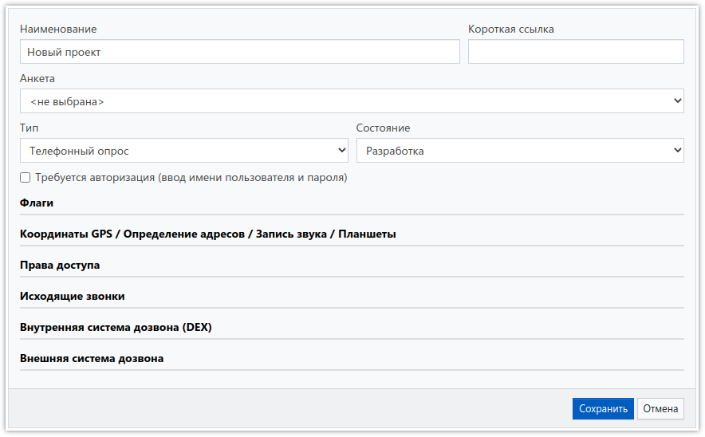

В редакторе свойств проекта необходимо указать следующие параметры:

- *Наименование* 
Наименование проекта.
- *Короткая ссылка* 
Поле для указания псевдонима рабочей ссылки. Указав здесь какое-либо слово, можно получить короткий вариант рабочей ссылки на опрос, если длинная ссылка по каким-то причинам не подходит. Короткая ссылка будет отображаться под основной на странице проекта.
- *Анкета* 
Анкета, по которой будет производиться сбор данных.
- *Тип* 
Тип проекта. Доступны следующие варианты:
    - *Телефонный опрос* 
    Позволяет проводить телефонные интервью в ручном режиме. В проект с этим типом необходимо предварительно загрузить [базы контактов](3005.md) с телефонами респондентов. Во время работы на экране будет выводиться номер телефона, по которому интервьюеру необходимо позвонить и выбрать статус звонка. В случае успешного соединения будет запущена анкета. После завершения анкеты, можно продолжить работу, перейдя к запросу нового контакта.
    - *Веб-опрос* 
    Обычно используется для самостоятельного заполнения анкет респондентами. При переходе по рабочей ссылке сразу будет запущена анкета, а после её завершения - сессия автоматически завершится.
    - *Ввод анкет* 
    Обычно используется для ввода анкет с бумажных носителей. При переходе по рабочей ссылке будет доступна возможность запустить анкету для ввода, а после завершения - запустить ввод следующей анкеты.
    - *Внутренняя система дозвона (DEX)* 
    Позволяет проводить телефонные интервью с помощью [DEX](5000.md), активированного в вашем личном кабинете **SURVEY**STUDIO. Запуск анкеты производится сразу. У этого типа проекта есть возможность продолжения начатой анкеты с прерванного места, если повторно открыть рабочую ссылку для одного и того же контакта.
    - *Внешняя система дозвона* 
    Позволяет проводить телефонные интервью с помощью внешнего [DEX](https://www.siisltd.ru/dex) или другой системы дозвона, передающей в параметре *extPhone* рабочей ссылки номер телефона респондента, по которому уже дозвонились ([подробнее](../faq.md#Q21)). Запуск анкеты производится сразу. У этого типа проекта есть возможность продолжения начатой анкеты с прерванного места, если повторно открыть рабочую ссылку для одного и того же контакта. Также этот тип проекта можно использовать для веб-опросов с индивидуальными для респондентов ссылками и подстановки в анкету информации из базы контактов. Подробнее об этом - [здесь](../articles/1009.md).
    - *Ввод на планшетах* 
    Предусмотрен для личных интервью с помощью [планшетов на Android](../articles/1007.md) без постоянного доступа в интернет. Рабочая ссылка будет работать аналогично *Веб-опросу* - в браузере.
- *Состояние* 
Текущее состояние проекта. Доступны следующие варианты:
    - *Разработка* - проект ещё не запущен в работу, например производится настройка квот, загрузка баз контактов и т.д. Сбор данных в этом режиме запрещен.
    - *Сбор данных* - проект находится в режиме сбора данных.
    - *Обработка* - проект уже завершен, данные собраны и новые добавлять запрещено, но всё ещё принимаются файлы с планшета из полученных ранее интервью. Производится обработка результатов, выгрузка массивов и прочие действия.
    - *Архив* - проект завершен, помещен в архив (не отображается по умолчанию в списке проектов). Сбор данных и приём файлов с планшета запрещены.

Если требуется видеть в [статистике](3002.md) проекта или в массиве, кто проводил интервью, то необходимо включить флаг *Требуется авторизация (ввод имени пользователя и пароля)*, который заставит систему запрашивать имя [пользователя](4000.md) и пароль при попытке начать ввод данных.

### Флаги {: #flags}

В этом разделе можно включить дополнительные опции:

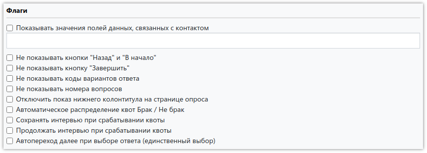

- *Показывать значения полей данных, связанных с контактом* 
Если в базе контактов, кроме номера телефона, есть дополнительные колонки, включение этого флага добавит информацию из них в анкету. В поле под этим флагом можно указать через запятую названия необходимых колонок, если нужно выводить значения только некоторых из них.
- *Не показывать кнопки "Назад" и "В начало"* 
Скрывает в анкете кнопки "Назад" и "В начало".
- *Не показывать кнопку "Завершить"* 
Скрывает в анкете кнопку "Завершить". Не следует скрывать эту кнопку в телефонных опросах, а также при вводе анкет. На неё необходимо нажимать для корректного прерывания интервью.
- *Не показывать коды вариантов ответа* 
Скрывает в анкете все коды ответов, строк и колонок.
- *Не показывать номера вопросов* 
Скрывает номера вопросов анкеты, а также их количество.
- *Отключить показ нижнего колонтитула на странице опроса* 
Скрывает на всех экранах опроса нижний блок, содержащий имя клиента и логотип **SURVEY**STUDIO.
- *Сохранять интервью при срабатывании квоты* 
По умолчанию интервью, превысившее квоту, удаляется. Этим флагом включается сохранение таких интервью.
- *Продолжать интервью при срабатывании квоты* 
Позволяет продолжить интервью, если квота закрыта, то есть полностью отключает проверку квот. Внимание! Без сохранения интервью этот флаг не имеет смысла, так как интервью будет удалено, если сохранение выключено.
- *Автопереход далее при выборе ответа (единственный выбор)* 
Включает автоматический переход к следующему вопросу при выборе ответа в вопросе с единственным выбором.

### Координаты GPS / Определение адресов / Запись звука / Планшеты {: #other}

Здесь можно включить соответствующие возможности **SURVEY**STUDIO:

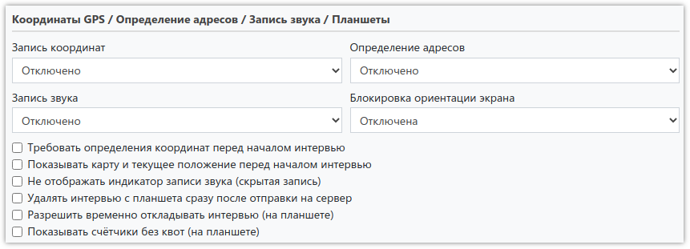

В выпадающих меню *Запись координат*, *Определение адресов* и *Запись звука* доступны следующие варианты:

- Включено.
- Включено для выбранных вопросов.

Если выбран пункт *Включено*, соответствующая опция будет включена для всего интервью в целом, независимо от того, какие флаги установлены в вопросах анкеты. При выборе этого варианта в массив будут добавлены дополнительные колонки с координатами места опроса, адресом (город, улица, дом) опроса или ссылкой на MP3-файл, записанный во время интервью.

Если выбран пункт *Включено для выбранных вопросов*, соответствующая опция будет включена только для тех вопросов анкеты, в которых установлены аналогичные [флаги](1003.md#_5). При выборе этого варианта в массив, рядом с соответствующими вопросами, будут добавлены дополнительные колонки с координатами, адресом или ссылкой на MP3-файл, полученный с планшета.

В выпадающем меню *Блокировка ориентации экрана* можно зафиксировать экран планшета в альбомном или портретном режиме.

Также доступны флаги, влияющие на работу опроса в приложении:

- *Требовать определения координат перед началом интервью* 
Запрещает проведение интервью, если планшет не определил текущие координаты. Определение положения может занимать несколько минут.
- *Показывать карту и текущее положение перед началом интервью* 
Включает карту с отображением текущего местоположения планшета, если также включена запись координат или определение адресов.
- *Не отображать индикатор записи звука (скрытая запись)* 
Скрывает значок микрофона в вопросах анкеты при включённой записи звука.
- *Удалять интервью с планшета сразу после отправки на сервер* 
Заставляет приложение удалять из памяти планшета интервью со всеми файлами сразу же после отправки. При этом статистика по сохранённым данным на экране со списком опросов обнуляется.
- *Разрешить временно откладывать интервью (на планшете)* 
Позволяет отложить на планшете начатое интервью, чтобы заполнить анкету позже.
- *Показывать счётчики без квот (на планшете)* 
По умолчанию в приложении отображаются только счётчики, в которых указано значение квоты. Этот флаг включает показ всех счётчиков.

Координаты будут сохранены, если устройство сможет определить местоположение (по GPS, Wi-Fi, сотовой сети или IP-адресу). Если опрос проходит через браузер - он может запросить разрешение на отправку координат, и в случае отказа, а также если включена функция защиты от отслеживания, координаты сохранены не будут. Это же относится и к определению адресов. Для определения адресов в приложении интернет должен быть доступен всё время.

### Права доступа {: #rights}

Если необходимо как-то переопределить глобальные права доступа к проекту, то здесь нужно указать через запятую названия [групп](4002.md) и/или логины [пользователей](4001.md), которым разрешён или запрещён доступ к проекту:

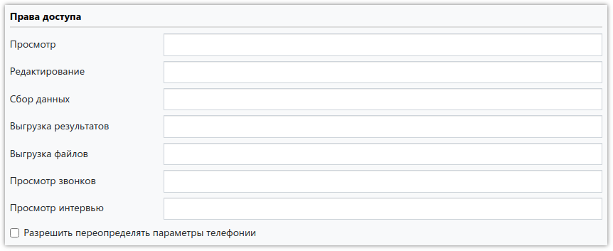

- *Просмотр* - список групп/пользователей, которым разрешён/запрещён только просмотр проекта.
- *Редактирование* - список групп/пользователей, которым разрешено/запрещено вносить изменения в проект.
- *Сбор данных* - список групп/пользователей, которым разрешено/запрещено проводить интервью (заполнять анкету).
- *Выгрузка результатов* - список групп/пользователей, которым разрешено/запрещено выгружать массив с ответами. Чтобы группа/пользователь могли выгружать результаты, у них также должно быть право на просмотр проекта.
- *Выгрузка файлов* - список групп/пользователей, которым разрешено/запрещено выгружать аудиозаписи, фотографии и подписи респондентов. Чтобы группа/пользователь могли выгружать результаты, у них также должно быть право на просмотр проекта.
- *Просмотр звонков* - список групп/пользователей, которым разрешено/запрещено просматривать совершённые звонки в DEX.
- *Просмотр интервью* - список групп/пользователей, которым разрешено/запрещено просматривать ответы в интервью, проведённых с помощью DEX.

Восклицательный знак перед названием/логином означает, что доступ запрещён. Если восклицательного знака нет - доступ разрешён.

Флаг *Разрешить переопределять параметры телефонии* даёт право подрядчикам, которым вы назначили проект, менять некоторые параметры в разделе [Внутренняя система дозвона (DEX)](#dex).

### Исходящие звонки {: #calls}

В этом блоке задаются параметры для телефонных проектов:

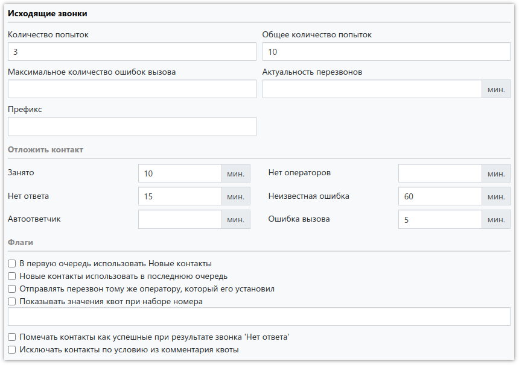

- *Количество попыток* 
Максимальное количество безуспешных попыток дозвона по контакту. При достижении установленного количества контакт будет исключён из очереди. При успешном дозвоне счётчик попыток сбрасывается, но в случае установки перезвона, счётчик снова будет накапливать значение до максимального или до успешного дозвона.
- *Максимальное количество ошибок вызова* 
При ошибке вызова счётчик попыток не увеличивается. Цель этого параметра - ограничить бесконечное откладывание контакта при таком статусе звонка. При достижении указанного количества ошибок подряд, контакт будет исключён.
- *Префикс* 
Поле для указания значения, которое будет добавляться перед номером телефона в ссылки, открывающиеся при нажатии на кнопки *SIP* и *Skype* на странице *Набор номера*.
- *Общее количество попыток* 
Максимальное количество всех попыток дозвона. При достижении установленного количества контакт будет исключён из очереди. Счётчик попыток никогда не сбрасывается. Цель этого значения - ограничить бесконечную установку перезвонов. В некоторых проектах лучше ставить значение побольше, чтобы не исключился важный контакт.
- *Актуальность перезвонов* 
Время в минутах, в течение которого необходимо осуществить перезвон. Например, если перезвон установлен на 20:00, а актуальность установлена в 60 минут, то этот перезвон будет отдан оператору при запросе контакта в период с 20:00 до 21:00. Если за этот час никто контакт не запросит, он будет автоматически отложен на сутки. Если актуальность не задана, то перезвон придёт в любое время после указанного при установке перезвона, даже если пройдёт, например, неделя.
- В полях *Отложить контакт* указывается время в минутах, на которое необходимо отложить контакт для соответствующих статусов звонка.

- *Флаги* 
Дополнительно можно включить следующие опции:
    - *В первую очередь использовать Новые контакты* - выводить только новые контакты, пока они есть в базе контактов. Если новых нет - брать доступные - по которым уже звонили. Но если были установлены перезвоны, то они будут обрабатываться в первую очередь.
    - *Новые контакты использовать в последнюю очередь* - выводить сначала контакты, по которым уже звонили. Если таких нет - брать новые.
    - *Отправлять перезвон тому же оператору, который его установил* - контакт будет доступен только оператору, установившему в нём перезвон.
    - *Показывать значения квот при наборе номера* позволяет выводить значения счётчиков, у которых задана квота (указано допустимое количество интервью). В поле ниже можно указать значение, по которому будут отбираться счётчики. Например, если написать *Q3*, будут выведены все счётчики-квоты, в условиях которых есть Q3.
    - *Помечать контакты как успешные при результате звонка 'Нет ответа'* - (DEX, описание в разработке.)
    - *Исключать контакты по условию из комментария квоты* - после закрытия квоты во всех базах контактов будут исключаться контакты, которые подпадают под условие, указанное в поле *Комментарий* [счётчика](3003.md). Флаг временно работает только с внешним DEX.

### Внутренняя система дозвона (DEX) {: #dex}

Описание раздела в разработке.

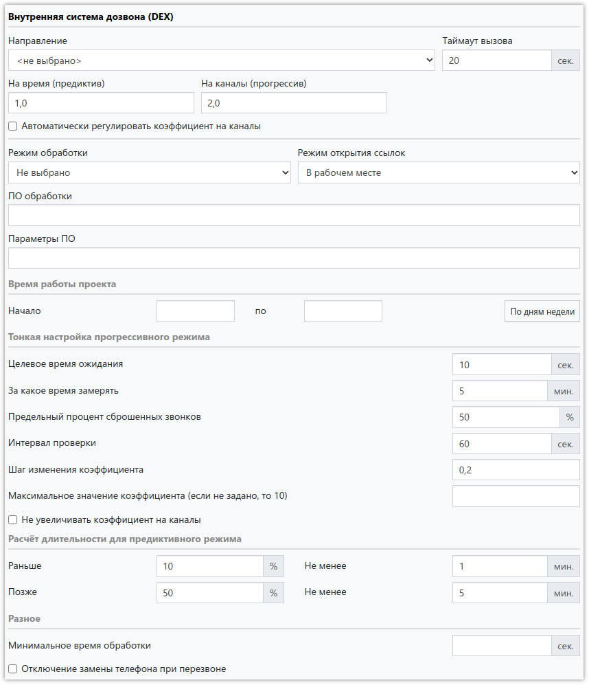

### Внешняя система дозвона {: #extdialer}

Если тип проекта - *Внешняя система дозвона* и указана ссылка на проект внешнего DEX, то при соответствующих настройках [счётчиков](3003.md) проекта **SURVEY**STUDIO сможет отключать базы контактов после закрытия квоты и исключать определённые контакты из всех баз.

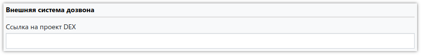

 Чтобы исключение контактов работало, необходимо в разделе *Исходящие звонки* поставить флаг *Исключать контакты по условию из комментария квоты*.

## Подрядчики {: #contractors}

Подрядчик - любой другой пользователь системы **SURVEY**STUDIO, которого можно привлечь к помощи по сбору данных в ваши проекты. [Назначать на проекты](3010.md) можно только тех подрядчиков, которые добавлены в этом разделе.

Для просмотра или изменения подрядчиков, перейдите в раздел *Подрядчики* через [левое меню](#menu) списка проектов.

Добавить нового подрядчика очень просто: укажите в поле идентификатор клиента (тот же, что указывается при входе в **SURVEY**STUDIO) и нажмите *Добавить*. При необходимости можно поменять название подрядчика, присвоить ему числовой код и указать регион нахождения. Для этого нужно щёлкнуть на строку таблицы:

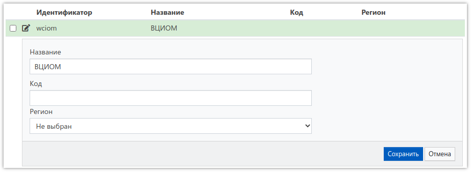

## Сессии сбора данных {: #sessions}

Описание раздела в разработке.

## Настройки по умолчанию {: #settings}

Для проектов с типом *Внутренняя система дозвона (DEX)* можно указать настройки, которые будут использоваться при создании каждого нового проекта. Это делается в разделе *Настройки по умолчанию*, который открывается через [левое меню](#menu) списка проектов:

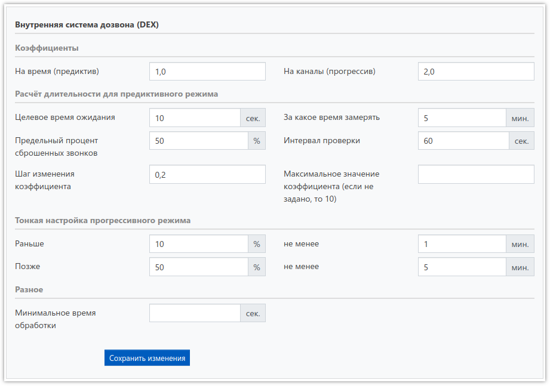
