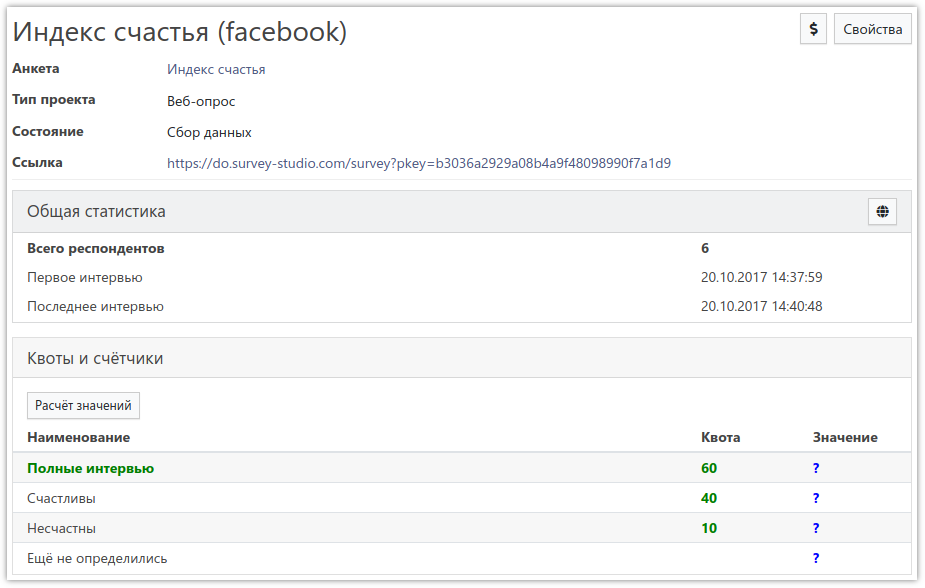
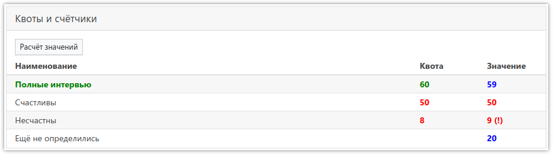

# Статистика проекта

## Общая статистика

При входе в проект всегда открывается раздел *Статистика*:

На этой странице отображается общая информация о проекте, а также указана *рабочая ссылка*, которую необходимо использовать для сбора данных:

В таблице *Общая статистика* есть несколько внутренних показателей, включающих в себя:

- *Всего респондентов* - общее число респондентов, интервью которых сохранены в проекте. Этот показатель учитывает интервью, даже если в них нет ответа ни на один вопрос.
- *Первое интервью* - дата и время сохранения в проект первого интервью.
- *Последнее интервью* - дата и время сохранения в проект последнего интервью.

В таблице *Квоты и счётчики* указаны все квоты и счётчики, заданные в проекте. Значения счётчиков в любой момент можно рассчитать, нажав кнопку `Расчёт значений`. Эта же кнопка обновляет и общую статистику.

При расчёте значений счётчиков, если для них заданы квоты - значения будут отображаться по-разному, в зависимости от степени заполнения квоты:

Подробнее познакомиться со счётчиками и квотами можно в разделе [Счётчики и квоты](3003.md).

Иногда бывает необходимо показать статистику заказчику или другому лицу, не имеющему доступ в личный кабинет. Для этого есть кнопка с изображением земного шара, расположенная в правой части заголовка таблицы *Общая статистика*. При нажатии на неё открывается страница со статистикой, которая доступна без входа в личный кабинет - ссылку на неё можно давать всем желающим.

Статистика может обновляться с задержкой. Чаще всего это заметно в веб-опросах, когда респондент, не дойдя до логического завершения анкеты (не появился прощальный текст), просто закрывает браузер. Так как интервью не завершено, оно не сохраняется в общую базу данных ответов и, соответственно, не учитывается в статистике. В течение 3-х часов можно вернуться и дозаполнить анкету. Если этого не произошло, через 3 часа сессия завершится автоматически и интервью сохранится, после чего учтётся в счётчиках и общей статистике.

## Статистика операторов

Для телефонных опросов предусмотрена статистика по операторам. Она доступна в соответствующих подразделах:

- *Операторы / Счётчики* 
Статистика работы операторов. Можно узнать количество сделанных операторами интервью по определённому счётчику за определённый период времени. Здесь тоже доступна кнопка с изображением земного шара, позволяющая предоставить доступ к этой статистике без входа в личный кабинет.
- *Операторы / Интервью* 
Эффективность работы операторов. Здесь можно узнать количество совершённых звонков каждым оператором, общее количество проведённых интервью и количество интервью, подпадающих под условие выбранного счётчика, а также можно оценить качество базы контактов и эффективность работы операторов.
- *Операторы / Время* 
Время работы операторов. Можно посмотреть сколько рабочего времени затратил каждый оператор за определённый промежуток времени.

## Финансы по проекту

Нажав кнопку `$`, расположенную в верхнем правом углу страницы (рядом с кнопкой `Свойства`), можно перейти в раздел *Финансы*, где будут показаны [все списания](6000.md#_4) по этому проекту, а также общая сумма расходов. При необходимости в форме фильтра можно задать интересующий период времени.
