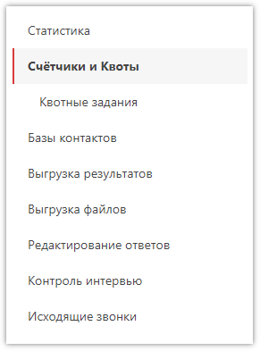
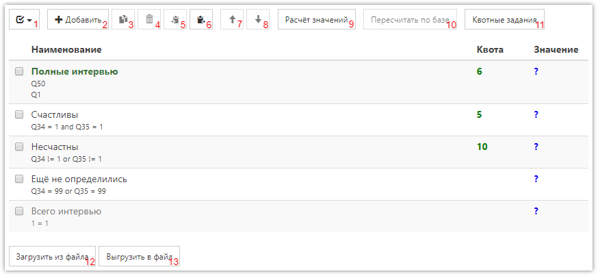
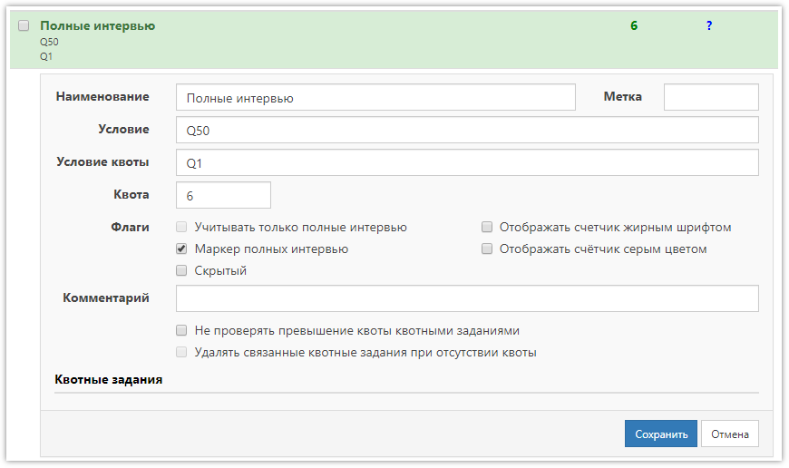
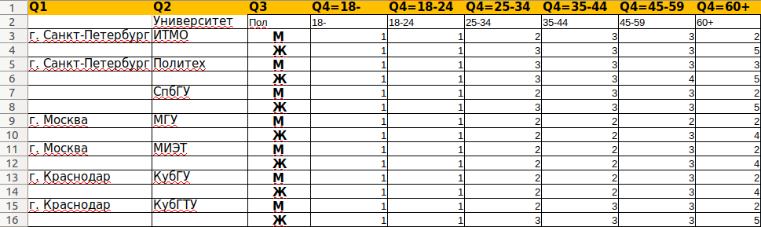
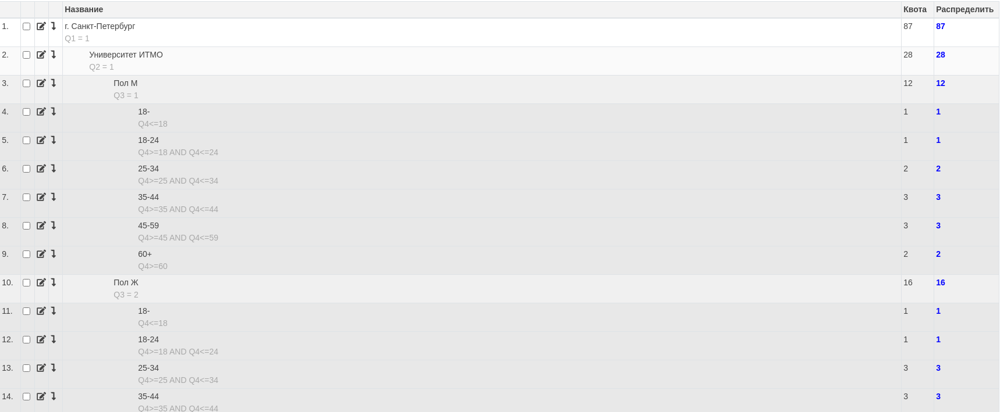

# Счётчики и квоты

*Счётчики* - это средство подсчёта собранных интервью по произвольному условию в реальном времени. Также, любой счётчик может являться *квотой*, если у него задано значение квоты.

*Квота* - это максимальное количество сохраненных интервью, подходящих под указанное в счётчике условие. Учёт квот производится автоматически во время заполнения анкеты. Как только будут получены ответы на все вопросы, которые указаны в условии счётчика, а также если текущие ответы удовлетворяют этому условию - будет проверена квота (сколько уже есть сохраненных интервью в проекте), и если сохранение текущего интервью приведет к переполнению квоты - произойдет автоматическое завершение, без сохранения интервью в проект (это поведение [можно изменить](../faq.md#Q5), при необходимости).

Для работы со счётчиками в проекте, необходимо выбрать соответствующий раздел в меню проекта:

Счётчики отображаются в таблице с возможностью редактирования каждой строки (для этого необходимо кликнуть по строке):

1. Быстрое выделение всех счётчиков, или снятие выделения.
2. Добавление нового счётчика в проект.
3. Создание копий (добавление в конец) выделенных счётчиков.
4. Удаление выделенных счётчиков.
5. Копирование выделенных счётчиков в буфер обмена.
6. Добавление счётчиков из буфера обмена (позволяет добавить счётчики, скопированные в буфер обмена в другом проекте).
7. Перемещение выделенных счётчиков на один шаг вверх.
8. Перемещение выделенных счётчиков на один шаг вниз.
9. Расчёт значений всех счётчиков.
10. Пересчёт счётчиков по базе ответов. Используется после [редактирования ответов](3006.md) в сохранённых интервью.
11. Деление квот между пользователями. Подробнее - [ниже](#_3).
12. Переход к форме загрузки счётчиков из файла. Описание формата файла находится в самой форме.
13. Выгрузить все счётчики в Excel-файл. Описание формата файла находится в форме загрузки счётчиков из файла.

В таблице со списком счётчиков отображаются следующие колонки:

- *Наименование* 
Наименование счётчика, может быть любым. Значение в этой колонке выделяется цветом, который зависит от установленных флагов или возникшей проблемы:
    - Наименование - счётчик является маркером полных интервью. Такой счётчик в проекте может быть только один.
    - Наименование - обычный счётчик, считает все интервью, согласно заданного условия.
    - Наименование - скрытый счётчик (не отображается на странице общей статистики проекта).
    - Наименование - счётчик отключён, потому что время расчёта значения по его условию превысило 30 секунд. Необходимо упростить условие.
- *Квота* 
Значение квоты для счётчика (максимально допустимое количество интервью).
- *Значение* 
Рассчитанное значение счётчика (текущее количество интервью в массиве).

[comment]: <> (- Наименование - счётчик учитывает только полные интервью при проверке условий, при этом полные интервью задаются счётчиком с включенным флагом *Маркер полных интервью*.)

## Добавление счётчика

При добавлении нового счётчика или при редактировании существующего используется следующая форма:

- *Наименование* – желаемое наименование счётчика.
- *Метка* – значение, используемое совместно с [базами контактов](3005.md) в телефонных опросах. В качестве метки может быть любое число или слово, главное - чтобы метки счётчика и базы совпадали. Когда на экране появится сообщение о том, что достигнут лимит по квоте, базы контактов с такими же метками будут отключены. Для отключения баз в во внешнем DEX нужно указать ссылку на проект [в соответствующем разделе](3001.md#extdialer) свойств проекта.
- *Условие* – основное условие, используемое для подсчета подходящих интервью (учитывает только уже сохраненные в базе интервью). Описание синтаксиса выражений можно найти [здесь](1006.md).
- *Условие квоты* – дополнительное условие (может отсутствовать, при этом будет использоваться основное), используемое для проверки, подходит ли интервью для этого счётчика, когда оно ещё не сохранено в базу, т.е. во время заполнения анкеты.
- *Квота* – числовое значение, при указании которого будет включен механизм автоматической проверки при заполнении анкеты, и если сохранение анкеты приведет к переполнению квоты – интервью завершится и в базу не сохранится (по умолчанию).

Также у счётчика можно установить флаги:

- *Учитывать только полные интервью [4]* (пока не реализовано) 
При включении этого флага, основное условие будет автоматически дополнено условием из счетчика, у которого установлен флаг *Маркер полных интервью*.
- *Маркер полных интервью [2]* 
При включении этого флага, условие счётчика определяет - какое интервью является полным (т.е. именно тем, которое Вас интересует и будет выгружено в итоговом массиве). Такой счётчик в проекте может быть только один.
- *Скрытый [1]* 
При включении этого флага счётчик не будет отображаться на странице с общей статистикой проекта.
- *Отображать счетчик жирным шрифтом [16]* 
Делает шрифт названия счётчика жирным.
- *Отображать счётчик серым цветом [32]* 
Делает цвет шрифта названия счётчика серым.

В квадратных скобках указаны коды флагов, которые можно добавлять в 6-й столбец файла со счётчиками. Если требуется установить несколько флагов одному счётчику, то необходимо указывать сумму их чисел. Например, для установки флагов *Скрытый* и *Отображать счётчик жирным шрифтом* нужно указать число 17.

Поле *Комментарий* используется для указания любого комментария. Если в свойствах проекта включён флаг *Исключать контакты по условию из комментария квоты*, то в этом поле можно указать условие для исключения контактов в формате `Имя поля базы контактов = Значение`. Например, `Группа = А, Пол = М`. То есть при появлении сообщения о том, что достигнут лимит по квоте, во всех базах будут исключены контакты, у которых в поле «Группа» значение «А» и одновременно в поле «Пол» значение «М».
Если в имени поля или в значении есть запятая, то их нужно брать в кавычки: `"Группа, подгруппа" = А`. Данная функция пока доступна только для внешнего DEX.

Подробнее об использовании счётчиков и квотах можно почитать [в статье](../articles/1006.md).

## Расширенный редактор

Это новый инструмент работы с квотами и счётчиками, который позволяет создавать и редактировать счётчики/квоты, организовывать их в иерархию, а также назначать квоты конкретным подрядчикам и пользователям (операторам/интервьюерам).

### Импорт квот

Редактор позволяет загружать иерархичные квоты из файла. Поддерживаются файлы в формате `*.xls` и `*.xlsx`. Пример файла представлен на рисунке ниже: 

Файл должен соответствовать следующим требованиям:

- Все данные располагаются на первом листе.
- Строки 1 и 2 - служебные с метаданными, необходимыми для построения счётчиков. Остальные строки начиная с 3 - строки с данными (ответ на вопрос либо значение квоты).
- В ячейках строки 1 должны быть номера вопроса в формате `Q{Number}`. Если после номера вопроса есть знак равенства, то в условие счётчика/квоты будет подставлено выражение после знака. Если после вопроса есть скбоки, то все внутри них будет считаться выражением. Если равенства и скобок нет, то ответом на вопрос считается значение из ячейки с данными (г. Санкт-Петербург, пол М). 
- В ячейках строки 2 опционально могут находиться префиксы для название счётчиков. Если префикс пустой, то в качестве названия будет использоваться значение из ячейки с данными.
- Если в ячейке с номером вопроса есть условие, значит, в ячейке данных находится значение квоты, если нет, то вариант ответа из списка ответов. 
  > Список ответов, вопросы и сама анкета должны быть созданы до импорт квот.
- Если в ячейке ничего не указано (как, например, в 4 строке), то будет взято значение из предыдушей строки (в нашем примере из строки 3).
 
> Не допускается наличие в файле строк ИТОГО для подсчета значения квот, т.к. импорт такого файла может быть некорректным.

Если в условии используются скобки, то можно написать детальное условие квоты:

- `Q1(valueNum=5 OR valueNum=4)`
- `Q1(valueTxt=text)`
- `Q1(code=>3 AND code<=6)` 

Если скобок нет, но есь знак равенства, то к таким условиям предъявляются дополнительные требования:

- Условием считается всё, что находится правее знака `=` в ячейке с вопросом.
- Условие должны быть простыми, без логических операций `И` или `ИЛИ`.
- Если знака равенства нет, то значение будет найдено среди ответов на указнный вопрос. Поиск ведется по точному соответствию.
- Возможны указания списков значений:

    - `{min}-{max}` (например, `18-24`) - диапазон значений. Будет сгенерировано условие `Q{Number} >= {min} AND Q{Number} <= {max}`
    - `{value}+` (например, `60+`) - ответ на вопрос больше либо равен указанному значению. Будет сгенерировано условие `Q{Number} >= {value}`
    - `{value}-` (например, `18-`) - ответ на вопрос меньше либо равен указанному значению. Будет сгенерировано условие `Q{Number} <= {value}`
    - `{value1},{value2}` (например, `1,2`) - ответ на вопрос равен любому значению из списка, в качестве разделителя используется запятая (`,`). Будет сгенерировано условие `Q{Number} = {value1} OR Q{Number} = {value2}`
- Указанные списки значения работают только для текстовых, числовых вопросов и вопросов с единственным выбором ответа.

Для расмотренного примера файла иерархия квот будет выглядеть следующим образом:

