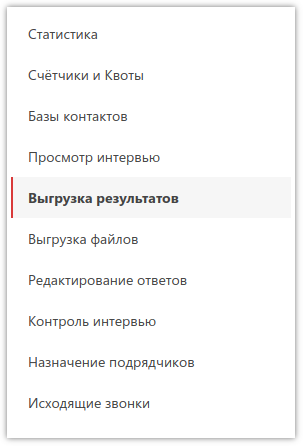
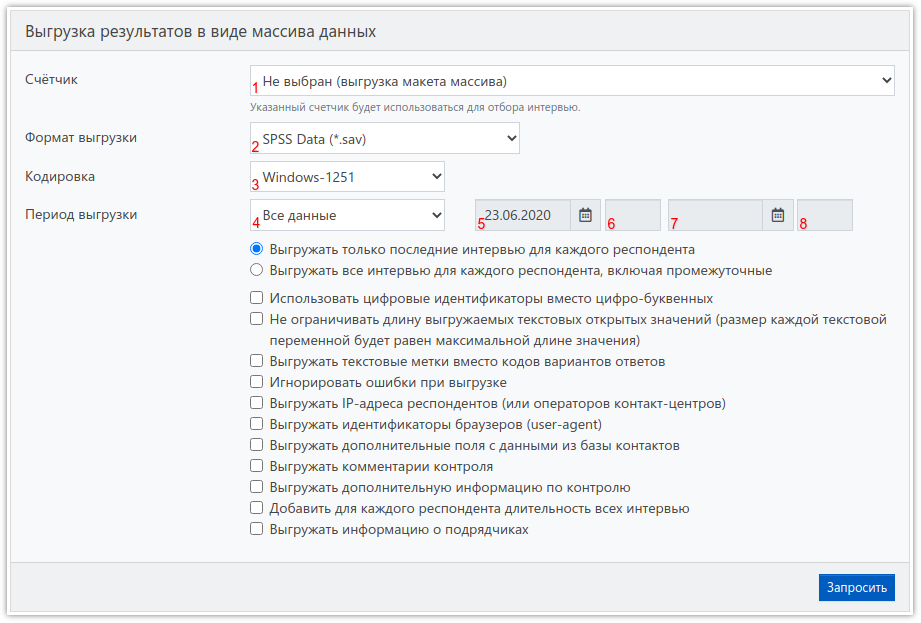
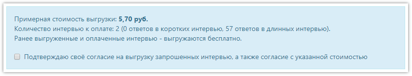
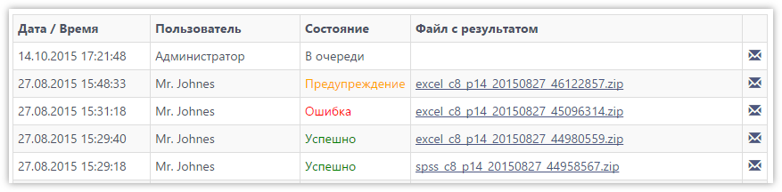
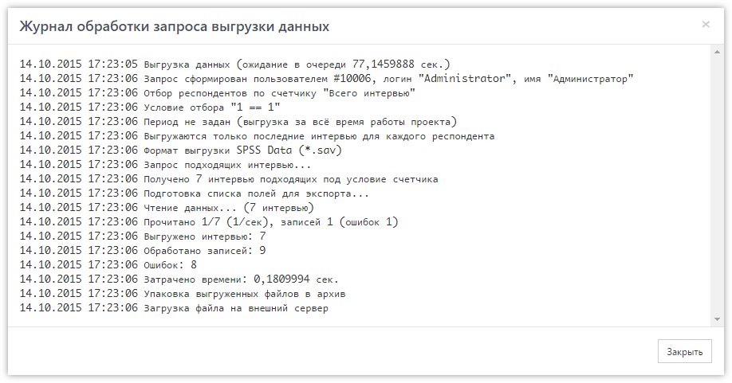

# Выгрузка результатов

## Запрос массива

Собранные в проекте данные всегда можно анализировать встроенными средствами **SURVEY**STUDIO, но обычно необходимо получить интервью в виде массива данных в удобном для последующей обработки формате. Для выгрузки массива необходимо зайти в соответствующий раздел в проекте:

Здесь расположена форма для запроса массива, а также список всех предыдущих запросов выгрузки с результатами. Форма запроса выгрузки выглядит следующим образом:

1. Счётчик, по которому будет производиться отбор интервью для выгрузки. Если счётчик не указан - будет выгружен пустой массив (макет).
2. Формат выгрузки массива. Доступны следующие варианты:
    - *SPSS Data (*.sav)* - формат [IBM SPSS Statistics](https://www.ibm.com/ru-ru/analytics/spss-statistics-software).
    - *Excel (*.xlsx)* - формат Microsoft Excel версии 2007 и новее.
    - *Excel (*.xls)* - формат Microsoft Excel старых версий (до 2003 включительно).
    - *Text (*.csv)* - универсальный текстовый формат [CSV](https://ru.wikipedia.org/wiki/CSV).
3. Кодировка файла SPSS. По умолчанию *Windows-1251*, можно выбрать *UTF8*.
4. Период выгрузки. Доступны следующие варианты:
    - *Все данные* - выгружаются все данные с самого начала проекта.
    - *За сегодня* - выгружаются интервью, дата начала которых - сегодня.
    - *За вчера* - выгружаются интервью, дата начала которых - вчера.
    - *За дату* - выгружаются интервью в указанную дату начала.
    - *За период* - выгружаются интервью, начатые в течение указанного периода.
5. Дата начала периода.
6. Время начала периода.
7. Дата окончания периода.
8. Время окончания периода.

Также можно установить флаги:

- *Выгружать только последние интервью для каждого респондента* 
Для каждого респондента (контакта) в базе может быть сохранено несколько версий одного и того же интервью. Например, это происходит в телефонных опросах, когда респондент просит перезвонить в другое время, в результате сохраняется интервью в текущем состоянии, а позже, когда наступит заданное время, интервью продолжается с прерванного места и в случае завершения - записывается в базу уже полностью как новое (отдельное). Этот флаг установлен по умолчанию и заставляет систему выгружать только последние версии интервью для каждого респондента.
- *Выгружать все интервью для каждого респондента, включая промежуточные* 
При выборе этого варианта выгрузки - будут выгружены все интервью для каждого респондента. Необходимо учитывать, что в оплату попадет каждое выгруженное интервью.
- *Использовать цифровые идентификаторы вместо цифро-буквенных* 
По умолчанию ID респондентов выгружаются в виде шестнадцатеричного числа (цифры + буквы) в текстовое поле. Этот флаг преобразует ID в десятичный вид. При этом числа помещаются в числовое поле в SPSS и в текстовое - в Excel, так как он не поддерживает более 15-ти цифр в числовом поле.
- *Не ограничивать длину выгружаемых текстовых открытых значений (размер каждой текстовой переменной будет равен максимальной длине значения)* 
Включение этого флага заставляет отключить ограничение в 255 символов для выгружаемых открытых текстовых значений.
- *Выгружать текстовые метки вместо кодов вариантов ответов* 
При выгрузке в Excel/CSV включение этого флага заставит выгружать вместо кодов вариантов ответа - текст выбранных вариантов ответа.
- *Игнорировать ошибки при выгрузке* 
Включение этого флага позволяет игнорировать ошибки, которые могут возникнуть при выгрузке, если, например, в анкете были удалены вопросы или варианты ответа, на которые уже есть ответы в базе данных, и их некуда записать в массив.
- *Выгружать IP-адреса респондентов (или операторов контакт-центров)* 
Добавляет в массив столбец с IP-адресами пользователей, заполнивших анкеты.
- *Выгружать идентификаторы браузеров (user-agent)* 
Добавляет в массив столбец с User Agent браузеров или планшетов пользователей, заполнивших анкеты.
- *Выгружать дополнительные поля с данными из базы контактов* 
Если в базе контактов, кроме номера телефона, есть дополнительная информация, включение этого флага добавит её в массив.
- *Выгружать комментарии контроля* 
Добавляет текст из поля «Комментарий», записанный во время контроля интервью.
- *Выгружать дополнительную информацию по контролю* 
Добавляет столбцы с информацией о пользователе, производившем контроль интервью, а также дату и время контроля и его длительность.
- *Добавить для каждого респондента длительность всех интервью* 
В массиве содержится информация о дате, времени и длительности последней версии интервью с респондентом (контактом). Включение этого флага добавляет столбцы с информацией о количестве версий и общей длительности всех интервью для респондента, так как при перезвонах интервью может прерываться и продолжаться неограниченное количество раз.
- *Выгружать информацию о подрядчиках* 
Добавляет колонки с названием и кодом подрядчика.

После отправки запроса на выгрузку массива, в случае если в выгрузку попадут новые интервью (которые ранее не выгружались), будет запрошено подтверждение выгрузки с указанием стоимости:

После согласия с указанной стоимостью, запрос будет добавлен в очередь на обработку, и его состояние (обновляется автоматически) можно посмотреть в таблице:

У каждого запроса отображается его состояние:

- В очереди - запрос ожидает обработки.
- Обработка - запрос находится в процессе обработки.
- Успешно - запрос успешно обработан, без ошибок.
- Ошибка - при обработке запроса были обнаружены ошибки, и выгрузка не была произведена. Подробнее об ошибках выгрузки можно почитать <a href="#_3">ниже</a>.
- Предупреждение - запрос обработан, но при этом были обнаружены ошибки (такое возможно, если включен флаг <i>Игнорировать ошибки при выгрузке</i>).

У каждого запроса можно посмотреть детальный журнал выгрузки, открывающийся после нажатия кнопки с изображением конверта, с указанием ошибок и прочих данных:
{: #log}

Файлы с выгруженными массивами хранятся на сервере неограниченное время и всегда могут быть загружены повторно.

## Колонки массива

Помимо ответов на вопросы анкеты, любой массив содержит стандартные данные:

- *ID* - идентификатор респондента.
- *UserID* - идентификатор пользователя, который провёл интервью.
- *UserName* - имя пользователя.
- *UserLgIn* - логин пользователя.
- *IVDate1* - дата и время начала интервью.
- *IVDate2* - дата и время окончания интервью.
- *IVDur* - длительность интервью в секундах. В телефонных опросах здесь будет указана длительность последнего интервью (из-за перезвонов их может быть несколько).
- *Phone* - номер телефона респондента (если проект телефонный).

При выгрузке массива с некоторыми флагами или установленными параметрами в свойствах проекта также будут добавлены:

- *ExtID* - идентификатор контакта, полученный от внешней системы дозвона (из параметра *extid* рабочей ссылки).
- *ContractorName* - название подрядчика, который провёл интервью.
- *ContractorCode* - код подрядчика (если присвоен ему).
- *IVDurAll* - общая длительность всех интервью респондента.
- *IVCnt* - общее количество интервью респондента.
- *IPAddress* - IP-адрес респондента или оператора.
- *UserAgent* - User Agent браузера или Android-приложения.
- *IVREC* - ссылка на аудиозапись с планшета. Если включена запись отдельных вопросов, а не всего интервью, аналогичные столбцы с названиями вида *ВОПРОС_REC* (Q21_REC) будут находиться после столбцов с ответами на эти вопросы.
- *IVLAT* и *IVLONG*, а также *ВОПРОС_LAT* и *ВОПРОС_LONG* - широта и долгота - GPS-координаты места опроса.
- *IVADDR*, а также *ВОПРОС_ADDR* - автоматически определённый по GPS адрес места опроса.
- *VComment* - комментарии, оставленные проверяющим во время контроля интервью.
- *VUserName* - имя пользователя, проводившего контроль интервью.
- *VUserLogin* - логин пользователя, проводившего контроль интервью.
- *VStarted* - дата и время начала проведения контроля.
- *VEnded* - дата и время окончания проведения контроля.
- *VDuration* - длительность контроля в секундах.
- *ВОПРОС_IMG1, ВОПРОС_IMG2..., ВОПРОС_SIGN* - прикреплённые к вопросу фотографии или подписи. Например, Q9_IMG1, Q9_IMG2, Q9_IMG3, Q86_SIGN.

## Возможные ошибки выгрузки и способы их исправления

Если состояние выгрузки массива *Ошибка*, нужно сразу смотреть [журнал](#log). Обычно там есть сообщение о причине ошибки. Если сообщения нет – смотрите последний абзац.

> Ошибка при подготовке списка полей массива для вопроса QXXX: Колонка с именем "X" уже существует в массиве
>
> Ошибка при подготовке списка полей массива для вопроса QXXX: Недопустимое имя переменной "X" для вопроса QXXX
>
> Ошибка при подготовке списка полей массива для вопроса QXXX: Индекс (отсчитываемый от нуля) должен быть больше или равен нулю, но меньше размера списка аргументов
>
> Ошибка при подготовке списка полей массива для вопроса QXXX: Input string was not in a correct format
>
> Ошибка при создании переменной X
>
> SPSS function spssSetVarName for X returned error code SPSS_INVALID_VARNAME

Все эти сообщения говорят о проблеме в имени переменной указанного вопроса. Нужно прочитать [статью](../articles/1005.md) и исправить ошибку или удалить некорректное имя. Также можно попробовать воспользоваться [этим скриптом](2999.md#S31).

> Для выгрузки в Excel (*.xls) максимально допустимое количество колонок - 256

При запросе массива был выбран формат **.xls*, который не поддерживает больше 256 столбцов, а в выгружаемом массиве их больше, поэтому нужно выбрать другой формат.

> Ошибка при подготовке списка полей массива для вопроса QXXX: Элемент с тем же ключом уже был добавлен

Это очень редкая ошибка, и связана она с выгрузкой ответов вопроса с множественным выбором в альтернативном [режиме](images/1001_img_006.png), если у одного из ответов есть код *0*. В этом режиме код выбранного ответа записывается в своё поле, а если ответ не выбран, ставится ноль. И если у варианта ответа код *0*, то получается наложение: ноль означает, что ответ не выбран, и одновременно ноль – это выбранный ответ. Поэтому такие вопросы нужно выгружать в другом режиме.

Есть случай, когда в журнале нет сообщения о причине ошибки и при этом доступен для скачивания текстовый файл. Чаще всего это означает, что после начала сбора данных, в анкету были внесены [недопустимые исправления](3000.md#rules). Реже – через *Редактирование ответов* добавили ответы, которых не может быть в анкете. В файле содержится информация об ответах, которые невозможно добавить в массив. В большинстве случаев, можно просто выгрузить массив с потерей этих ответов. Для этого нужно в форме запроса массива поставить флаг *Игнорировать ошибки при выгрузке*. При этом успешно выгруженный массив будет иметь состояние *Предупреждение*. Если потеря этих ответов недопустима - необходимо привести анкету к исходному виду либо внести правки через [Редактирование ответов](3006.md).
