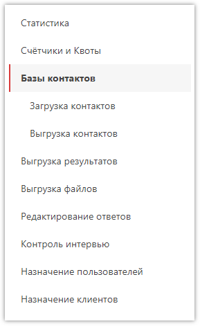
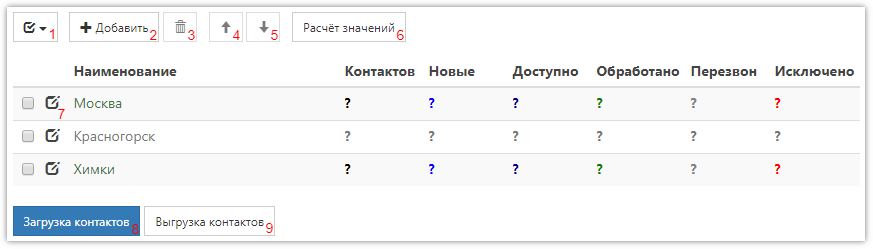
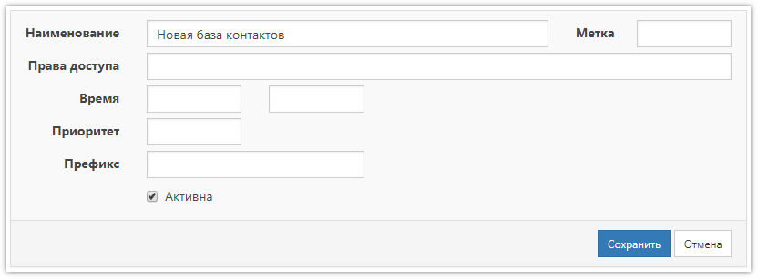
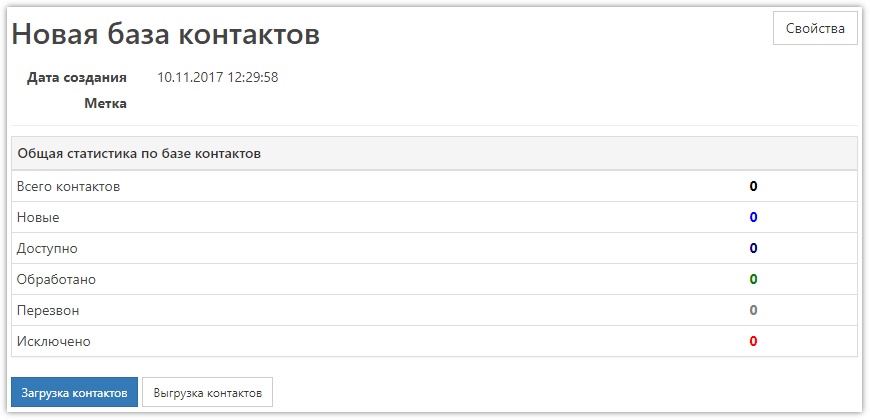
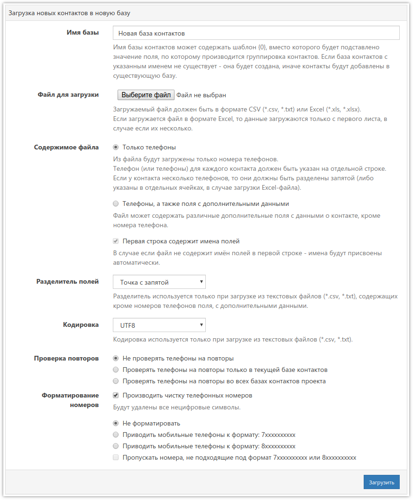
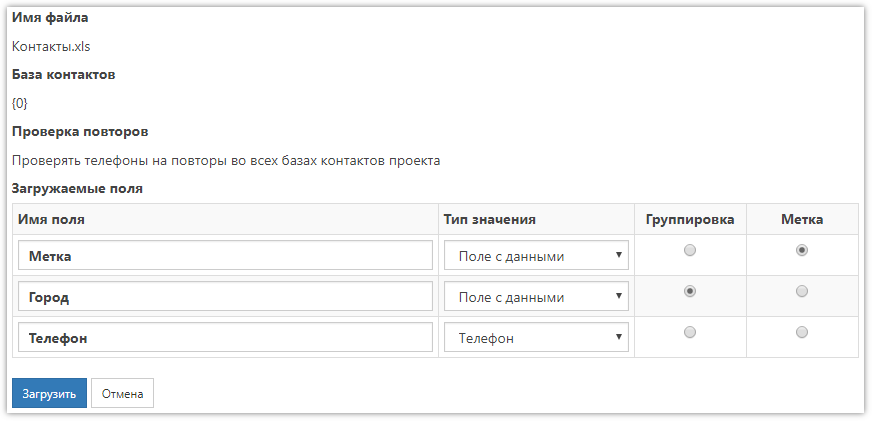
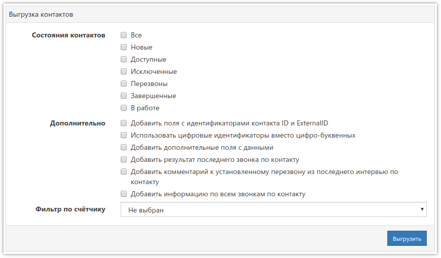

# Базы контактов

Для проведения телефонных опросов в проект должна быть загружена база номеров телефонов, по которым будут совершаться звонки. Кроме телефонов, базы контактов могут содержать другие необходимые для опроса данные, например имя респондента, название компании и прочее. Для управления базами контактов нужно перейти в соответствующий раздел проекта:

Созданные базы контактов отображаются в виде таблицы:

1. Быстрое выделение всех баз или снятие выделения.
2. Добавление новой базы контактов.
3. Удаление выделенных баз. Удаление возможно только тех баз, по которым не было звонков. Если звонки были – база удаляется из списка, но остаётся на сервере.
4. Перемещение выделенных баз на один шаг вверх.
5. Перемещение выделенных баз на один шаг вниз.
6. Расчёт значений по всем базам контактов.
7. Открытие свойств базы. Эта же форма используется при создании новой базы контактов.
8. Загрузка контактов с одновременным созданием новой базы. Эта же форма открывается из подраздела меню слева.
9. Выгрузка контактов из всех баз. Эта же форма открывается из подраздела меню слева.

В таблице со списком баз есть следующие колонки:

- *Наименование* 
Наименование базы контактов. Текст в этой колонке выделяется цветом, который зависит от состояния базы:
    - Наименование - база активна, контакты подаются в работу.
    - Наименование - база неактивна, то есть в её свойствах отключён флаг *Активна*. Контакты не попадают к операторам.
    - Наименование - база временно неактивна, потому что в её свойствах указан период активности. Контакты подаются в работу только в указанный промежуток времени.
- *Контактов* 
Общее количество контактов в базе.
- *Новые* 
Количество контактов, по которым ещё не осуществлялись звонки.
- *Доступно* 
Количество контактов, находящихся в работе, то есть тех, по которым ещё нет окончательного результата: проведено интервью, получен отказ, достигнуто максимальное количество попыток дозвона, установлен перезвон.
- *Обработано* 
Количество контактов, по которым работа завершена: проведено интервью или получен отказ.
- *Перезвон* 
Количество контактов, у которых установлен перезвон на определённое время.
- *Исключено* 
Количество контактов, по которым не удалось дозвониться, то есть достигнуто максимальное количество попыток дозвона, установленное [в свойствах проекта](3001.md#calls), или выбран статус «Неверный номер».

При добавлении новой базы контактов или при открытии свойств существующей используется следующая форма:

- *Наименование* 
Желаемое название базы, может быть любым. Поле обязательно для заполнения.
- *Метка* 
Используется совместно [со счётчиками](3003.md) для автоматического отключения базы контактов при заполнении квоты. В качестве метки можно использовать любое число или слово, главное - чтобы метки базы и счётчика совпадали. Когда на экране появится сообщение о том, что достигнут лимит по квоте, база контактов с такой же, как в счётчике, меткой будет отключена.
- *Права доступа* 
В этом поле, при необходимости, через запятую указываются логины пользователей и/или названия групп, (не)имеющие право совершать звонки по этой базе контактов. Восклицательный знак перед логином/названием означает, что звонки запрещены. Если восклицательного знака нет - звонки разрешены.
- *Время* 
Время в формате ЧЧ:ММ. В первом поле указывается время, начиная с которого разрешено совершать звонки, во втором - до которого.
- *Приоритет* 
В этом поле числом задаётся приоритет базы контактов. Например, если у одной базы приоритет 1, а у другой 2, то в первую очередь будут использоваться контакты из первой базы, и только если в ней не осталось доступных - из второй.
- *Префикс* 
Поле для указания значения, которое будет добавляться перед номером телефона в ссылки, открывающиеся при нажатии на кнопки *SIP* и *Skype* на странице *Набор номера*.

Флаг *Активна* включает или отключает базу. Если флага нет - база неактивна, её номера телефонов не попадают в работу.

После создания базы контактов её можно открыть, щёлкнув по её строке. Страница базы выглядит так:

Обратите внимание, что кнопка Свойства, а также подразделы в меню слева, меняют своё значение и относятся к текущей базе контактов.

Здесь можно посмотреть статистику, загрузить или выгрузить контакты:

- *Загрузка контактов* 
Открывает форму загрузки контактов из файла. Эта же форма открывается из подраздела меню слева.
- *Выгрузка контактов* 
Открывает форму выгрузки контактов базы в файл. Эта же форма открывается из подраздела меню слева.

## Загрузка контактов в новую базу

Перед загрузкой контактов необходимо подготовить файл. Он обязательно должен содержать номера телефонов, и его размер должен быть не более 24 Мб. Блоки формы содержат достаточно подробное описание, и обычно загрузка не вызывает сложностей:

Данная форма, в отличие от формы загрузки, расположенной в уже существующей базе контактов, позволяет разбивать загружаемый файл на отдельные базы контактов, группируя контакты по полю, выбранному на следующем шаге. Если группировка необходима, то в имени базы нужно обязательно использовать шаблон *{0}*, вместо которого будут подставляться значения из поля группировки.

При загрузке телефонов с дополнительными данными, после нажатия кнопки *Загрузить*, открывается следующая форма:

Здесь, при необходимости, можно изменить названия полей, но обязательно для каждого поля выбрать подходящий тип значения. Доступны следующие варианты:

- *Пропустить* - не загружать данные из поля.
- *Поле с данными* - поле содержит необходимые для проекта данные, например, имя респондента, город и так далее.
- *Телефон* - поле содержит номер телефона.
- *Внешний ключ* - поле содержит идентификатор контакта. Обычно используется для веб-опросов с уникальными ссылками для подстановки каких-либо данных в анкету.

При повторных загрузках файлов с такими же названиями полей, ранее выбранные типы значений будут подставлены автоматически.

Столбцы *Группировка* и *Метка* позволяют выбрать поля, из которых нужно брать значения для группировки контактов и меток баз контактов. Если это всё не требуется - их нужно оставить пустыми. Подробнее об этих возможностях можно почитать [в статье](../articles/1010.md).

Если что-то пошло не так, под формой загрузки есть таблица с информацией обо всех загрузках файлов. При нажатии на кнопку с изображением конверта откроется журнал загрузки, который может помочь найти причину проблемы. Также можно выгрузить контакты, чтобы посмотреть содержимое базы.

## Выгрузка контактов

Форма выгрузки контактов содержит большое количество параметров:

В блоке *Состояния контактов* можно выбрать, какие контакты нужно выгрузить:

- *Все* - вообще все контакты.
- *Новые* - по которым ещё не было совершено звонков.
- *Доступные* - по которым совершаются звонки, и ещё не получен окончательный результат.
- *Исключенные* - по которым не удалось дозвониться.
- *Перезвоны* - в которых установлены перезвоны на определённое время.
- *Завершенные* - удалось поговорить с респондентом, то есть проведено интервью или получен отказ.
- *В работе* - в момент выгрузки проводится интервью либо по каким-то причинам у оператора зависла сессия и осталась в таком состоянии.

В блоке *Дополнительно* можно включить следующие флаги:

- *Добавить поля с идентификаторами контакта ID и ExternalID* 
Добавляет в файл столбцы с системным идентификатором контакта и ExternalID, идентификатором, используемым в проекте Внешняя система дозвона.
- *Использовать цифровые идентификаторы вместо цифро-буквенных* 
По умолчанию ID контактов выгружаются в виде шестнадцатеричного числа (цифры + буквы). Этот флаг преобразует ID в десятичный вид. При этом числа помещаются в текстовое поле, так как Excel не поддерживает более 15-ти цифр в числовом поле.
- *Добавить дополнительные поля с данными* 
Добавляет столбцы с дополнительными данными, если они были загружены в базу контактов.
- *Добавить результат последнего звонка по контакту* 
Добавляет статус последнего звонка, установленный оператором.
- *Добавить комментарий к установленному перезвону из последнего интервью по контакту* 
Добавляет столбец с комментарием, указанным при установке последнего перезвона.
- *Добавить информацию по всем звонкам по контакту* 
Добавляет по каждому совершённому звонку колонки с информацией о нём.

В списке *Фильтр по счётчику* можно выбрать счётчик, по которому необходимо отфильтровать контакты. Например, для выгрузки только тех контактов, у которых есть полные интервью, нужно выбрать соответствующий счётчик.

Если при выгрузке контактов что-то пошло не так, под формой есть таблица с информацией обо всех попытках выгрузки файлов. При нажатии на кнопку с изображение конверта откроется журнал выгрузки, который может помочь найти причину проблемы.
