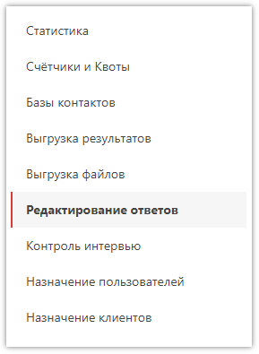
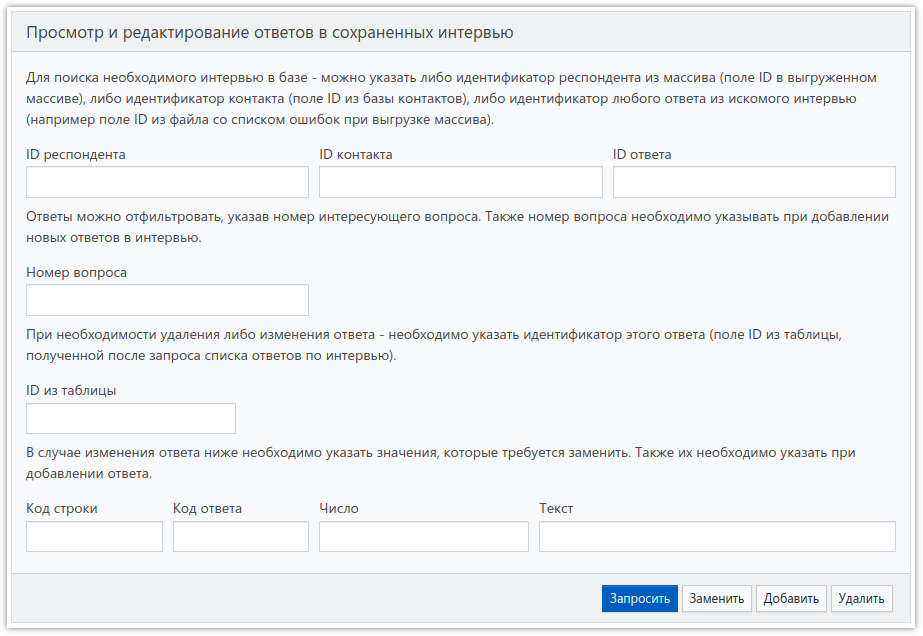
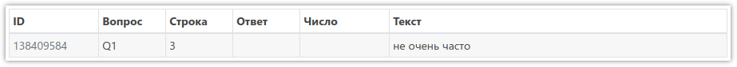

# Редактирование ответов

В **SURVEY**STUDIO предусмотрено редактирование сохранённых интервью: изменение, добавление или удаление ответа. Чтобы сделать это, нужно перейти в соответствующий раздел проекта:

Здесь доступна форма для запроса и последующего редактирования ответов:

Ответы из необходимого интервью можно запросить по *ID респондента*, который нужно взять в массиве, или по *ID контакта*, который нужно взять в базе контактов **SURVEY**STUDIO, или по *ID ответа*, находящемуся в текстовом файле, доступном при ошибке выгрузки массива, связанной с изменением анкеты после начала сбора данных в проект.

После запроса ответов в таблице под формой будут указаны ответы найденного интервью:

В данном примере в 3-ей строке табличного текстового вопроса Q1 введён текст «не очень часто».

Допустим, необходимо добавить ответ 5 в Q2, вопрос с типом *Единственный выбор*. Для этого нужно в поле *Номер вопроса* формы указать номер 2, а в поле *Код ответа* указать код 5 и нажать кнопку *Добавить*. Если бы, например, у ответа 5 в анкете было бы текстовое поле, тогда в поле *Текст* нужно было бы ещё указать желаемый текст.

Форма содержит описание полей, и редактирование ответов обычно не вызывает сложностей.

Если в проекте есть счётчики, в условиях которых содержатся вопросы с изменёнными ответами, то после редактирования ответов эти счётчики необходимо пересчитать. Если этого не сделать, они могут показывать некорректные значения. Поэтому нужно перейти в раздел проекта *Счётчики и Квоты*, выбрать необходимые или все счётчики и нажать кнопку *Пересчитать по базе*.
