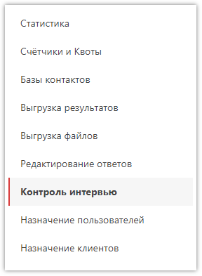

# Контроль интервью

В некоторых случаях бывает необходимо провести контроль работы интервьюера, то есть запустить анкету повторно по ранее сохранённому интервью и, в случае необходимости, изменить ответы или добавить какие-либо комментарии. Для этого существует раздел в левом меню проекта:

Для запуска анкеты в режим контроля необходимо указать ID респондента, который нужно взять в массиве. У пользователя (у группы пользователей), выполняющего контроль, должны быть права доступа: *Контроль интервью* и *Сбор данных*.

В анкете под списком ответов на протяжении всего интервью будет доступно текстовое поле, в которое можно записывать комментарии.

Поскольку для контроля используется анкета, указанная в проекте, со всей её логикой, в некоторых скриптах необходимо учитывать возможность запуска контроля. Например, не делать чего-то, если функция [isValidation()](2001.md#isvalidation) возвращает *true*. Также если в середине поля в анкету добавили новый вопрос, например, или поле у ответа, то при контроле первых интервью в новых вопросах и полях не будет ответов.

При выгрузке массива можно добавить столбцы с информацией по контролю, включив необходимые флаги. Интервью, по которому сделан контроль, снова попадёт в оплату, так как вместо исходного интервью будет выгружена его копия с возможными исправлениями контролёра.
