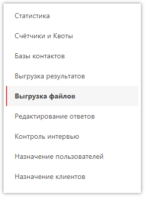
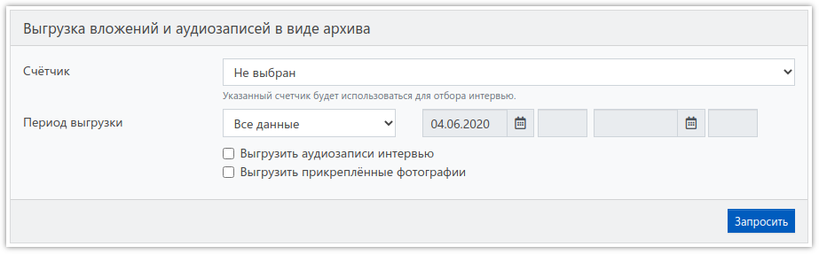

# Выгрузка файлов

Если во время интервью в приложении на планшете велась аудиозапись, были прикреплены фотографии или подписи респондентов, и есть необходимость скачать все эти файлы на свой ПК, то это можно сделать в течение 1 года в данном разделе:

Здесь расположена форма, аналогичная форме [запроса массива](3004.md):

Как минимум, необходимо выбрать счётчик, по которому будет производиться отбор интервью для выгрузки файлов, а также установить хотя бы один из флагов:

- *Выгрузить аудиозаписи интервью* 
Будут выгружены только аудиозаписи интервью.
- *Выгрузить прикреплённые фотографии* 
Будут выгружены прикреплённые фотографии, а также подписи респондентов.

После отправки запроса на выгрузку файлов он будет добавлен в очередь на обработку, и его состояние, как и при выгрузке массива, можно посмотреть в таблице с результатами. Отдельно хотелось бы сказать о состоянии Предупреждение. Оно означает, что запрос обработан, но не удалось выгрузить некоторые или все файлы, например потому что они ещё не выгружены с планшета.

У каждого запроса можно посмотреть детальный журнал выгрузки, открывающийся после нажатия кнопки с изображением конверта.

После успешного завершения обработки (или с предупреждением) в таблице появляется ссылка, по которой можно скачать архив с выгруженными файлами. Имена файлов в архиве имеют такой формат:

`ID из массива_код вопроса_уникальный код.расширение`

Если файл относится ко всему интервью, а не к конкретному вопросу, то в имени не будет кода вопроса.
