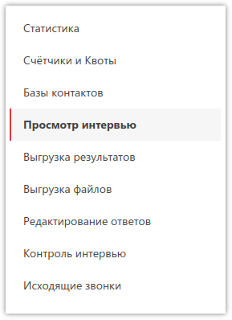
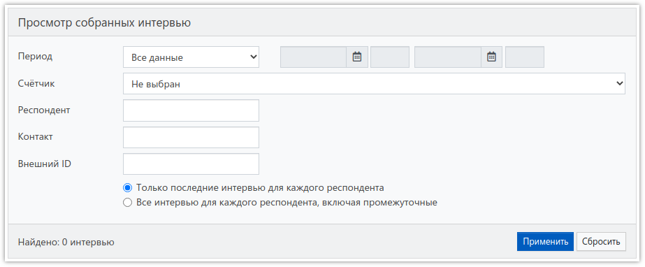
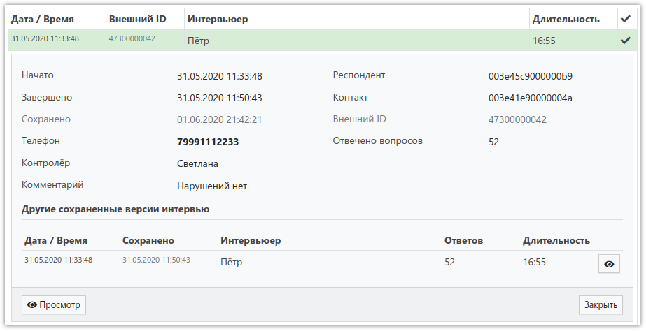
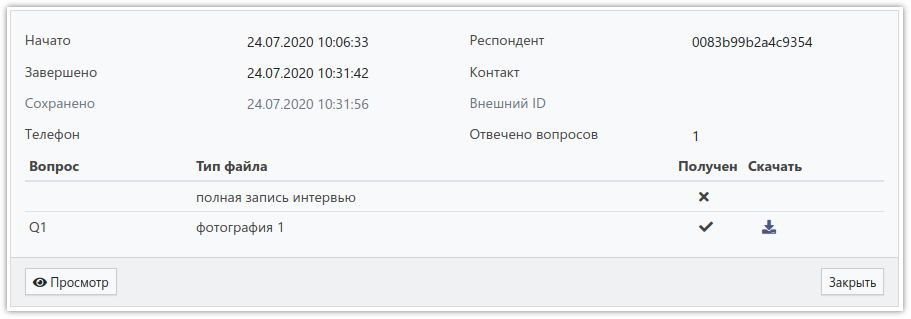

# Просмотр интервью

Сохранённые в системе интервью можно просматривать в соответствующем разделе проекта:

Здесь расположена форма для фильтрации интервью:

Отбирать интервью можно по одному или всем доступным параметрам:

- Период:
    - *Все данные* - отбираются все данные с самого начала проекта.
    - *За сегодня* - отбираются интервью, дата начала которых - сегодня.
    - *За вчера* - отбираются интервью, дата начала которых - вчера.
    - *За дату* - отбираются интервью в указанную дату начала.
    - *За период* - отбираются интервью, начатые в течение указанного периода.
- Счётчик проекта. Если он не выбран - отбор осуществляется среди всех интервью.
- Респондент - ID респондента из массива.
- Контакт - ID контакта из базы контактов.
- Внешний ID - идентификатор контакта из внешней системы дозвона (*ExtID* в массиве).
- Только последние интервью для каждого респондента 
Для каждого респондента (контакта) может быть сохранено несколько версий одного и того же интервью. Например, это происходит в телефонных опросах, когда респондент просит перезвонить в другое время, и в результате сохраняется интервью в текущем состоянии, а позже, когда наступит заданное время, интервью продолжится с прерванного места, и в случае завершения запишется в базу уже полностью как новое (отдельное). Эта опция заставляет систему отбирать только последние версии интервью.
- Все интервью для каждого респондента, включая промежуточные 
При выборе этой опции будут показаны все интервью для каждого респондента.

В левом нижнем углу формы отображается количество интервью, соответствующих указанным критериям отбора, а ниже - таблица с этими интервью, состоящая из семи колонок:

- *Дата / Время* начала интервью.
- *Внешний ID* - идентификатор контакта в проекте с типом *Внешняя система дозвона*.
- *Интервьюер* - имя пользователя в **SURVEY**STUDIO.
- *Длительность* интервью в минутах и секундах.
- *{Галочка}* - отметка о произведённом контроле интервью.
- *{Микрофон}* - отметка о получении аудиозаписей с планшета.
- *{Фотоаппарат}* - отметка о получении фотографий или подписей с планшета.

При нажатии на строку таблицы открывается детальная информация об интервью:

Если в интервью должны быть какие-либо файлы, то состояние каждого из них можно посмотреть также в детализации:

Нажав кнопку `Просмотр`, можно посмотреть ответы респондента.
