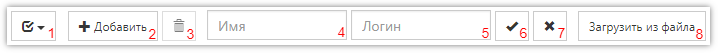

# Работа со списком пользователей, добавление нового пользователя

Для перехода к управлению пользователями, а также группами пользователей и правами доступа, необходимо выбрать [соответствующий раздел]({{ variables.ss_url }}/client/users) в основном меню [Личного кабинета]({{ variables.ss_url }}/client):

## Список пользователей

Раздел управления пользователями, как и многие другие разделы системы, содержит таблицу со списком пользователей, а также дополнительные средства для фильтрации этого списка. В меню слева можно выбрать - отображать или нет пользователей, помещенных в архив:

Для работы со списком пользователей над ним расположены кнопки, а также поля для поиска:

1. Выбрать все элементы списка, или снять выделение со всех.
2. Добавить нового пользователя.
3. Удалить выделенных пользователей (если они не входили в систему).
4. Поле для ввода имени пользователя для поиска/фильтрации. Можно указать часть имени.
5. Поле для ввода логина пользователя для поиска/фильтрации. Можно указать часть логина.
6. Кнопка для осуществления поиска/фильтрации по значениям, указанным в предыдущих полях.
7. Кнопка для отмены наложенных на список фильтров.
8. Импорт пользователей из файла. Описание формата файла находится в форме загрузки.

## Добавление нового пользователя

При добавлении нового пользователя, а также при изменении свойств уже созданного, используется следующая форма:

- *Имя* 
Имя пользователя, может быть любым, например содержать ФИО сотрудника.
- *Должность* 
Вспомогательное поле для указания должности пользователя. Может отсутствовать.
- *Логин* 
Идентификатор пользователя, используемый при входе в систему или при авторизации в проекте для ввода данных. Допускается использовать латинские буквы, а также цифры и некоторые вспомогательные знаки: _, !, -.
- *Пароль* 
Пароль пользователя, используемый для входа в систему. При изменении свойств уже существующего пользователя, поля для указания пароля можно оставить пустыми, если не требуется их менять.
- *Подтверждение* 
Подтверждение указанного пароля для проверки ввода. Так же как и поле Пароль, используется только при создании пользователя, или если необходимо изменить ранее установленный пароль.
- *Помещен в архив* 
При установке этого флага пользователь считается помещенным в архив, т.е. не отображается по умолчанию в списке пользователей, а также ему запрещен вход в систему.

Каждый пользователь может входить в одну или несколько групп, для удобства распределения прав доступа. Для выбора, в какие группы входит пользователь, необходимо нажать кнопку `Входит в группы`. При этом появится окно со списком групп:

Кроме этого, пользователь может управлять пользователями групп, в которые входит сам, если у него есть такое право. Выбрать группы для управления можно в окне, открывающемся кнопкой `Управляет группами`.
