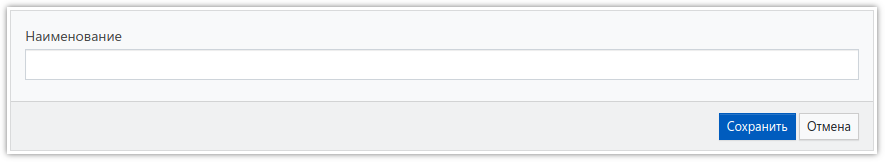

# Группы пользователей

Для удобства управления правами доступа к различным разделам, а также проектам, пользователей можно объединить в группы. В системе предусмотрены три группы, которые нельзя изменить или удалить: *Администраторы*, *Супервайзеры* и *Операторы*. Также есть группа *Все*, в которую автоматически включены все пользователи. Дополнительно к встроенным группам можно создать сколько угодно своих групп, с произвольными названиями. Далее, в свойствах любого пользователя можно выбрать, в каких группах он состоит. Также в разделе [Права доступа](4003.md) можно задать, каким группам разрешено или запрещено определенное право доступа.

Переход в раздел для управления группами осуществляется выбором соответствующего пункта меню:

Таблица со списком групп выглядит следующим образом:

1. Выделение всех групп в списке или снятие выделения со всех.
2. Добавление новой группы.
3. Удаление выделенных групп (нельзя удалять встроенные группы, помеченные знаком замка).

Для добавления новой группы, или изменении свойств существующей, используется следующая форма:

У группы можно указать только её наименование.
