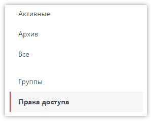
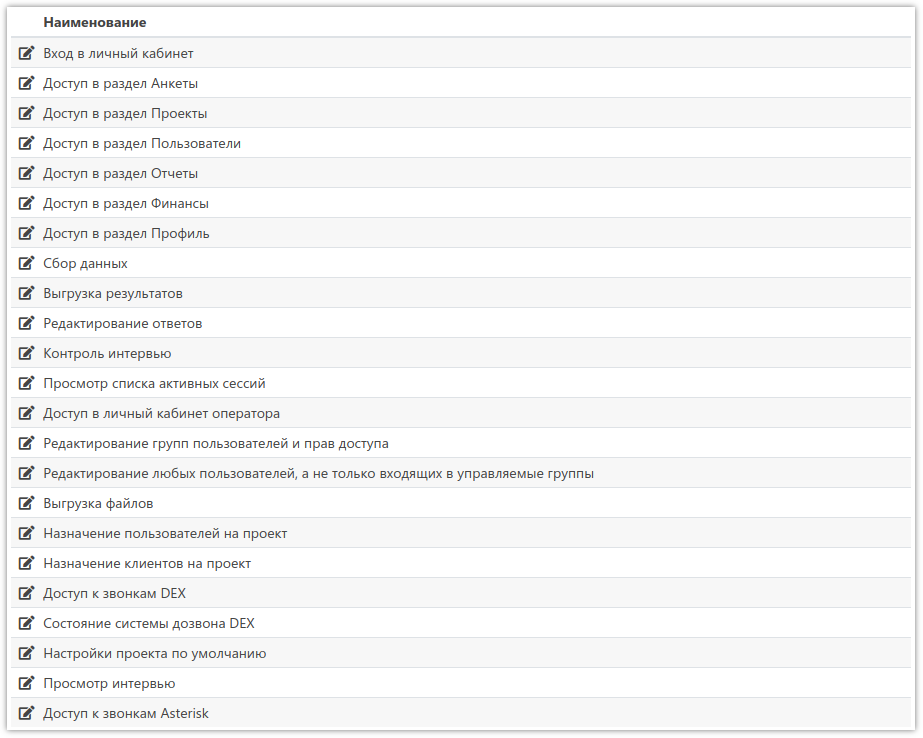
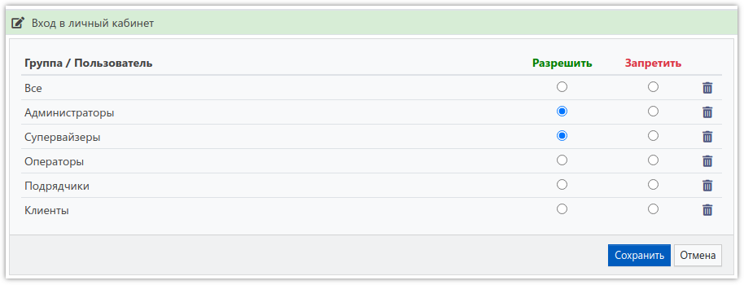

# Права доступа

Для доступа к большинству разделов и действий в системе, пользователь должен обладать соответствующим разрешением (правом доступа). Встроенный пользователь *Администратор* имеет полные права доступа, которые нельзя ограничить.

Переход в раздел для управления правами доступа осуществляется выбором соответствующего пункта меню:

Права доступа, которыми можно управлять, представлены в виде таблицы, каждый элемент которой можно редактировать, кликнув по строке:

Для каждой группы пользователей можно указать разрешен доступ пользователям, которые в неё входят, или наоборот - запрещён:

Обычно достаточно проставлять только права на разрешение доступа. Однако бывают случаи, когда, например, пользователи входят сразу в несколько групп, и необходимо всем разрешить доступ, но запретить части пользователей, входящих в другую группу. Например, разрешить для всей группы *Операторы*, но запретить для группы *Клиенты*.

Проверка прав осуществляется в следующем порядке: сначала проверяются запреты, затем разрешения. Если есть запрет для группы, в которую входит пользователь, то доступ запрещается, а проверка разрешений не осуществляется. Если же запрета нет, то проверяются разрешения, и если есть разрешение для группы, в которую входит пользователь, то доступ разрешается.
