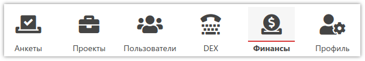

# Финансы

В разделе [Финансы]({{ variables.ss_url }}/finance) можно просматривать текущее состояние счёта, операции по нему, а также пополнять баланс с помощью доступных способов оплаты:

## Баланс и текущие затраты

При переходе в Финансы открывается раздел текущего состояния баланса:

- *Текущий баланс* 
Текущее состояние баланса. Отрицательное число - ваш долг перед нами.
- *Долг к погашению* 
Если у вас включён кредитный лимит, то здесь отображается сумма, которую необходимо оплатить до 20 числа текущего месяца. В случае нарушения срока оплаты, кредитный лимит может быть отключён.
- *Кредитный лимит* 
Сумма, которую вы можете использовать без пополнения баланса в течение месяца. Устанавливается индивидуально после получения нами реквизитов вашей организации и имени клиента, которое указываете при входе в **SURVEY**STUDIO. Если этой суммы недостаточно - можем увеличить её по запросу [в поддержку]({{ variables.ss_url }}/client/support).
- *Расход за месяц* 
Общая сумма, списанная за текущий месяц. В неё входят все расходы на полученные вами услуги: выгрузка интервью, программирование анкет, использование DEX и прочие.

Справа находятся кнопки, с помощью которых открываются форма оплаты и детализация со всеми операциями по счёту. В левом меню - аналоги этих кнопок.

## Пополнение баланса

Пополнить баланс можно моментально с помощью банковской карты, Google Pay или электронных денег:

Если хотите оплачивать услуги с расчётного счёта организации - можем включить кредитный лимит (см. выше). В этом случае, счёт за услуги будет направляться вам в начале нового месяца, а оплатить его необходимо до 20 числа. К счёту прилагается детализация выгрузок по каждому проекту.

## Платежи и списания денежных средств

Все операции по счёту можно посмотреть, нажав кнопку `Подробнее`. С помощью расположенной в верхней части страницы формы можно отфильтровать необходимые операции и посчитать итоговую сумму:

