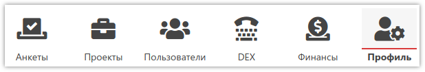
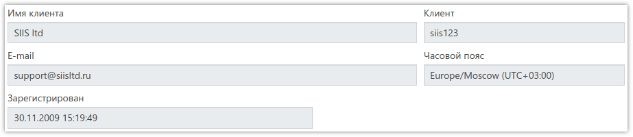
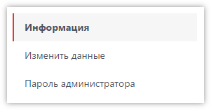
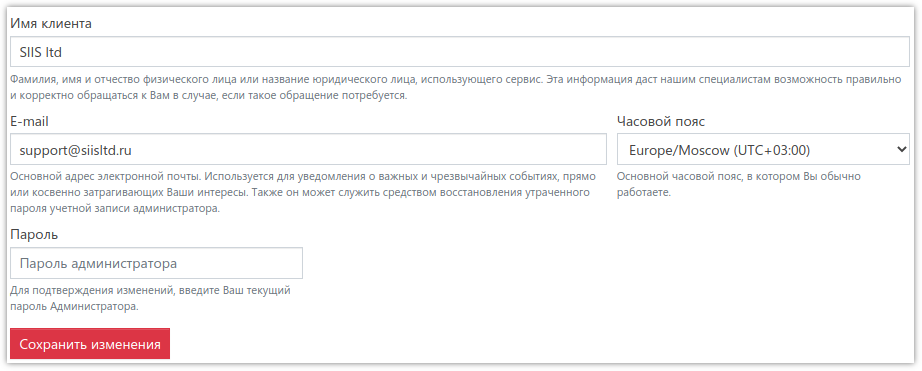
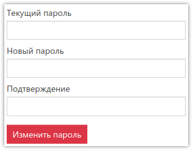

# Профиль

В этом разделе отображается информация о клиенте, а также есть возможность изменить данные, указанные при регистрации в системе.

## Информация о клиенте

Здесь страница выглядит следующим образом:

Для изменения данных или пароля администратора, необходимо выбрать соответствующий пункт в меню:

## Изменение регистрационных данных

Для изменения регистрационных данных используется следующая форма:

Чтобы изменения были приняты - необходимо указать пароль администратора системы в поле *Пароль*.

## Изменение пароля администратора

Для изменения пароля администратора необходимо указать текущий пароль, а также новый с подтверждением:

