# DEX 1.x

## С чего начать изучение DEX? Есть ли какая-нибудь инструкция по работе?

Смотрите [этот файл](https://zendesk.siisltd.ru/hc/ru/article_attachments/360009665252/DEX_user_manual.pdf). Однако он устарел, поэтому рекомендуем посмотреть запись вебинара в разделе [Видео](../video.md#dex), а также почитать ответы на вопросы, собранные на этой странице.

## Где найти журналы работы Рабочего места?

В правом верхнем углу нажмите кнопку с изображением блокнота:

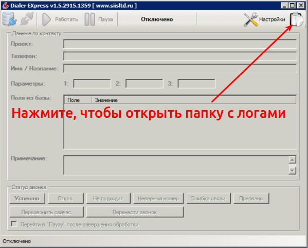

В открывшейся папке находятся журналы за текущий день, а в папке `archive` – за предыдущие дни:

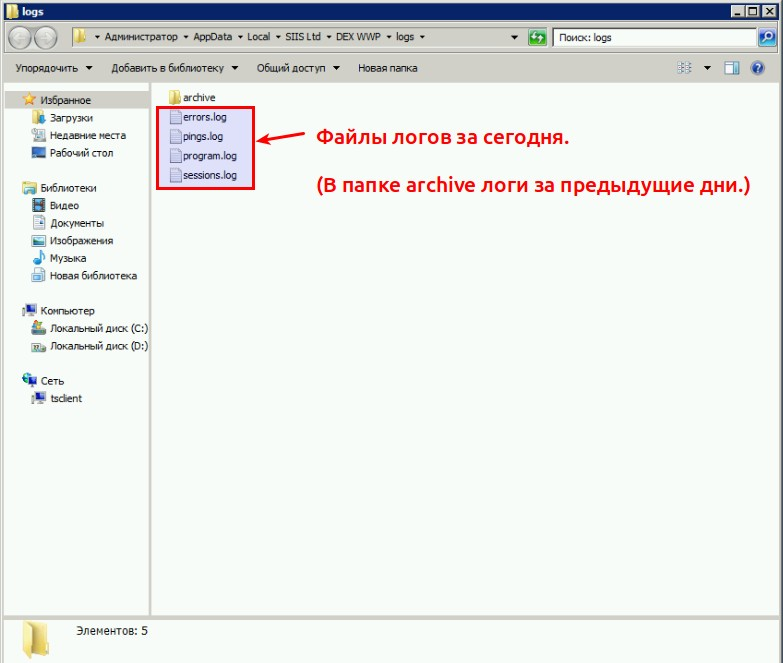

## При загрузке в базу контактов файла с контактами появляется сообщение *Ошибка сервера в приложении '/'*. Что делать?

Скорее всего, размер загружаемого файла превышает 8 Мб. Если это так, файл нужно разделить на части меньшего размера и загрузить их по отдельности.

## Какие данные DEX может передавать в ссылку?

Ниже полный список возможных подстановок для формирования ссылки или параметров запускаемой программы:

- `userId` - id пользователя в системе
- `userName` - имя пользователя
- `loginName` - логин пользователя
- `sipIdentity` - sip-идентификатор оператора, указанный в настройках рабочего места
- `CID` - id контакта (это будет или id контакта в системе, или значение поля CID при загрузке базы, если нужны свои идентификаторы контакта)
- `phone` - телефон (в том виде, в котором был загружен)
- `projectCode` - код проекта (указывается в свойствах проекта, если нужно)
- `tag` - метка из свойств баз контактов (если там задана)
- `name` - имя/название (если грузили базу контактов и там было помечено такое поле)
- `comment` - комментарий
- `additionalComment`
- `P1, P2, P3` - параметры выборки

Также можно передавать все поля из данных контакта по их имени, если загружали не просто телефоны, а базу с дополнительными данными.

Имя параметра необходимо заключить в фигурные скобки, например

`http://example.com/?p={phone}&id={CID}`

К параметру можно добавить модификатор `:raw`, чтобы данные не кодировались, а передавались в исходном виде, например `{Ссылка:raw}`.

## В нашем проекте много ссылок на анкету, для каждого респондента должна открываться своя ссылка. Как это реализовать в DEX?

Добавьте в отдельную колонку файла с телефонами все ссылки. Назовите её, например, `Link`.

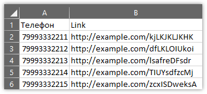

Загрузите полученный файл в базу контактов DEX, выбрав в форме загрузки пункт *Телефоны, а также поля с дополнительными данными*. На следующем шаге нужно будет выбрать типы значений:

- `Телефон` – Телефон,
- `Link` – Поле с данными.

Перейдите в свойства проекта DEX, в списке *Режим обработки* выберите *Ссылка в браузере* и в поле *ПО обработки* укажите `{Link:raw}`

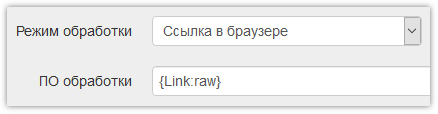

## Как изменить формат имени файла аудиозаписи интервью?

Формат можно изменить как для всех проектов, в параметрах DEX, так и для одного проекта. Для изменения формата имён в проекте откройте его свойства и найдите поле *Шаблон имени записи*:

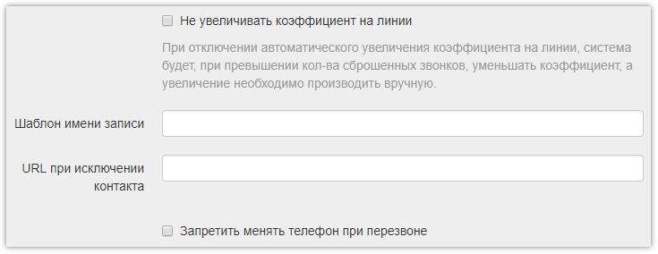

Используя следующие подстановки, сформируйте желаемое имя:

- `{0}` - год
- `{1}` - месяц
- `{2}` - день
- `{3}` - час
- `{4}` - минута
- `{5}` - секунда
- `{6}` - уникальный идентификатор звонка (actionId)
- `{7}` - набранный номер
- `{8}` - код проекта
- `{9}` - sip-идентификация оператора
- `{10}` - идентификатор оператора (operatorId)
- `{11}` - имя оператора
- `{12}` - логин оператора
- `{13}` - расширение файла
- `{CID}` - ID контакта

Также в фигурных скобках можно указывать имена полей базы контактов.

Формат чисел можно задать модификатором `:d`

> **Пример:**
>
> `Опрос о колбасе-{Город}-{7}-{0:d4}{1:d2}{2:d2}-{3:d2}{4:d2}-{11}.{13}`
>
> `Опрос о колбасе` – статичный текст, `{Город}` – поле из базы контактов, `:d4` – 4 цифры, `:d2` – 2 цифры.
>
> По этому шаблону будут генерироваться имена файлов в таком виде:
>
> `Опрос о колбасе-Москва-79991112233-20190509-1204-Иванов Иван.mp3`

**Внимание!** В итоговых файлах:

- не должно быть [запрещённых спецсимволов](https://ru.wikipedia.org/wiki/%D0%98%D0%BC%D1%8F_%D1%84%D0%B0%D0%B9%D0%BB%D0%B0#%D0%97%D0%B0%D0%BF%D1%80%D0%B5%D1%89%D1%91%D0%BD%D0%BD%D1%8B%D0%B5_%D1%81%D0%B8%D0%BC%D0%B2%D0%BE%D0%BB%D1%8B),
- должно быть расширение - `.{13}` в конце шаблона.

Шаблон имени записи никак не затрагивает файлы, хранящиеся на сервере, и применяется только при запросе файла (для выгрузки или прослушивания), поэтому его можно менять в любой момент, чтобы переименовывать все сделанные записи.

## Как запустить Рабочее место на Linux?

Необходимо установить Mono, если ещё не установлен, и запускать файл `SIISLtd.DEX.WWPLoader.exe` через него.

На Ubuntu желательно устанавливать пакет `mono-complete` из стандартного репозитория.

Можно воспользоваться [готовым скриптом](https://zendesk.siisltd.ru/hc/ru/article_attachments/360009843832/install_dex.sh), проверенным на Ubuntu 16.04, который автоматически устанавливает Mono и Рабочее место.

## Каким образом происходит набор номеров: в случайном порядке, по очереди или для каждого освободившегося оператора?

Номера по разным проектам набираются независимо, в случайном порядке. Каждую секунду набирается пул номеров в зависимости от CPS (количество звонков в секунду) на каналах связи.

Например, на двух проектах используется один оператор IP-телефонии, и у него CPS – 8. Соответственно, каждую секунду будут набираться 8 номеров по обоим проектам в равной степени. Таким образом, на проекте, где работает мало операторов, они быстро уйдут из состояния "Готов" и освободят место в пуле для проектов, где операторов больше.

## Есть ли какие-то универсальные настройки проекта, которые максимально оптимизируют работу?

Тут всё зависит от необходимости. Именно из-за этого в системе так много настроек.

По умолчанию (когда поля в настройках пустые) параметры более-менее оптимальные. Единственное, для каждого проекта нужно решить что делать с номерами по разным статусам:​​

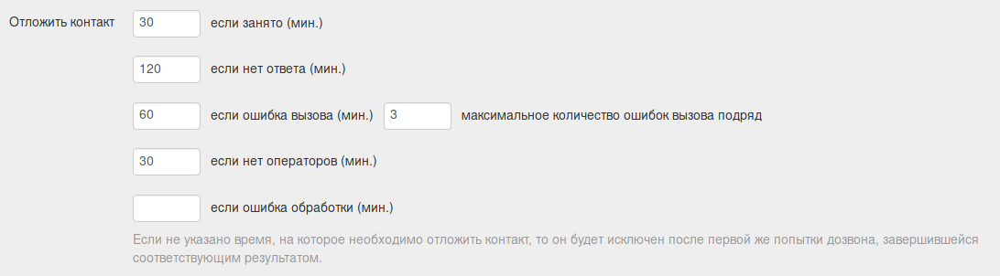

Собственно, там внизу написано, что если какое-то из полей пустое, то контакты с этим статусом будут исключены из дальнейшего дозвона.

Что касается коэффициентов и автоматики, то тут нужно решать исходя из качества баз и приоритетов на проекте.

Если база чистая, с живыми номерами, которые нельзя терять впустую, то коэффициенты лучше поставить пониже и убрать предиктив, автоматику, соответственно, отключить.

Если база сгенерированная, то для ускорения в ход можно пустить как предиктив, так и автоматику, которая будет решать понижать или повышать коэффициент на прогрессив (предиктив она не трогает). Автоматику тоже можно настроить, чтобы она, например, не повышала выше какого-то коэффициента. Если поле пустое, то максимальный коэффициент - 10.

## В каком формате должны быть номера телефонов в файле для загрузки в DEX?

По умолчанию формат значения не имеет. При загрузке система удалит лишние знаки, оставив только цифры. *7* или *8* в начале номера при звонке поменяет на необходимую для провайдера телефонии цифру. Перед 10-тизначным номером тоже подставится нужная цифра.

Очистка телефонов отключается в глобальных параметрах DEX флагом *Очищать номера телефонов при загрузке контактов (оставлять только цифры)*, однако этот флаг лучше не снимать. Если для каких-то целей телефоны нужны в исходном виде, то перед загрузкой файла необходимо сделать копию колонки с телефонами и загрузить этот файл, выбрав в форме загрузки пункт *Телефоны, а также поля с дополнительными данными* и на следующем шаге указав типы значений:

- первое поле – Телефон,
- второе – Поле с данными.

Далее телефон в исходном виде можно получать по имени второго поля.

## Почему набор происходит медленно? Операторы жалуются, что ждут звонка по 2 и больше минут.

Для наблюдения за процессом дозвона и поиска причин - в первую очередь используйте две основные страницы:

- https://<адрес DEX>/state/calls
- https://<адрес DEX>/statistics/calls

На первой видны текущие параметры дозвона, и здесь можно посмотреть "качество базы": бывает, что он всего 1%, т.е. чтобы дозвониться до 1 респондента надо набрать 100 номеров, или больше.

Чтобы как-то понять, почему так - идете на вторую страницу и смотрите результаты по последним попыткам вызова. Например, там может оказаться, что номера идут в "Занято" с 0 секунд временем вызова. Т.е. дозвон идет впустую.

Заходите в любой такой вызов и смотрите причину отключения звонка - часто со статусом "Занято" здесь можно увидеть "Call Rejected", т.е. вызов отклонен сразу. Причин обычно несколько, но основные - нет денег или оператор связи заблокировал аккаунт из-за каких-то других причин.

При такой ситуации что-то делать с коэффициентами - смыла никакого нет. Сначала надо починить связь, чтобы все вызовы завершались корректно.

## Что такое CPS и каким оно может быть?

CPS (Calls per Second) – значение предельного количества звонков в секунду, то есть сколько звонков можно совершить за 1 секунду и не быть заблокированным. Операторы связи обычно ограничивают это число (1-10 или более по договорённости), так как большое количество звонков существенно нагружает оборудование. Этот параметр напрямую влияет на скорость подачи номеров для дозвона.

Параметр CPS часто путают с количеством каналов / линий / одновременных разговоров, которых может быть существенно больше.

## Почему телефоны с проставленными вручную статусами снова попадают в работу?

Наиболее вероятная причина – контакты загружались в DEX без проверки на дубли.

Проверить это просто. В разделе Звонки найдите все звонки по проблемному номеру телефона. Здесь можно поставить фильтр по периоду.

В списке с найденными звонками будет указано имя базы контактов. Если оно в некоторых строках разное – значит один и тот же номер находится в разных базах. Если база одинаковая, то по очереди нажимайте на звонки и смотрите в поле *ID контакта* на числа. Если они разные, то значит дубли внутри одной базы.

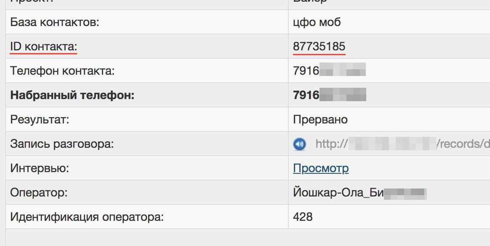

Другой способ проверить – выгрузить все контакты в файл и искать по номеру в нём. Если есть дубли, то телефон будет встречаться более, чем в одной строке. Однако, если контактов много, выгрузка создаст большую нагрузку на систему.

## Как посмотреть ответы в сохранённом интервью из DEX?

Если в свойствах проекта DEX `Режим обработки` – `Проект Survey-Studio (версия 2)`, то в разделе *Звонки* можно нажать на интересующий звонок, и в нём будет ссылка *Просмотр*, нажав на которую можно увидеть ответы, полученные во время этого звонка.

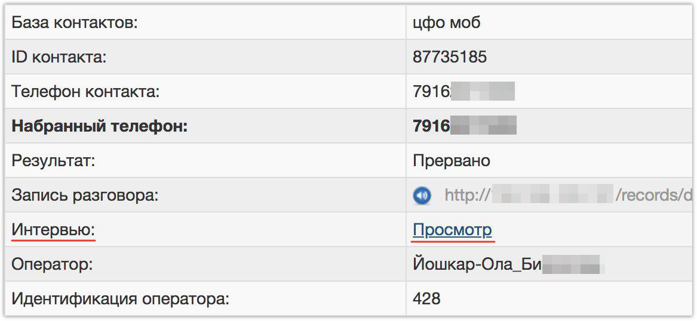

## Как дать клиенту доступ к его проекту?

Добавьте нового пользователя с правами *Супервайзер* (чтобы этот пользователь мог войти в панель администрирования по вашей ссылке DEX) и *Доступ только к разрешенным проектам*:

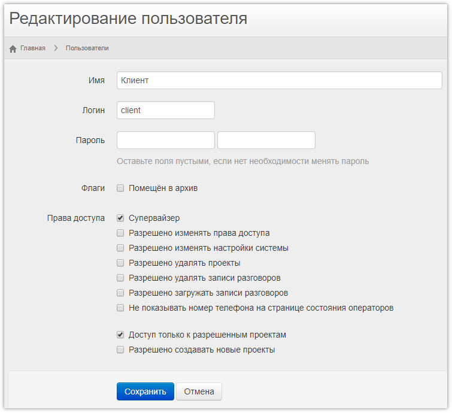

Затем откройте свойства проекта, который пользователь должен видеть, и в поле *Пользователи* укажите созданный логин:

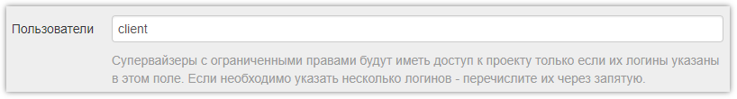

## Почему система переводит на операторов звонки, где автомат говорит «вызываемый абонент недоступен» или отвечает автоответчик, или просто тишина?

Система переводит звонок на оператора, когда получает от сервера провайдера IP-телефонии ответ, что абонент взял трубку. К сожалению, по каким-то причинам этот ответ бывает ошибочным.

Если такие вызовы доставляют много неудобств, мы можем добавить вам направление с функцией *Антиавтоответчик* (AMD). Количество ложных переводов сократится, но в то же время могут начать сбрасываться звонки с реальными людьми. Перед переводом звонка оператору, если ответил человек, или разрывом соединения, если на другом конце автоответчик, система будет слушать звук - это время будет тарифицироваться вашим оператором связи, так как при «снятии трубки» происходит соединение.

**Важный момент.** При написании писем не используйте слово *автоответчик*, так как СПАМ-фильтры иногда блокируют такие письма, и мы можем не увидеть ваш вопрос. Можно использовать различные сокращения: *AM, AMD, а-отв* и так далее.

## При попытке удаления пользователя появляется сообщение об ошибке. Как удалить пользователя?

Если пользователь хотя бы раз работал на проекте, то его удалить нельзя. Можно переместить его в архив. В этом случае он не сможет войти в систему и не будет отображаться в общем списке пользователей.

Для перемещения в архив необходимо в разделе *Пользователи* нажать на пользователя, поставить флаг *Помещён в архив* и нажать кнопку *Сохранить*.

## Как загрузить контакты вместе с идентификаторами, которые есть в файле, а не присваивать контактам новые?

При загрузке файла с контактами нужно выбрать пункт *Телефоны, а также поля с дополнительными данными*:

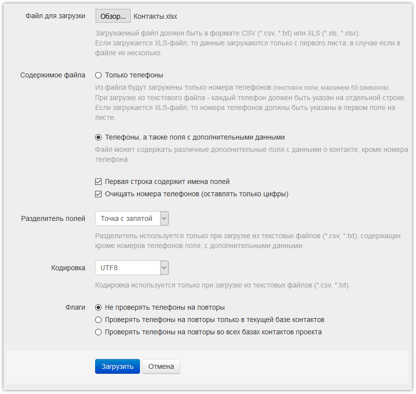

На следующем шаге нужно указать типы значений:

- поле с телефонами – Телефон,
- поле с ID – Идентификатор контакта.

Остальным полям (если есть) можно оставить *Поле с данными*:

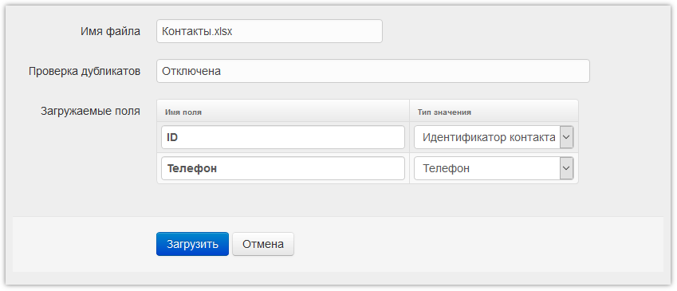

Теперь DEX будет подставлять в рабочую ссылку эти идентификаторы автоматически, если в свойствах проекта установлен режим обработки `Проект Survey-Studio (версия 2)`. Также их можно добавлять в любую ссылку с помощью подстановки `{CID}`.

## Какой программный телефон лучше использовать для работы с DEX?

Для работы подойдет любой программный SIP-телефон, у которого есть функция автоответа на входящий звонок. Под Windows рекомендуем использовать MicroSIP.

Скачать MicroSIP можно тут (достаточно Lite версии):

[https://www.microsip.org/downloads](https://www.microsip.org/downloads)

Про настройку телефона можно почитать ниже.

## Как настроить клиент MicroSIP?

Скачиваем клиент MicroSIP [по ссылке](https://www.microsip.org/downloads), выбираем версию Lite (Без поддержки Видео), запускаем.

1 Настраиваем автозапуск при старте компьютера. Скорее всего не нужно.

2 Отключаем срабатывание по ссылке из браузера callto:

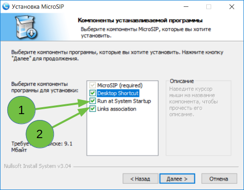

3 Нажимаем `Установить`.

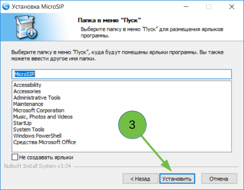

4 Нажимаем `Готово`.

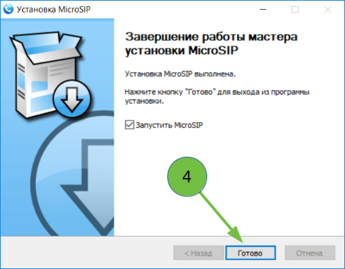

5 Проверяем наличие разрешения для частных сетей

6 Проверяем наличие разрешения для общественных сетей. Нажимаем `Разрешить доступ`.

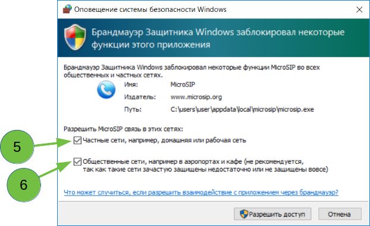

7 Заходим в меню настроек.

8 Выбираем пункт "Добавить аккаунт..."

9 Настраиваем название аккаунта и своего пользователя, для удобства одинаковые, для примера использован `testuser`.

10 Настраиваем свой SIP сервер, для примера использован `voip-firm.dialerex.ru`

11 Вводим свой пароль

12 Пункт "Шифрование медиа" устанавливаем в "Необязательно SRTP (RTP/AVP)"

13 Устанавливаем галочки "Публиковать присутствие" и "Отключить таймеры сессии". Нажимаем `Сохранить`.

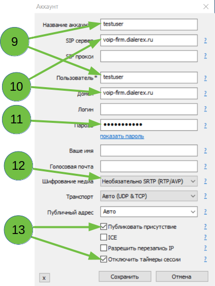

14 Клиент должен подключится и должна появиться надпись "Онлайн" в нижнем левом углу. Если не появилась - внимательно проверяем все настройки из предыдущего шага.

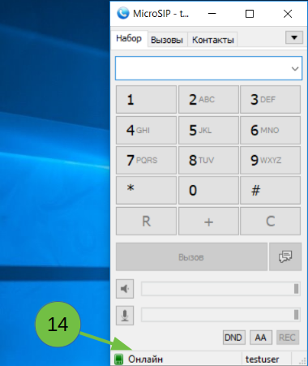

15 Заходим опять в меню, как это делалось в пункте 7 и выбираем пункт "Настройки".

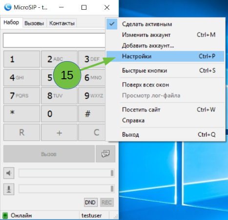

Приводим настройки к следующему виду:

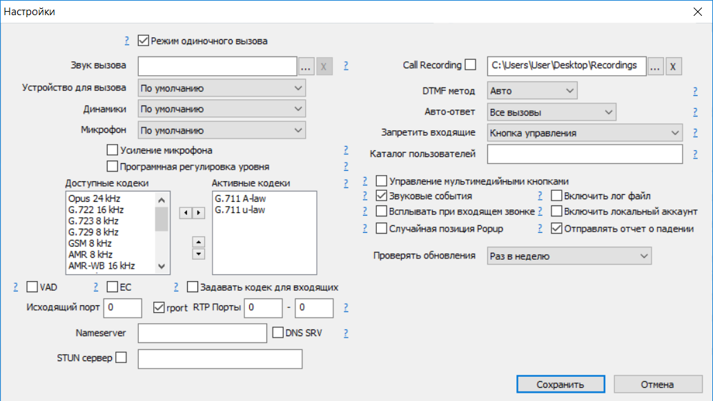

Нажимаем `Сохранить`, готово.

## Статусы звонков в DEX

### Статусы звонков, в которых не удалось дозвониться до респондента:

**Занято** - вызываемый номер занят, звонок будет отложен на время, указанное в настройках проекта.

**Нет ответа** - вызываемый номер не отвечает за указанный в настройках таймаут, звонок будет отложен на время, указанное в настройках проекта.

**Ошибка вызова** - не удалось произвести вызов, обычно из-за проблем на стороне используемого провайдера телефонии, либо из-за других ошибок, например на нашей телефонной станции, звонок будет отложен на время, указанное в настройках проекта. При этом статусе не изменяется кол-во попыток вызова для контакта.

**Несуществующий** - вызываемый номер не существует, при этом контакт будет сразу исключен из дальнейшего обзвона.

### Статусы, которые проставляются в случае успешного дозвона до респондента, но на оператора вызов перевести не удалось:

**Нет операторов** - дозвонились до респондента, но не оказалось операторов, готовых обработать звонок. Звонок будет отложен на время, указанное в настройках проекта.

**Ошибка перевода** - дозвонились до респондента, выбрали оператора для обработки звонка, но не смогли перевести на него вызов. Обычно причина в неправильной настройке телефона на компьютере оператора.

### Статусы, которые проставляет оператор, после получения вызова, с помощью "Рабочего места DEX":

**Успешный** - сделано успешное интервью. Дальнейшие звонки по контакту не совершаются, он помечается как успешный.

**Отказ** - респондент отказался от разговора. Контакт также завершается.

**Прервано** - обрыв связи во время разговора. Работа по контакту завершается (!!!).

**Не подходит** - респондент не подходит по результатам ответов на отборочные вопросы. Работа по контакту завершается.

**Неверный номер** - по указанному номеру ответил не тот респондент, который ожидался (например другая организация, или человек больше не живет в этой квартире, и т.д.). Работа по контакту завершается.

**Ошибка связи** - плохо слышно, эхо, односторонняя слышимость и прочие проблемы со связью. Звонок будет отложен на время, указанное в настройках проекта (тоже самое, как и для "Ошибка вызова").

**Перенос** - оператор перенес звонок на другое время.

**Перезвон** - оператор перезвонил по контакту сразу, т.е. использовал функцию рабочего места "Перезвонить сейчас".

**Ошибка обработки** - этот статус проставляется системой в том случае, если не получили результат от оператора. Обычно такое происходит, если во время обработки звонка рабочее место оператора потеряет связь с сервером.

## Настройка собственного Asterisk для работы с DEX.

Для настройки необходимо предоставить названия используемых для DEX транков c провайдерами телефонии. Количество линий и значение CPS.

**Доступ к астериску по AMI**

Необходим адрес и порт, а также логин и пароль, для подключения по AMI к Asterisk (подключение будет выполняться с сервера с адреса `dex.dialerex.ru`).

Примерные настройки:

/etc/asterisk.newcati/manager.conf
```ini
[general]
enabled=yes
port=<port>
bindaddr=<ip address>

[dex]
secret=<password>
read=all
write=all
deny=0.0.0.0/0.0.0.0
permit=23.105.236.212/255.255.255.255
eventfilter=Event: *
eventfilter=!Event: VarSet
eventfilter=!Event: RTCP*
```

**Примерные настройки, для компании firm.**

**в sip.conf**
```ini
[firm](!)
type=friend
qualify=30000
host=dynamic
directmedia=no
nat=force_rport,comedia
context=local
disallow=all
allow=alaw

[firm001](firm)
secret=<some password>
```

**extensions.conf**
```ini
[local]
exten = _XXX,1,Dial(SIP/firm${EXTEN},30,t)
same = n,Hangup()
exten = _firmXXX,1,Dial(SIP/${EXTEN},30,t)
same = n,Hangup()
exten = _*firmXXX,1,ChanSpy(SIP/firm${EXTEN:-3},qb)
same = n,Hangup()
exten = _**firmXXX,1,ChanSpy(SIP/firm${EXTEN:-3},qbw)
same = n,Hangup()

[dex]
exten => s,1,NoOp()
same = n,ExecIf($["${recfile}" = ""]?Set(recfile=${STRFTIME(${EPOCH},,%Y/%m/%d)}/FAILED-${EPOCH}.alaw))
same = n,GotoIf($["${recfile}" = "disabled"]?select_operator)
same = n,MixMonitor(${recfile},,/home/robot/encode2mp3-ffmpeg.sh /var/spool/asterisk/monitor/${recfile})
same = n(select_operator),Set(OPERATOR=${CURL(http://dex.dialerex.ru:4580/dex_firm/?ac=${CDR(accountcode)})})
same = n,ExecIf($["${OPERATOR}" = ""]?HangUp())
same = n,Dial(SIP/${OPERATOR},5)
same = n,HangUp()
```

**Скрипт конвертации записей, запускаемый астериском.**

/home/robot/encode2mp3-ffmpeg.sh

```bash
#!/bin/bash
#
# WAV|ALAW to MP3 converter, v2017071101
#
# Requires ffmpeg:
# apt install ffmpeg
#
# Usage: encode2mp3-ffmpeg.sh <source_sile_name>

if [[ -s $1 ]]; then
if [[ "$1" =~ \.wav$ ]]; then
nice -n 19 ffmpeg -loglevel panic -f wav -i $1 -q:a 10 ${1%.*}.mp3 </dev/null
elif [[ "$1" =~ \.alaw$ ]]; then
nice -n 19 ffmpeg -loglevel panic -ar 8k -f alaw -i $1 -q:a 10 ${1%.*}.mp3 </dev/null
fi
fi
```

Так же необходим доступ по http/https к папке с записями с сервера DEX на сервер телефонии.
Нам нужна ссылка по которой система DEX будет искать записи.

## Получение доступа к ручным записям

Перейдите в раздел [DEX]({{ variables.ss_url }}/dex) и выберите слева *Детализация звонков Asterisk*. Если этого пункта у вас нет - обратитесь в [поддержку]({{ variables.ss_url }}/client/support).

Открывшуюся форму можно заполнить необходимыми данными и нажать кнопку `Выгрузить записи`.

Записи можно выгрузить и по списку телефонных номеров. Для этого нужно поставить флаг *Использовать файл с телефонами* и выбрать соответствующий файл. Далее необходимо указать период выгрузки и так же нажать `Выгрузить записи`.

Отслеживать состояние выгрузки и скачать архив с записями можно в разделе *Выгрузка записей* (в левом меню).

## Не работает прослушивание текущих звонков

В системе должен быть прописан клиент SIP (программный телефон) как обработчик для SIP-протокола. Обычно при установке SIP-клиента это настраивается автоматически. Необходимо проверить, так ли это.

В Windows 10 нужно нажать Пуск -> Параметры -> Приложения -> Приложения по-умолчанию -> Выбор стандартных приложения для протоколов -> SIP.

Если здесь указан не ваш программный телефон, то выберите его вручную. Если в списке вообще нет SIP-протокола или SIP-клиента нет в списке доступных программ - значит необходимо установить телефон, который корректно работает с Windows 10 и прописывает себя обработчиком SIP-протокола. Мы рекомендуем использовать [MicroSIP](#microsip).

## При запуске Рабочего места или при поступлении звонка оператору появляется ошибка: *The underlying connection was closed: Could not establish trust relationship for the SSL/TLS secure channel*. Что она означает?

В операционной системе устарели корневые сертификаты - не удаётся установить защищённое соединение с сервером. Проблема решается обычной установкой обновлений Windows. Если по каким-то причинам автоматическое обновление невозможно, то это нужно сделать вручную или импортировать необходимые корневые сертификаты самостоятельно.

В Windows 7 должно быть установлено KB3004394, чтобы система сама актуализировала все известные корневые сертификаты. Возможно, для его установки потребуются какие-либо дополнительные обновления. Ознакомиться с системными требованиями и скачать файл можно здесь: [32-битная версия](https://www.microsoft.com/ru-RU/download/details.aspx?id=45588), [64-битная](https://www.microsoft.com/ru-RU/download/details.aspx?id=45633).

Для работы **SURVEY**STUDIO требуется сертификат [GlobalSign Root R3](http://secure.globalsign.com/cacert/root-r3.crt). Чтобы добавить его вручную в Windows XP/7, нужно сохранить файл с сертификатом, например, на рабочий стол, дважды щёлкнуть по нему и нажать `Установить сертификат`. В открывшемся мастере импорта сертификатов необходимо вручную выбрать хранилище *Доверенные корневые центры сертификации*, импортировать сертификат и перезагрузить систему.

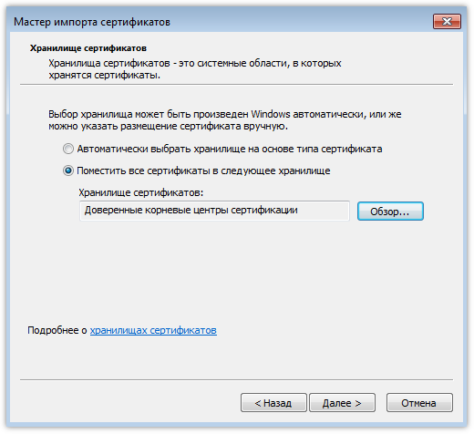

## Как рассчитывается стоимость использования DEX за сутки?

В системе есть три вида оплачиваемых подключений:

- рабочее место оператора,
- исходящий ручной звонок на телефоне,
- линия прозвона базы контактов.

В каждый момент времени учитывается, сколько существует активных подключений всех видов. Максимальное значение суммы этих подключений за сутки умножается на цену одного подключения в соответствии с [тарифами]({{variables.ss_url}}/account/pricing).

> Пример. Операторы обрабатывают звонки в Рабочем месте в две смены: первая из 10 человек, вторая из 15. Цена за одно подключение 55 рублей. Стоимость использования за сутки будет 15 * 55 руб. = 825 рублей.
>
> Либо то же самое, но у вас приобретено 5 постоянных подключений, цена за использование которых 10 рублей. Тогда общая стоимость получится 5 * 10 руб. + 10 * 55 руб. = 600 рублей.

Если у одного оператора запущено Рабочее место DEX (в любом состоянии, кроме *Отключено*) и он одновременно совершает исходящие звонки вручную, набирая номера на телефоне - для системы это два отдельных подключения.

## Как предоставить логи MicroSIP?

1. Включите в настройках MicroSIP лог. Поле так и называется: *Включить лог*.
2. Имитируйте проблемную ситуацию (ошибку перевода, проблемный ручной набор и т.п.).
3. Нажмите на иконке MicroSIP в правом нижнем углу правой кнопкой мыши и выберите пункт *Просмотр лог-файла*. Откроется редактор с логом, сохраните его куда-нибудь, например на рабочий стол, и отправьте нам.

## Каких провайдеров IP-телефонии вы можете порекомендовать для звонков с помощью DEX?

Ниже список провайдеров, которыми пользуются наши клиенты чаще всего. При звонке контактному лицу можно сказать, что пришли по рекомендации ООО "Системы информации и связи", и попросить прислать тарифы. Скорее всего, они будут более выгодными, чем стандартные.

- PowerTelecom: +7 (495) 983-33-00 (доб. 108) или +7 (985) 095-82-22, Алексей Моцарт.
- Мегафон: +7 (929) 708-57-23, Александр Фадеев.
- МТТ: +7 (958) 771-62-42, Николай Краснов.
- Билайн: +7 (906) 479-57-55, Игорь Науменко.
- МТС: +7 (981) 190-02-33, Артём Тарасов.

Важными параметрами подключения являются [CPS](#cps) (максимальное количество одновременных вызовов в секунду) и количество линий (одновременных телефонных соединений). Для маленьких контакт-центров (~15 операторов) мы рекомендуем запрашивать у провайдеров телефонии как минимум 8 CPS и 100 линий.

## При поступлении звонка оператору появляется сообщение *Ошибка запуска ПО обработки: Приложение не найдено*. Что она означает и как исправить?

При соединении с респондентом Рабочее место DEX передаёт операционной системе значение строки *ПО обработки* из свойств проекта.

Если там указана ссылка на анкету, то операционная система отправляет её в браузер, назначенный по умолчанию. Если такого браузера нет, то ссылка не откроется с этим сообщением об ошибке - нужно установить необходимый браузер по умолчанию. О том, как это сделать в Windows 10, почитать можно [здесь](https://support.microsoft.com/ru-ru/help/4028606/windows-10-change-your-default-browser).

Если там указан путь к программе, то операционная система пытается запустить её, и если этого сделать не удалось - появляется такое сообщение об ошибке. Нужно убедиться, что на ПК оператора по указанному пути есть необходимое ПО и оно корректно запускается без Рабочего места DEX.

Если в *ПО обработки* указанно некорректное значение, например адрес ссылки без `http` или ссылка начинается с посторонних символов, то операционная система не поймёт что нужно сделать.

Что именно запускается, можно посмотреть в [журналах Рабочего места](#_1), например в *program.log*.

## При ручных звонках через X-Lite разговор обрывается на 31-й секунде. Как это исправить?

В разделе *Network* настроек X-Lite необходимо снять флаг *In times of network disruption, automatically hang up calls after*:

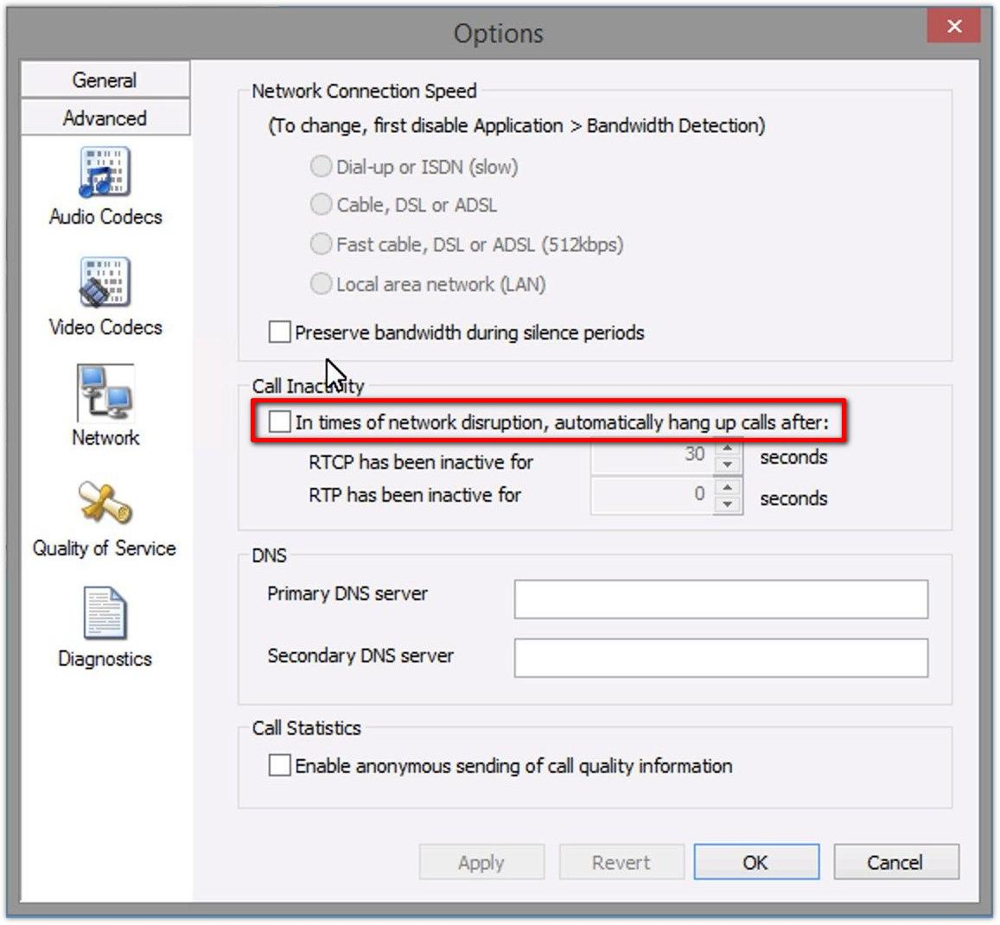
